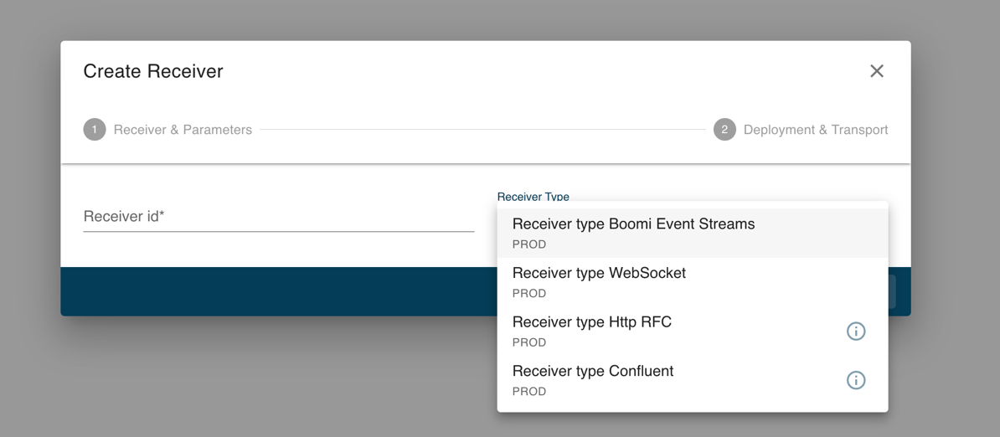
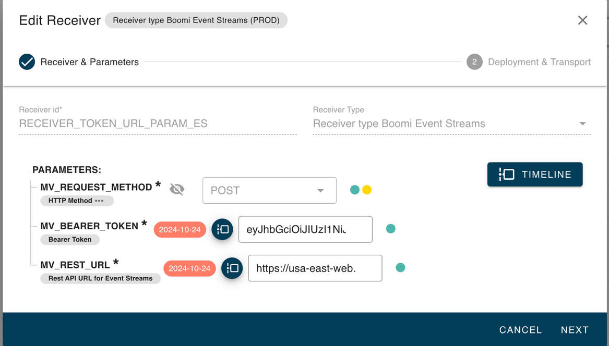
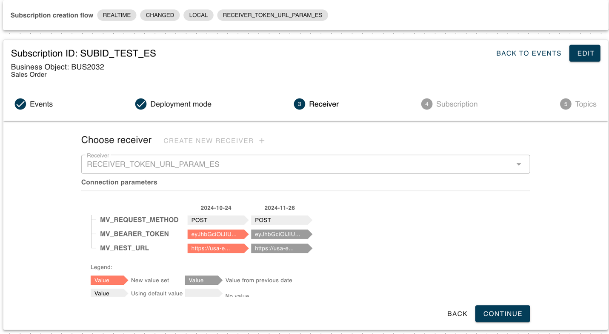
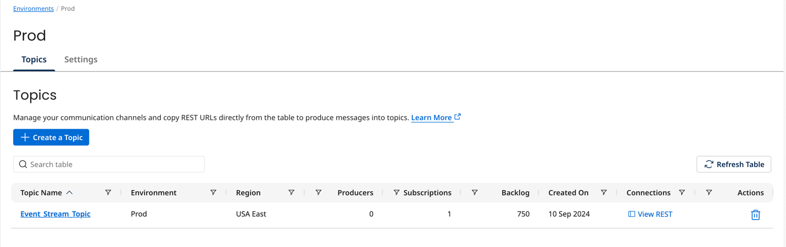
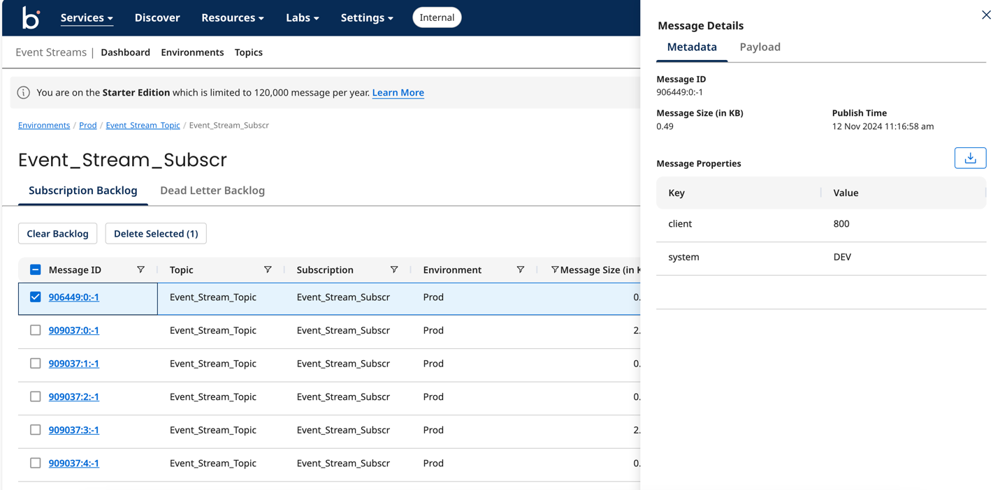

# Receiver Framework

<head>
  <meta name="guidename" content="Boomi for SAP"/>
  <meta name="context" content="GUID-1749ff8b-ba52-46eb-b4fd-a4b2d5025296"/>
</head>

The Receiver Framework lets you to transmit data in your preferred format, offering versatility in customization and data handling via the following components:

- An interface where you can choose from implemented prebuilt receivers.
- Possibility to create custom receivers.
- A custom data formatter, allowing you to select the desired output format for transmitting your data.
- A Migration Tool designed to seamlessly transition your existing receivers from version 1.5.2 or older to the latest framework.
- The option to set timelines and parameters for your receivers, so you can automatically change them over time.

<!--Use case examples:

- You would like to send an email to the customer when a delivery of a good is happening, without having to use other middleware.
- You would like your receivers to automatically change periodically.
-->
## Boomi for SAP Receiver Framework

**Receiver Framework for Boomi for SAP**

The Boomi for SAP Receiver Framework facilitates a variety of receivers and data transmission methods. We developed a framework to enhance receiver functionality, enabling seamless handling of diverse receiver types and data transmission formats.

### Receivers

The supported receiver types are:
- Boomi Event Streams - Send data to the Event Streams service on the Boomi Enterprise Platform. 

  Parameters

| Field name | Technical name |	Notes | 
| ---------- | -------------- | ----- |
| Bearer Token | MV_BEARER_TOKEN | Required. Copy and paste your JWT Bearer Token from Event Streams on Platform.  |
| REST API URL  | MV_REST_URL | Required. Copy and paste your REST API URL from Event Streams on Platform. |

- Confluent REST - Send data to Confluent by RFC dest.

  Parameters

| Field name | Technical name |	Notes |
| ---------- | -------------- | ----- |
| HTTP Method | MV_HTTP_METHOD | Required. Default value 'POST'. |
| RFC Destination | MV_RFC_DEST | Required. Choose a value from the drop-down list or enter it by hand.|
| Value schema ID |	MV_VALUE_SCHEMA_ID | Optional. Id of the JSON records schema in confluent. |
| Key schema ID | MV_KEY_SCHEMA_ID | Optional. Id of the schema for the key field. |
| Key | MV_KEY | Optional: Key (can be complex JSON type). |

- HTTPS RFC - Classic http rfc receiver type. 

  Parameters

| Field name | Technical name |	Notes | 
| ---------- | -------------- | ----- |
| HTTP Method | MV_HTTP_METHOD | Required. Default value 'POST'. |
| RFC Destination | MV_RFC_DEST | Required. Choose a value from the drop-down list or enter it by hand. |

:::note
You can maintain parameter values that are dependent on the date.
:::

Possible validation errors: 
- Critical errors - If the input parameter value doesn't match the parameter data type. 
- Warning errors - If the input parameter value is not in the possible value list. It's not allowed to save the receiver if there are some critical errors in parameter values.
<!--
The receiver sets the deployment mode at its level along with its parameter values.
The receiver will use the parameter framework to allow the reuse of the receiver object where the customizing enables different settings.
-->
The deployment mode is configured at the receiver level along with its parameter values.

Using the parameter framework, the receiver incorporates flexibility by enabling the reuse of receiver objects, allowing for customizable settings to accommodate different configurations.

### Setting up the Event Streams Receiver 

1. Navigate to **Create Receiver** in Boomi for SAP.

2. Fill in the necessary parameters. Click **Next**. 

3. Once the receiver is created, it can be used while creating a subscription for a Business object or changing pointers. Creating a topic isn't required for the Event Streams receiver type. 

4. Trigger an event in SAP to see if the data is successfully received in Event Streams. 

5. Navigate to **Event Streams** in Services, then select the environment where the topic and subscription was created. 

6. Click **View Backlog messages** to see any messages and data sent from SAP. You can see the metadata and payload data from triggered events by clicking on **Message ID**.

### Data formats

Supported Output data formats:

| Data format name | Technical name | Notes |
| ---------- | -------------- | ----- |
| v1.5 JSON Format | LEGACY | Legacy JSON format, used for releases prior to the 1.5.2 Release. Mainly used for special format rules for PAYLOAD subscriptions.|
| v1.6 JSON | STD_JSON | A JSON format to convert data 'as is', without applying special rules to the PAYLOAD. Empty fields are skipped.|
| XML char format | XML_C | XML format. Data is converted 'as is', without applying special PAYLOAD rules. Empty fields are skipped. |

Supported data formats for receiver types is managed within the transaction /IXBX/DCONV_RECV_MAP(/IXBX/ZBX019). This transaction contains mappings tailored specifically for integration with Boomi for SAP.

 Data Formats and Receiver types:

| Receiver type | receiver Description | Data Format | Data Format Description |
| ------------- | -------------------- | ----------- | ----------------------- |
| /IXBX/CL_EDA_REC_TYPE_CONFL | Receiver type Confluent | STD_JSON | v1.6 JSON |
| /IXBX/CL_EDA_REC_TYPE_HTTP_RFC | Receiver type Http RFC | STD_JSON | v1.6 JSON |
| /IXBX/CL_EDA_REC_TYPE_HTTP_RFC | Receiver type Http RFC | LEGACY | v1.5 JSON Format |
| /IXBX/CL_EDA_REC_TYPE_HTTP_RFC | Receiver type Http RFC | XML_C | XML char format |

### Custom enhancements

Custom enhancements let you implement custom-specific receiver types or data formats.

**Receiver type**

The behavior of the main Boomi for the SAP receiver type is implemented within the abstract class /IXBX/CL_EDA_RECEIVER_TYPE. To incorporate custom-specific behaviors, define attributes, and redefine the methods per your requirement; you can inherit this class or a suitable child class. Documenting the class to provide the end user with more information about the receiver type is recommended. 

For greater clarity and usability, parameters controlling the processing logic of the receiver type are recommended to be defined as standard protected attributes within the class. We suggest using data elements for attribute typification to ensure consistency and facilitate maintenance. Parameter descriptions, search help values, or permitted domain values are obtained from the associated data elements.

Required implementation methods:

| Method | Notes |
| ------ | ----- |
| Send | Implementation for sending: is_data - contains data, subscription, and topic path. |

Optional implementation methods:

| Method | Notes |
| ------ | ----- |
| Check_combination | Additional parameters check. Can determine if the values of the parameters are allowed together. Although it enables the creation and saving of a receiver, processing a subscription with this parameter can encounter errors. |
| Process_init_helper | Reimplement in receiver type classes to allow additional logic before processing starts. |
| Set_parameters | Set parameters if needed. Use add_method to set parameters for user input. |
| Wrap | Implement additional fields in the output data if needed. |

### Data Format

Data conversion Format is a rule on how the output data should look.

To define a user-specific data format, follow the steps below:

1: Use this Custom data conversion filter transaction /IXBX/DATA_CONV (/IXBX/ZBX005). Define the Data Conversion format ID and Description. Note, custom-defined Data conversion types must begin with either Z or Y.

2: Implement BADI /IXBX/BADI_EVENT_DATA_CONV, and set the Data Conversion format ID from the previous step as Badi filter.

3 Implement these methods.

| Method | Notes |
| ------ | ----- |
| Convert | Conversion rule implementation for output. |
| Get_schema | Getting schema, according to the Conversion rule. |
| Get_content_type | The MIME type for output data. |

4: Define which Receiver types can work with the new user-defined Data Conversion format, then go to transaction /IXBX/DCONV_RECV_MAP (/IXBX/ZBX019).

5: After those steps, a new Data Conversion format is available for selection and use.

