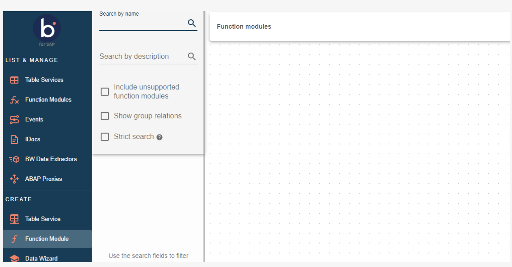
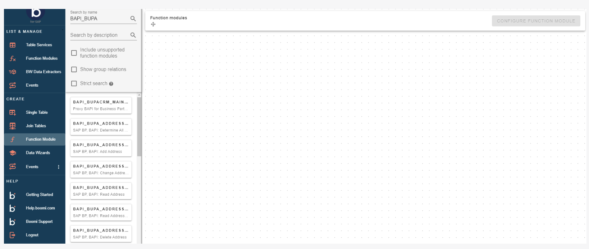
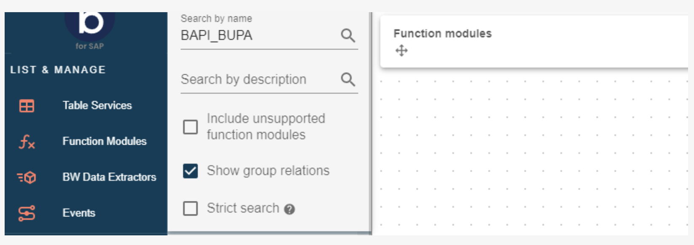
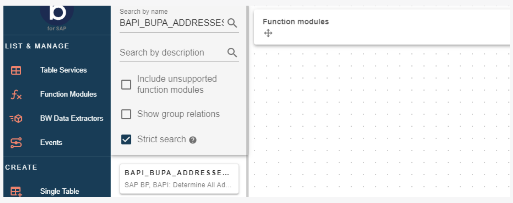

# Function Modules

<head>
  <meta name="guidename" content="Boomi for SAP"/>
  <meta name="context" content="GUID-cea6408e-8292-45af-a60e-2ed71ff2c7de"/>
</head>

The Function Module Service feature enables exposing Function Modules as REST services.

When configured, it quickly exposes all Function Modules, including non-RFC enabled ones, based on your specific use-case requirements.

Some use case examples are:
- Update a data object
  - Update a Business Partner object
- Query a (complex) data object
  - Retrieve a Business Partner object
- Expose a custom Function Module
  - Allow integrations to call custom Function Module
- Trigger a Table Service Extract
  - Expose and call the Boomi for the SAP Function Module

When you enter the front page of Boomi for SAP, choose ***Function Module*** under **CREATE** in the menu on the left side.

By clicking on **Function Module**, the system will direct you to the *Function Module* page listing all function modules in SAP, allowing you to enable them for use in Boomi. It is possible to find all existing modules; however, only the modules made available in SAP (by default, only RFC-enabled modules) can expose function module services to Boomi.

You can use the search function in the upper left corner of the page to search for function modules by name, description, or a combination of name and description. Searching by name for *BAPI_BUPA* will list all function modules starting with that string. If you search for a word contained somewhere in the name, put an '*' in front of the word.

:::note
Developers create the descriptions in SAP. Hence, descriptions can be empty.
:::

You can also see any group relations associated with the search you make. For example, if you search for *BAPI_BUPA*, all Function Modules related to that and any associated groups will be shown. To show group relations, enable the **Search group relations** option below the search boxes.

The strict search option will help ensure specific search results. Check the box **Strict search**, but be aware that strict search is case-sensitive and excludes wildcards(*).

