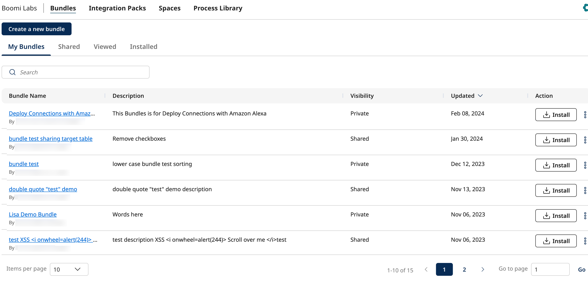
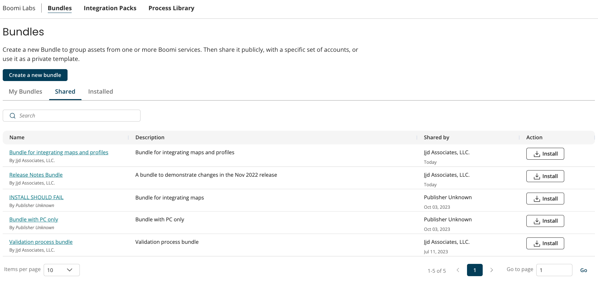
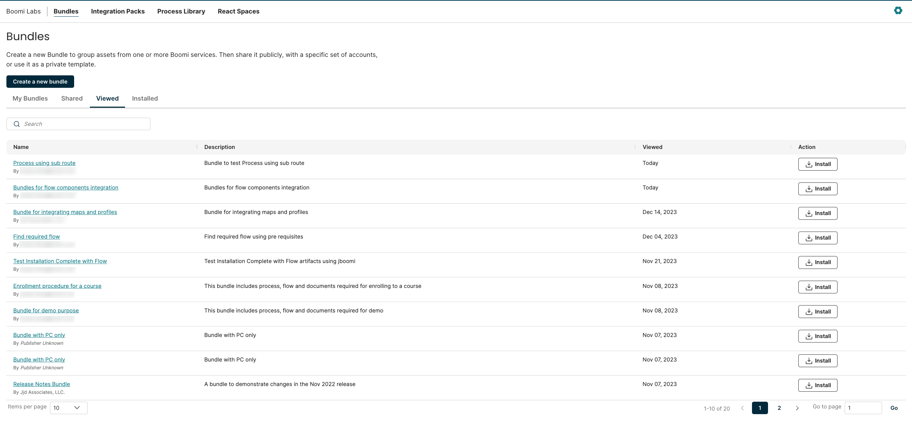
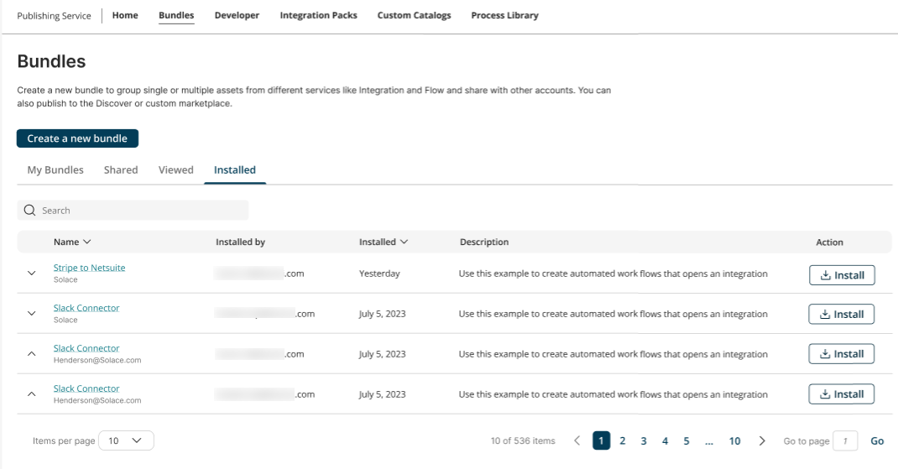

# Bundles User Interface 

<head>
  <meta name="guidename" content="Bundles"/>
  <meta name="context" content="a611179b-af54-4b3f-8980-6883c2b24bd4"/>
</head>

To use the Bundles UI, you must have the “build” privilege set for your user on the account in AtomSphere. 

Perform one of the following to access the Bundles UI:

* Log in to the [Boomi Enterprise Platform](https://platform.boomi.com/#login) and select **Bundles** from the **Labs** drop-down menu.  
* To access the Bundles page directly, log in to [https://platform.boomi.com/BoomiLabs.html#pub_bundles](https://platform.boomi.com/BoomiLabs.html#pub_bundles)

:::tip

If you are unable to access the Bundles UI, check with your admin to set that privilege for you.

:::

## Understanding the Bundles UI

Using the Bundles UI, you can create, share, and manage your Bundles. The **Create a new bundle** button on the main page enables you to create your new Bundle. For more information on Bundle creation, check  [here](./bundles_Creating_a_Bundle.md).

You can perform other Bundle functionalities using the [My Bundles](#my-bundles-tab), [Shared](#shared-tab), [Viewed](#viewed-tab), and [Installed](#installed-tab) tabs.

The **Search** bar on each tab enables you to search for Bundles using a keyword for the Bundle name and description. It searches across all the pages, and the Bundle table is re-loaded with the search results.

Using the pagination option below each table, you can select the number of items to be displayed on each page, as 10, 20, or 50, for managing data viewing.

### **My Bundles** Tab

The **My Bundles** tab displays the list of Bundles created by all users of the current account. You can sort the My Bundles table using the Bundle name or Updated date. The default sorting order is to list Bundles based on their updated date, sorted in descending order.

You can view the following information for each Bundle listed on this page.

| **Parameter** | **Description** |
| --- | --- | 
| **Bundle Name** | Name of the Bundle. Below the Bundle name, displays the email address of the user who created the Bundle. |
| **Description** | Description of the Bundle. |
| **Updated** | The date on which the Bundle was last updated. |
| **Install** | Option to install the Bundle. For more information on installation, check [here](./bundles_Installing_a_Bundle.md). |
| **Share** | Option to share the Bundle. To access this option, click the ellipsis at the end of the row to expand the menu. For more information, check [here](./bundles_Sharing_a_Bundle.md).|
| **Delete** | Option to delete the Bundle. To access this option, click the ellipsis at the end of the row to expand the menu. For more information, check [here](./bundles_Deleting_a_Bundle.md).|

### **Shared** Tab

The **Shared** tab tab displays all the Bundles shared with the account. A user can install any Bundle listed in the Shared tab.

 

You can view the following information for each Bundle listed on this page.

| **Parameter** |  **Description** |
| --- | --- | 
| **Name** | Name of the shared Bundle. You can view the Publisher name displayed below the Bundle name. |
| **Description** | Description of the shared Bundle. |
| **Shared By** | Displays the **Publisher Name** of the account  that shared the Bundle. The column also displays the date on which the Bundle was shared. |
| **Action** | Option to install the Bundle. For more information on installation, check [here](./bundles_Installing_a_Bundle.md). |

### **Viewed** Tab

The **Viewed** tab displays all the previously viewed Bundles in a table. 
Viewed Bundles deleted from the account by the Bundle owner will not be listed in the viewed table. 
You can sort the Viewed Bundles table using Bundle name or viewed date. Most recently viewed Bundle appears at the top of the table and the least recently viewed Bundles at the bottom. 

 

You can view the following information for each Bundle listed on this page.

| **Parameter** |  **Description** |
| --- | --- | 
| **Name** | Name of the viewed Bundle. Clicking the Bundle name will help you navigate to the existing Bundle detail page. |
| **Description** | Description of the viewed Bundle. |
| **Viewed** | Displays the last viewed date of a Bundle. |
| **Action** | Option to install the Bundle. For more information on installation, check [here](./bundles_Installing_a_Bundle.md). |

### **Installed** Tab

The **Installed** tab displays the Bundles installed by the user’s account. The Bundles deleted from the account by the Bundle owner are also visible on the list. If the Bundle was deleted after installation, then it shows the Bundle name that was present at the time of installing the Bundle. If the bundle is not deleted, then it shows the latest Bundle name from the Bundle database.  You can sort the Installed table using Bundle Name or installed date.

:::note

The **Installed** table displays the most recently installed 1000 Bundles.

:::

You can view the following information for each Bundle listed on this page.

| **Parameter** | **Description** | 
| --- | --- | 
| **Name** | Name of the installed Bundle. If your Account owns the Bundle, then it displays the **email address** of the user who created the Bundle below the Bundle name. If the Bundle is shared with this account, then it displays the **Publisher Name** for the account that created the Bundle. |
| **Installed by** |Displays the email address of the user that installed the Bundle within your account. |
| **Installed** | Date on which the Bundle was installed. |
| **Description** | Description of the installed Bundle. For deleted Bundles, description is displayed as 'Bundle deleted'.|
| **Action** | Option to install the Bundle. This option is disabled for the deleted Bundles. For more information on installation, check [here](./bundles_Installing_a_Bundle.md).  |

