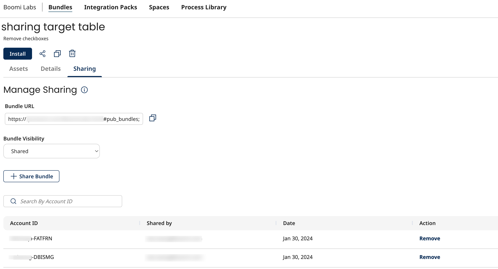
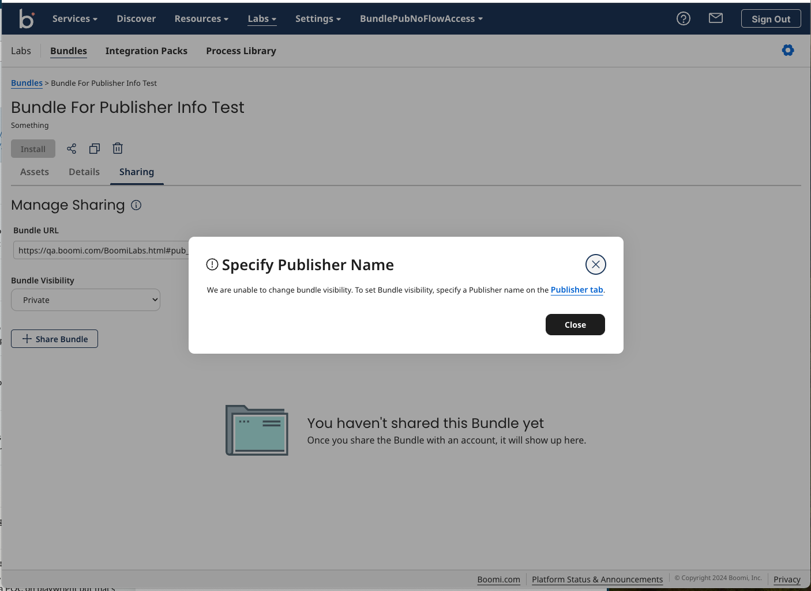
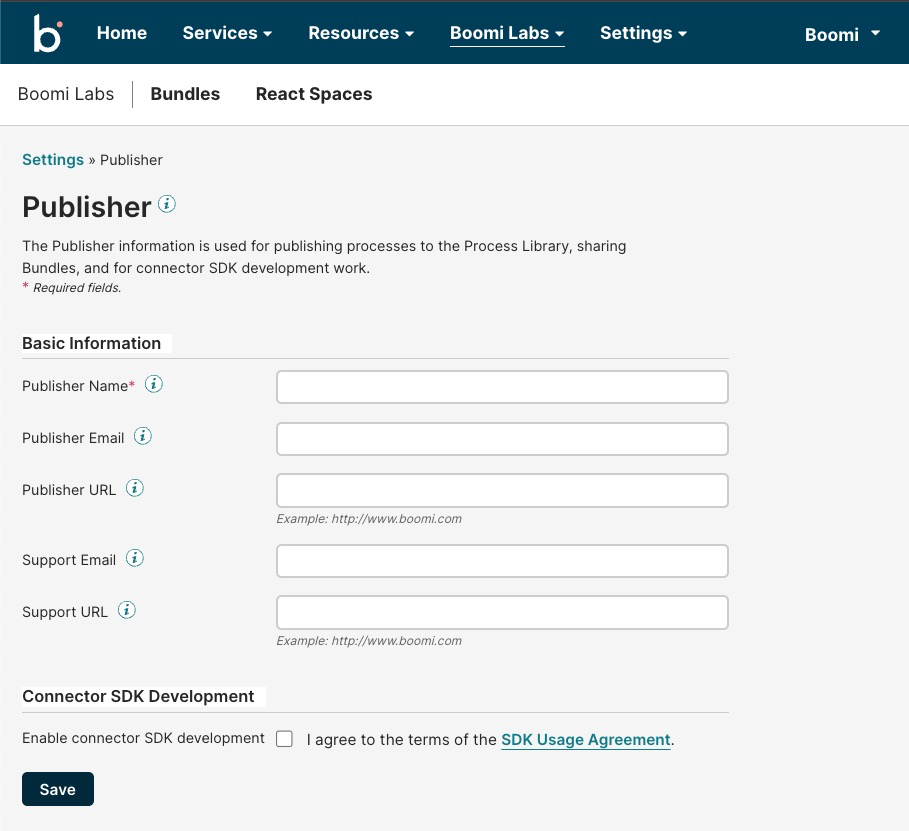
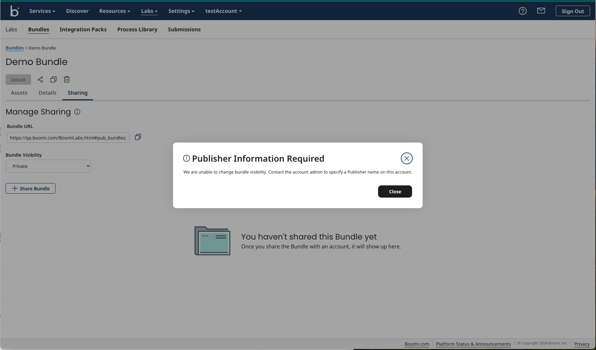

# Sharing a Bundle 

<head>
  <meta name="guidename" content="Bundles"/>
  <meta name="context" content="ed57a6b1-44aa-41e9-b6a8-03d0afa11c27"/>
</head>

Sharing of the Bundle is managed in the **Sharing** tab. You can share your Bundle with other accounts using the Sharing option and allow them to install and use your assets. 

:::note

**Sharing** tab is visible only if you are the owner of the Bundle.

:::

The **Sharing** tab lists all the accounts with which this Bunlde is shared, along with the following information:

|  **Parameter** | **Description** |
| --- | --- |
| Account ID | Account ID that this bundle is shared with. |
| Shared By | The email address of the **user** within this account who shared the bundle with this specified account ID. |
| Date | The date on which the Bundle was shared. |
| Action | Option to remove the ability for the specified account ID to access the Bundle that was added to the table with the "**Share Bundle**" tab on the page. If you remove the new entry with "**Remove**" option, then the Bundle is no longer shared with that account and they can no longer see it or install it. |

# Bundle Visibility

Bundle Visibility refers to the type of visibility assigned to the Bundle:

      * `Private` - Private Bundles are accessible only to users of the Bundle owner’s account.
      * `Shared` - Shared Bundles are accessible only to the users of the accounts explicitly added to that Bundle’s sharing list. 
      * `Public` - Public Bundles are shared with all Boomi accounts who have access to the Bundle URL.

 To configure Bundle visibility, see [Bundle Visibility configuration](#bundle-visibility-configuration).

The Bundle can be shared when it is **Shared** or **Public**. You cannot share the Bundles for which the **Bundle Visibility** is set to `Private`. You can revoke access to a Bundle by changing its visibility to `Private`. To share a private Bundle, select Bundle visibility and select **Shared** to share with added accounts or select **Public** to share publicly with any account. 

Bundle owners can share a Bundle with others using the following options:

* Through account ID. For more information, see [Sharing a Bundle using account ID](#sharing-a-bundle-using-an-account-id). 
* Through URL. For more information, see [Sharing a Bundle using URL](#sharing-a-bundle-using-url).

## Sharing a Bundle using an account ID

1. Select the visibility of Bundle as `Shared` or `Public` under **Bundle visibility**. 

2. To share a Bundle with an account, add the account to the sharing list of the Bundle. 

    Follow any of the following:

    * In the **My Bundles** tab, select the Bundle you want to share, click the ellipsis at the end of the row to expand the menu, and click 
     to add the account ID.

      OR

    * In the **My Bundles** tab, click on the Bundle name link to go inside the Bundle and click
    . In the **Account IDs** field, add the ID of the account with which you want to share the Bundle. You can add multiple account IDs separated by a comma, space, or a new line in the account ID field.

      OR

    * In the **My Bundles** tab, click on the Bundle name link to go inside the Bundle and navigate to the **Sharing** tab and click **Share Bundle.** In the **Account IDs** field, add the ID of the account with which you want to share the Bundle. You can add multiple account IDs separated by a comma, space, or a new line in the account ID field.

2. Click **Share** to finish.

:::note

No validation is performed when an account is added to the sharing list of a Bundle. That means even if the account ID sent does not exist or is not a Boomi user account; it will still get added to the sharing target list. 

:::

To remove an account from the sharing list of the Bundle, select the account you want to remove and click **Remove.**

## Sharing a Bundle using URL

Another option to share a Bundle is sharing the Bundle URL. A Bundle owner can share a Bundle URL with others using the copy Bundle URL option in the Bundle UI. 

:::note

Other platform users can use this copied URL to view or install a Bundle only if the Bundle visibility is `Public` or if the Bundle visibility is `Shared` and it is shared explicitly with that user using the **Sharing** tab in the Bundle UI. If it is sent to a person who does not have access to that Bundle, they will see the “Bundle doesn't exist" page.

:::

To copy a Bundle URL and share it with other Boomi users:
1. On the Bundles page, click on the Bundle name link.
2. Inside the Bundle page, click the **Sharing** tab.
3. Copy the URL from the **Bundle URL** field using the copy icon and share this URL with the intended users.

:::note

If you are the Bundle owner, you have the option to copy the sharing URL using the copy button icon in the header to share the public URL more easily. 

:::

This URL will take you directly to the shared Bundle page.

  ## Bundle Visibility configuration

To change the Bundle visibility, Publisher information must be configured in the **Publisher settings** page on the Bundle UI. Admins can access this page using the **Publisher Settings** button added to the upper right of the Boomi Labs page. When changing the Bundle visibility, you will receive a user-specific alert message if your account does not have Publisher information set in the settings page.

**Bundle visibility scenarios**

| **If you try to change the Bundle visibility from** | **To**           | **Then**                                                                                                                                             |
|-----------------------------------------------------|------------------|------------------------------------------------------------------------------------------------------------------------------------------------------|
| Private                                             | Public or Shared | Publisher information must be present in AtomSphere. If not, you will receive a pop-up message instructing you to set the Publisher information.     |
| Public                                              | Private          | It is not mandatory to have Publisher information in the AtomSphere. You can change the Bundle visibility in this scenario.                          |
| Public                                              | Shared           | Publisher information must be present in the AtomSphere. If not, you will receive a pop-up message instructing you to set the Publisher information. |
| Shared                                              | Private          | It is not mandatory to have Publisher information in the AtomSphere. You can change the Bundle visibility in this scenario.                          |
| Shared                                              | Public           | Publisher information must be present in the AtomSphere. If not, you will receive a pop-up message instructing you to set the Publisher information. |

If you are an **admin**, you have the access rights to set the Publisher information in the settings page. Click the link in the pop-up message to add the Publisher information.

The link opens Boomi Labs publisher settings page on the Bundle UI.

After setting the information, you can change the Bundle visibility as per your use case.

If you are not an **admin**, you will receive a pop-up to contact your account admin to set the Publisher name on the account. After the admin sets this information, you can then change the Bundle visibility. 

