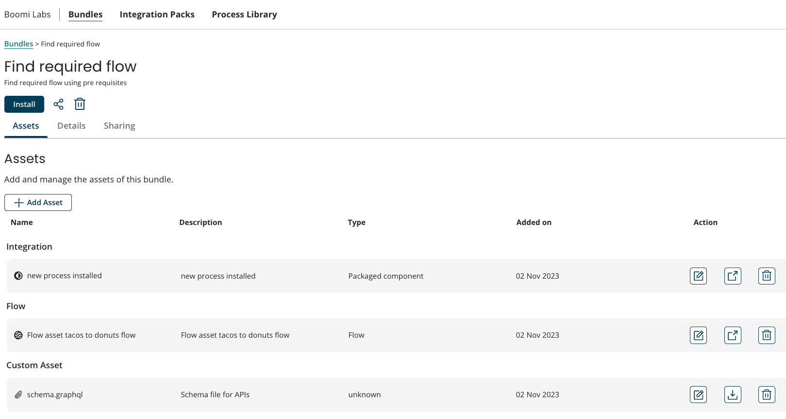

# Working with Bundle Assets

<head>
  <meta name="guidename" content="Bundles"/>
  <meta name="context" content="5460a589-72dc-4846-975d-000164ebbd07"/>
</head>

**Assets** are the various objects you can add to a Bundle, such as Integration, Flow, and Custom Assets. 

Types of assets: 

* **Flow** - Created in Boomi Flow, a cloud-native, low-code application development platform for creating customer journeys and automating simple, sophisticated workflows that accelerate your business.

* **Integration** - The integration asset enables you to share **Packaged Components** with the user of the Bundle. Packaged Components are “snapshots” of the Integrations you have built.

* **Custom Assets** - Custom assets include supporting files such as documentation, READMEs, and sample data to help users get started with the Bundle. 

