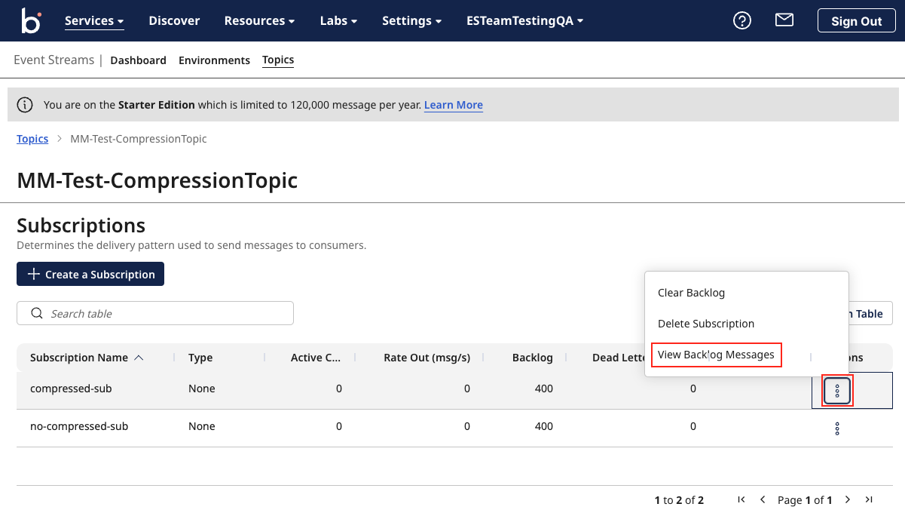
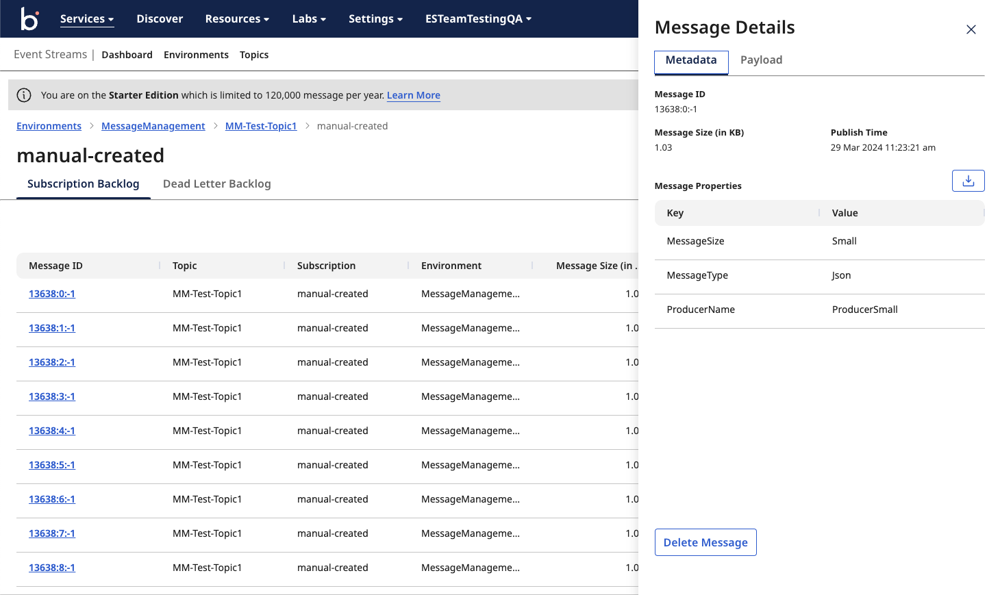
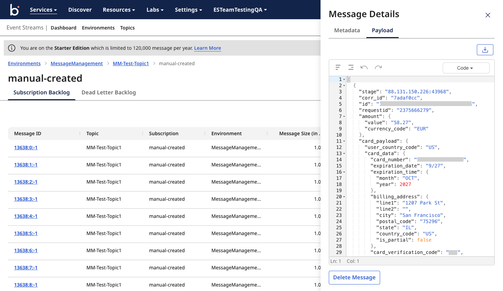
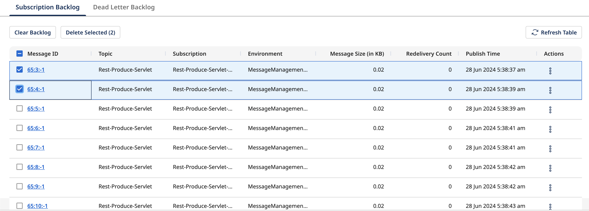
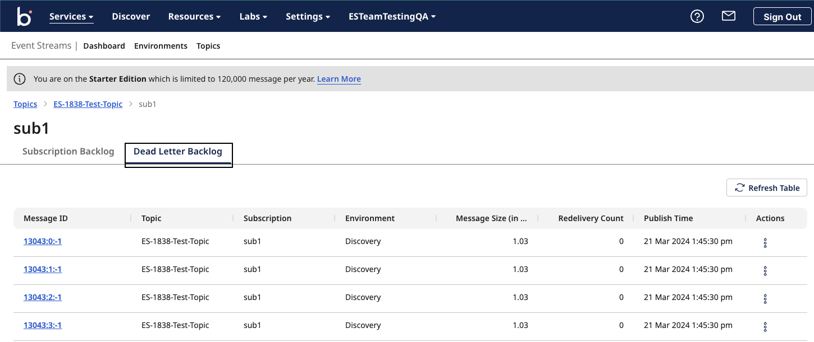

# Message Management 

<head>
  <meta name="guidename" content="Event Streams"/>
  <meta name="context" content="GUID-a0c827ee-5df5-46bd-94d5-64262b72851a"/>
</head>

Message management actions allow you to manage all of your subscription messages in one place.

As an Event Streams user, you can perform the following subscription message management actions:

- View subscription backlog messages.
- View and download a particular message and its metadata.
- Delete individual and multiple messages at time, including backlog messages.
- View dead letter backlog.

## View subscription backlog messages

Navigate to Environment > Topics > Subscriptions. Click on the three dots under *Actions* > *View Backlog Messages* to view the messages. This opens the Message Management page on the *View Backlog Messages* default tab.

## View and download a particular message and its metadata from the subscription backlog

View a particular message by clicking on the Message id or the three dots under *Actions* > *View Message*. 
This opens a side panel with two tabs. One for the message’s metadata and another for the payload information. This panel also includes the download icon at the top. 

## Delete individual and multiple messages

Messages can be deleted in one of three ways: 

1. Click on the message, click the 'delete' button at the bottom side panel or from actions > delete message
2. Click on 'check box' next to the message(s) and click on 'delete selected' button at the top.
3. Clear backlog button will delete all the messages in the subscription

## View Dead Letter Backlog Messages 

Navigate to *Environment* > *Topics* > *Subscriptions*. Click on the three dots under *Actions* > *View Backlog Messages* to view the messages. This opens the Message Management page on the *View Backlog Messages* default tab, Click on the *Dead letter backlog* tab to view dead letter backlog messages. 

Same as the *Backlog Messages* tab, you can follow all the same steps to view a particular dead letter topic’s backlog messages, delete or clear individual dead letters, and download a message’s metadata and payload. 