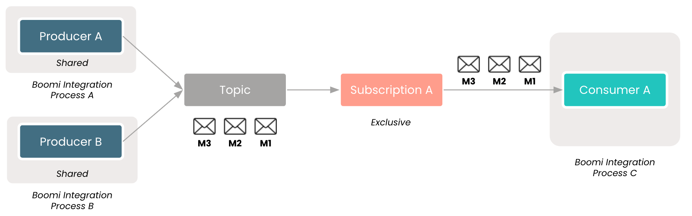
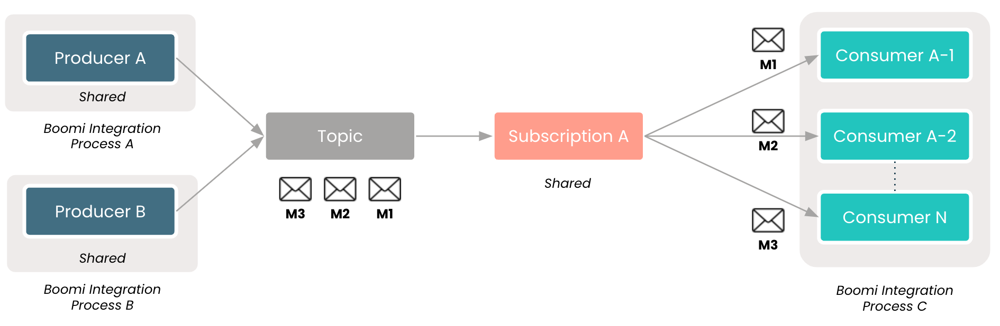
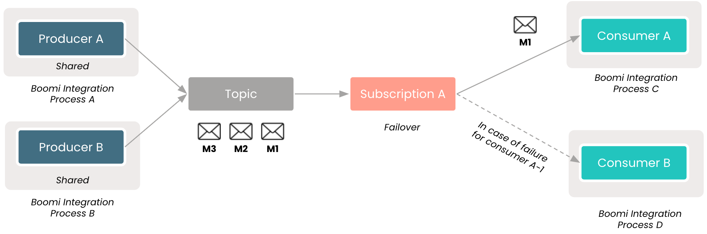
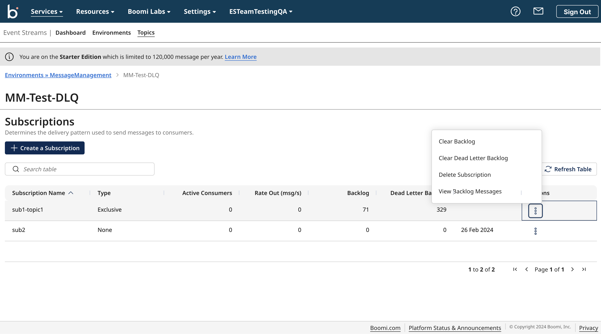
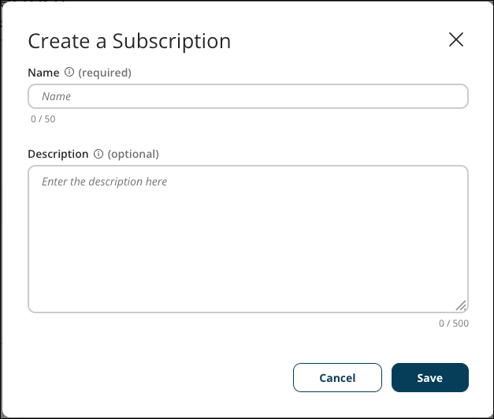

# Subscriptions

<head>
  <meta name="guidename" content="Event Streams"/>
  <meta name="context" content="GUID-7e2cc68b-217c-49ec-ad25-6b6f9426b3f8"/>
</head>

A subscription determines the delivery pattern used to send messages to consumers. You can have as many subscriptions as necessary for each topic.

There are multiple types of subscriptions to serve different needs:

- **Exclusive** - Only a single consumer can attach to the topic subscription. All messages are delivered to a single consumer and ordering is guaranteed \(FIFO\). Exclusive subscriptions are best for situations where the consumers require ordering at the expense of higher throughput.

    

- **Shared**- Multiple consumers can attach to the same topic subscription. Messages are distributed across consumers to increase throughput but there is no guarantee that messages will be processed in order. Shared subscriptions are best for situations where consumers need high throughput and ordering is not required.

    

- **Failover** - Multiple consumers can attach to the same topic subscription but only one is actively consuming messages at a time. The first consumer to connect \(called the Primary\) will receive messages. When the Primary consumer disconnects, subsequent messages will be delivered to the next consumer in line. The order of the messages is maintained. Failover subscriptions are best for situations where ordering is required but you need high availability if a consumer process disconnects or fails.

    

## Actions

On the Topics page, you can perform several actions on each subscription. Click the three dots in the Actions column to make a selection.

Available actions:

- **Clear Backlog** - Remove all messages from the subscription backlog.
- **Clear Dead Letter Backlog** - Remove all undelivered messages from the dead letter backlog.
- **Delete Subscription** - Remove the subscription from the topic.
- **View Backlog Messages** - View all messages in the subscription backlog.

:::note

The **Clear backlog** and **Clear dead letter backlog** options will be available only when the subscription has messages in the backlog and dead letter backlog.

:::

## Creating subscriptions

When you create a subscription, it must be added to an existing topic.

To create a new subscription, perform the following steps:

1. Navigate to **Services** \> **Event Streams**.
2. Click the **Topic** you would like to add a subscription to.
3. Click **Create a Subscription**.
4. Complete the following fields: 
    a. **Name**  
    b. **Description** \(optional\)
5. Click **Save** to finish creating a subscription.

:::note

When a subscription is created within the platform, the subscription type will be undefined. The type of a subscription is defined when a consumer connects to it, and the type can be changed by restarting all consumers with a different configuration.

:::

:::note

Subscriptions can also be automatically created by the Connector. For more information, see [Boomi Event Streams Operation](/docs/Atomsphere/Event%20Streams/es-event_streams_operation_c4a09f7a-17fb-4212-8955-dd561a3fb121.md).

:::