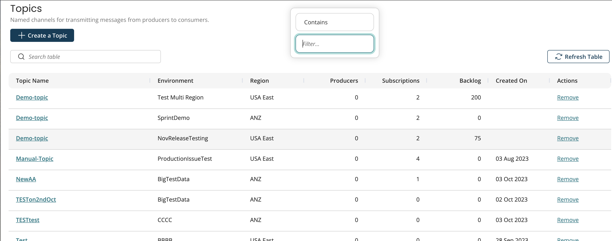
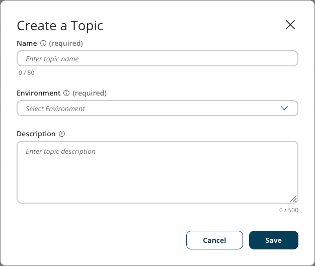

# Creating topics 

<head>
  <meta name="guidename" content="Event Streams"/>
  <meta name="context" content="GUID-d04bea85-10e0-43ae-9162-b77a54574a36"/>
</head>

Topics function as channels where producers can publish messages and consumers can subscribe to receive those messages. 

Typically, topics will be organized by the application and business event (for example, Workday Employees or Salesforce Accounts). All messages stored within a topic are persistent and durably stored on disk until they are acknowledged by all of the consumers.

:::note

Unacknowledged messages are retained for 14 days before they are removed from the topic.

:::

    

## Removing topics

In the Actions column, click *Remove* to remove the topic from the subscription.

## Creating topics

To create a new topic, perform the following steps:

1.  Navigate to **Services** \> Event Streams.
2.  Click the **Topics** page.

    :::note
    
    You can also create a topic by clicking on the environment where you will place the topic.

    :::

3.  Click **Create a Topic**
4.  Complete the following fields:
    a.  **Name**  
    b.  **Environment** - Select from the dropdown menu of available environments.  
    c.  **Description** \(optional\)
5.  Click **Save** to finish creating a topic.

:::note

Topics can also be automatically created by the Boomi Connector. For more information, check out [Boomi Event Streams Operations](/docs/Atomsphere/Event%20Streams/es-event_streams_operation_c4a09f7a-17fb-4212-8955-dd561a3fb121.md).

:::