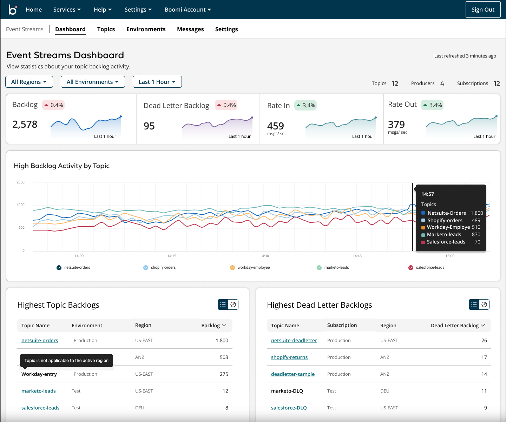

# Dashboard

<head>
  <meta name="guidename" content="Event Streams"/>
  <meta name="context" content="GUID-60cf4bc1-7129-4898-8d37-a1cc01a088bf"/>
</head>

The Event Streams dashboard provides a simple way to monitor topic throughput and identify backlog and dead letter backlogs that have unprocessed messages. You can filter metrics by environment and time range to help you drill down into the information you need to see.

