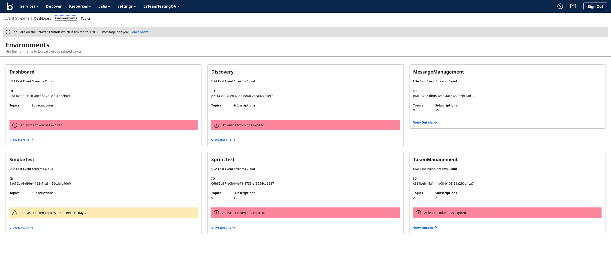
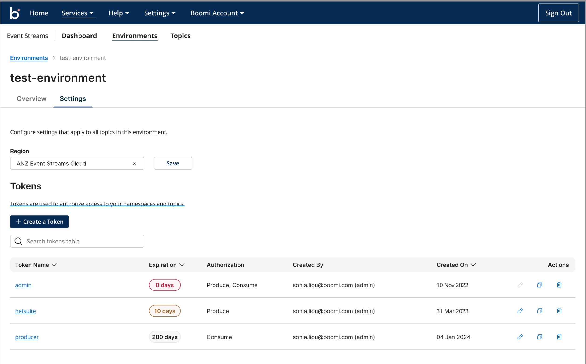

# Environments

<head>
  <meta name="guidename" content="Event Streams"/>
  <meta name="context" content="GUID-9b9b2036-6a19-422d-a7a1-c164a2b0541b"/>
</head>

Boomi Event Streams leverages your existing Boomi Integration environments to enhance support for various stages of the development life cycle. Environments created on the [Atom Management page](/docs/Atomsphere/Integration/Integration%20management/c-atm-Environment_management_1ec94aeb-ffaf-4cec-a3b0-483c2af3967c.md) are automatically reflected in Event Streams, making setup and configuration seamless.

Each environment is associated with an Environment token that is used by the Boomi Event Streams connector to establish a secure connection with that environment. 

You can create new tokens for your environments and manage existing tokens in the *Tokens* table in the *Environment settings* page. 

When creating new tokens, you can name your token, assign authorization levels, add descriptions, and set an expiration date for each one, for a maximum of 365 days. The name, description, expiration date, and authorization level of new and existing tokens can be edited and/or deleted. 

:::warning
Once a token is deleted, it cannot be recovered. The delete option is available to Administrators only.
:::
:::note
Legacy tokens cannot be edited but can be deleted.
:::

You can also copy new and existing tokens from the *Actions* column in the tokens table, where you can view their expiration date and other details. 
 
When utilizing the Boomi Event Streams Connector in Integration, [Environment Extensions](/docs/Atomsphere/Integration/Integration%20management/r-atm-Environment_Extensions_dialog_3ee06677-2936-432b-9f29-ce4706083fe5.md) can be used to override the Environment token in the connector. This enables the connector to dynamically set the appropriate Environment token during deployment, rather than at the individual process or Atom level.

