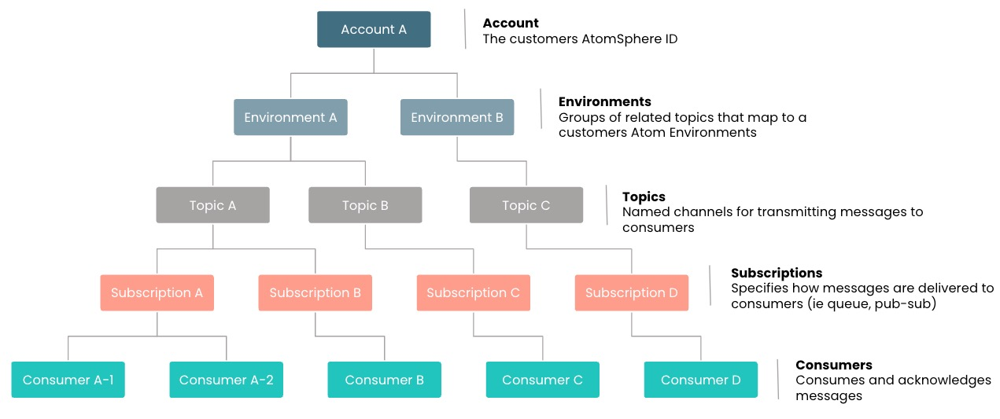

# Getting Started with Event Streams

<head>
  <meta name="guidename" content="Event Streams"/>
  <meta name="context" content="GUID-4264b227-9e7a-4705-add9-2bfda9327306"/>
</head>

Event Streams is a multi-tenant enterprise message queueing and streaming service fully hosted and managed within the Boomi Enterprise platform. It is hosted in 4 regions; US-EAST, ANZ(Sydney), DEU(Germany), and GBR (United Kingdom). 

## Overview

Event Streams supports common enterprise messaging patterns like Publish-Subscribe \(pub/sub\) and queuing with guaranteed message delivery, ordering, and availability. When used in combination with Boomi Integration, it provides a highly scalable and reliable backbone for an “event driven integration” approach to building integrations.

The Event Streams system functions in a hierarchy organized in the following tiers:

- **Account**- The administrative units that provide the ability to isolate environments, specify quotas, and configure authentication and authorization on a per customer basis.

- **Environments** - Groups of related topics. Event Streams creates these automatically based on your existing Atom Environments.
  
- **Topics** - Named channels used to transmit messages from producers to consumers.

- **Subscriptions** - Determine the delivery pattern used to send messages to consumers.

- **Consumers** - Subscribe to one or more topics to consume and acknowledge messages.

Before you can begin sending messages, you must create [**Topics**](/docs/Atomsphere/Event%20Streams/es-creating_topics_d04bea85-10e0-43ae-9162-b77a54574a36.md) and [**Subscriptions**](/docs/Atomsphere/Event%20Streams/es-creating_subscriptions_7e2cc68b-217c-49ec-ad25-6b6f9426b3f8.md) for your environment.

The following chart illustrates the relationship between the components.

