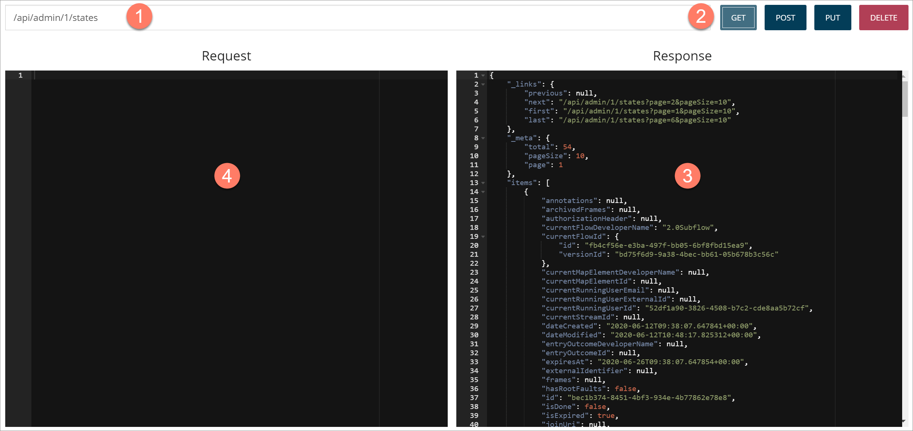
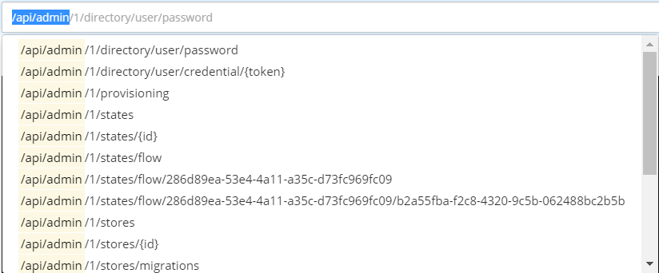

# API tool page

<head>
  <meta name="guidename" content="Flow"/>
  <meta name="context" content="GUID-a5cfaf7e-2c60-499b-957c-272def76dc79"/>
</head>

The **API tool** page allows you to make API requests to Boomi Flow endpoints from within the tooling.

## Opening the page

-   Select **API** from the left-hand menu.

## Page overview

The **API tool** page allows you to make API requests to Boomi Flow API endpoints from within the tooling. See [Making API requests using the API tool](c-flo-APItool_using_8a620c2a-753f-4eb9-9457-d67931336d2f.md).

-   The **API Address** field allows you to enter or select any of the Boomi Flow endpoints. 

    -   Click on the field and a drop-down list of API endpoints is displayed; scroll and select from the list to populate the field with that endpoint.

    -   Begin typing a valid API endpoint into the field and it will automatically pre-fill and filter the field with all matching endpoints. For example, entering '/api/admin' will display all API endpoints matching your entry.

        

    -   A full list and description of the API endpoints can be found in the Boomi Flow developer [API reference documentation](https://manywho.github.io/docs-api/).

-   Once you have entered/selected an endpoint, you can make API requests to the endpoint using the **GET**, **POST**, **PUT** and **DELETE** buttons. 

    -   **GET**: An HTTP GET request that retrieves data from the API.

    -   **POST**: An HTTP POST request that adds data via the API.

    -   **PUT**: An HTTP PUT request that replaces data via the API.

    -   **DELETE**: An HTTP PUT request that deletes data from the API.

-   Once you have executed a request, the JSON data response is shown in the **Response** pane. 

-   You can create API requests directly in the **Request** pane. 

    For example, you can copy and paste the JSON data response from the **Response** pane into the **Request** pane and modify it. The API request can then be executed using the relevant **POST**, **PUT** or **DELETE** button.