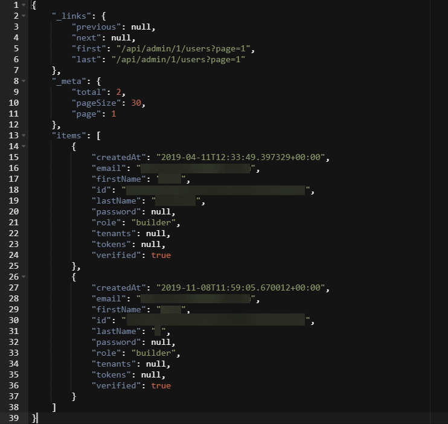

# Making API requests using the API tool

<head>
  <meta name="guidename" content="Flow"/>
  <meta name="context" content="GUID-8a620c2a-753f-4eb9-9457-d67931336d2f"/>
</head>


You can create and execute API requests using the API tool.

API requests can be made using any of the standard HTTP methods. The following examples are provided:

-   [A worked GET example - listing users in a tenant](#a-worked-get-example---listing-users-in-a-tenant)

-   [A worked POST example - inviting/adding a user to a tenant](#a-worked-post-example---invitingadding-a-user-to-a-tenant)

-   [A worked PUT example - updating the current user settings](#a-worked-put-example---updating-the-current-user-settings)

-   [A worked DELETE example - deleting \(killing\) a flow state](#a-worked-delete-example---deleting-killing-a-flow-state)


## A worked GET example - listing users in a tenant

In this example, we are going to list all the users in a tenant.

1.  Open the API tool.
2.  Enter`/select the /api/admin/1/users` endpoint in the **API Address** field.
3.  Click **GET**.
4.  If the user was successfully added, a green confirmation message is displayed and the **Response** pane lists all the users in the current tenant.

    


## A worked POST example - inviting/adding a user to a tenant

In this example, we are going to invite/add a user to a tenant.

1.  Open the API tool.
2.  Enter`/select the /api/admin/1/users` endpoint in the **API Address** field.
3.  In the **Request** pane, enter the following JSON, replacing the email, firstname and lastname values:

    ```
    {
      "email":"user@boomi.com",
        "firstname":"Example",
        "lastname":"User",
      "notificationMessages": [
        {
          "mediaType": "string",
          "message": "string"
        }
      ],
      "reason": "string",
      "redirectUrl": "string"
    }
    ```

4.  Click **POST**.
5.  If the user was successfully added, a green confirmation message is displayed and the **Response** pane is updated. An email is sent to the user inviting them to set a password and sign up to Boomi Flow.

    


## A worked PUT example - updating the current user settings

In this example, we are going to update the email settings for the currently signed in user.

1.  Open the API tool.
2.  Enter`/select the /api/admin/1/users/me/`settings endpoint in the **API Address** field.
3.  In the **Request** pane, enter the following JSON:

    ```
    {
      "notifications": {
        "enableEmails": true
      }
    }
    ```

4.  Click **PUT**.
5.  If the user email setting was successfully updated, a green confirmation message is displayed.

    


## A worked DELETE example - deleting \(killing\) a flow state

In this example, we are going to delete a flow state; a flow state is the running instance of a flow.

1.  Open the API tool.
2.  Enter `/select the /api/admin/1/states/` endpoint in the **API Address** field.
3.  Click **GET**.
4.  The **Response** pane now lists all the states. Copy the unique \{id\} value of the state you wish to delete.
5.  Paste this \{id\} value onto the end of the /api/admin/1/states/ endpoint in the **API Address** field.

    

6.  Click **DELETE**.
7.  If the state was successfully deleted, a green confirmation message is displayed.

    