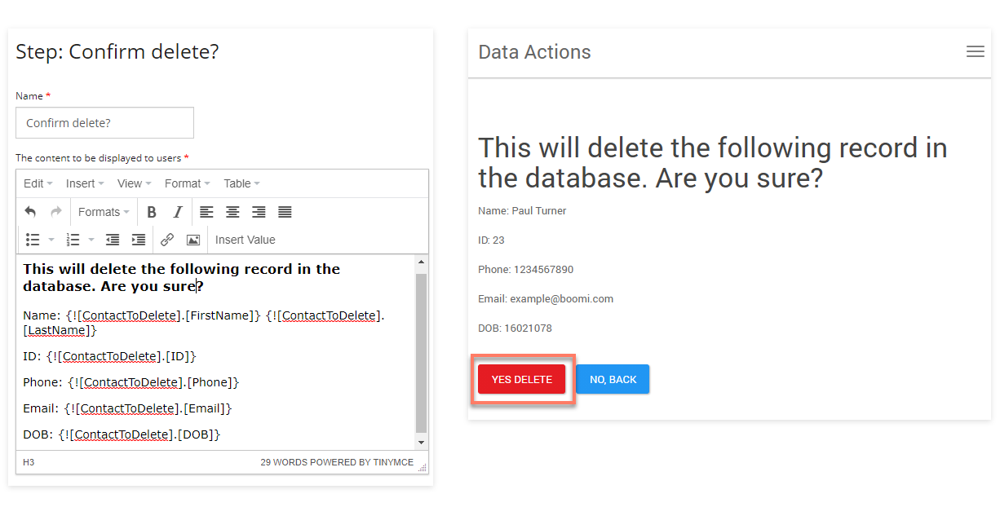

# Deleting data from using Flow

<head>
  <meta name="guidename" content="Flow"/>
  <meta name="context" content="GUID-d3baf6e2-e355-4fff-a323-0582815c481f"/>
</head>

This section of the flow uses a [Database Delete map element](c-flo-ME_Delete_3488f656-867a-426f-911a-54b620716d0d.md) to delete data from Integration .

1.  The 'Choose record to delete' page map element presents the user with a table populated with the contact entries entered into the database (loaded directly from the connector).

    

2. When a user selects a row in the table and clicks **Delete**, the user selection is stored in a 'ContactToDelete' object value, and the flow progresses to the 'Confirm delete' step map element, displaying a confirmation screen containing the details of the selected record (shown using the contents of the 'ContactToDelete' object value).

    

3.  If the user clicks the **Yes Delete** outcome, the flow progresses to the 'DELETE' Database Delete map element, where a Data Action has been set up to pass the stored 'ContactToDelete' object value data of the 'Contact' type.

    

4.  This request is passed into Integration by the connector, initiating the **Delete Process** assigned to the Flow Service Data Action. In this example, the process deletes the selected single record from a database, for example:

    