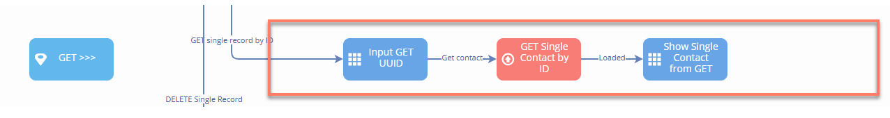
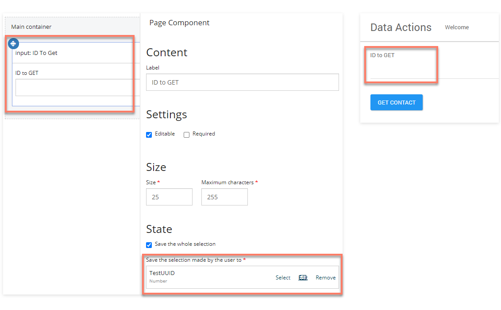
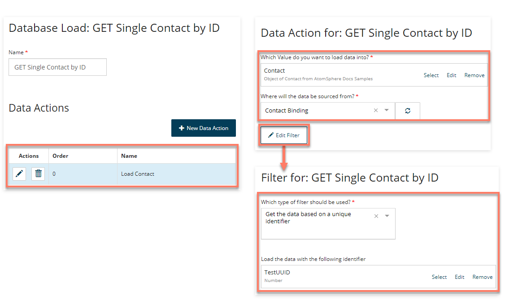
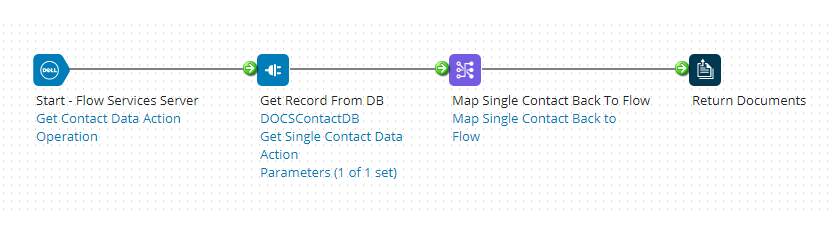
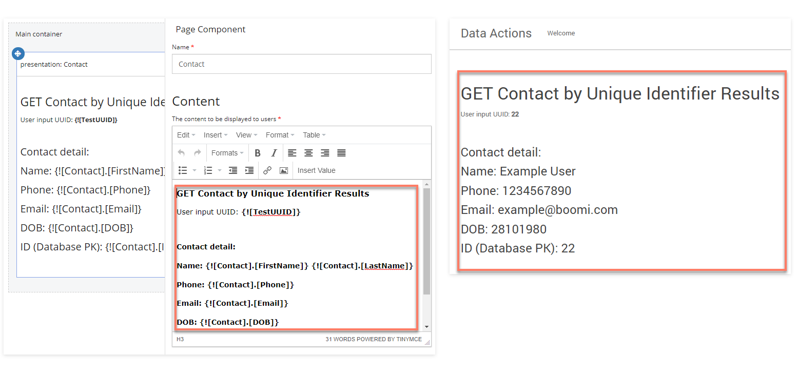

# Loading data from Integration into Flow

<head>
  <meta name="guidename" content="Flow"/>
  <meta name="context" content="GUID-081bdc6c-1481-4097-91f5-fec8aeb7c389"/>
</head>

This section of the flow uses a [Database Load map element](c-flo-ME_Load_d47f5e01-a760-4aa2-8342-e843dd3abc48.md) to GET data from Integration.

1. The 'Input GET UUID' page map element presents the user with an input field to enter the UUID of the contact whose details should be retrieved and displayed. The data entered into the input field is linked to and stored in a 'TestUUID' numeric value.

    

2. When the user has entered a UUID and clicks the Get Contact outcome, the flow progresses to the 'GET Single Contact by ID' Database Load map element, where a Data Action has been set with a filter to load the 'Contact' object value with data from the database using the UUID value entered by the user (the 'TestUUID' numeric value).

    

3.  This request is passed into Integration by the service, initiating the Get Process assigned to the Flow Service Data Action. In this example, the process retrieves the filtered data record from a database, for example:

    

4.  Now that the matching database record has been loaded into the 'Contact' object value, the flow proceeds to the 'Show Single Contact from GET' page map element that displays the data that was loaded from Integration.

    