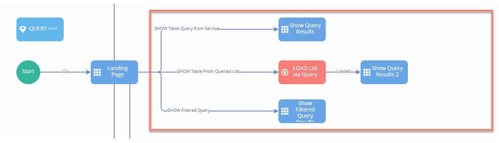
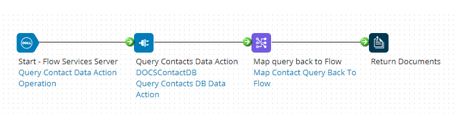
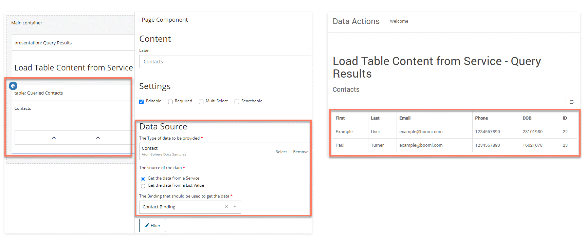
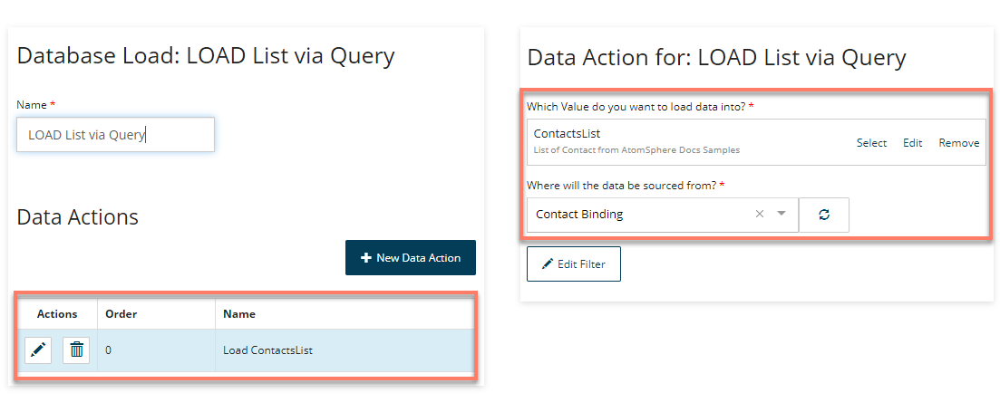
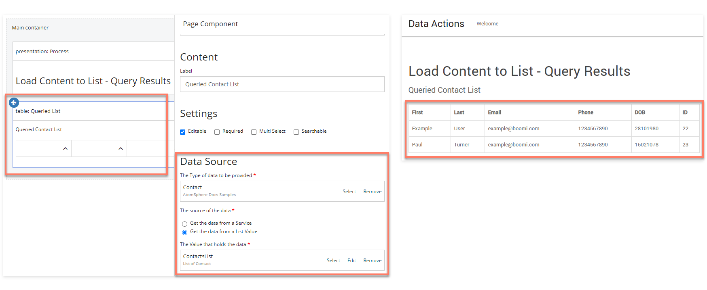
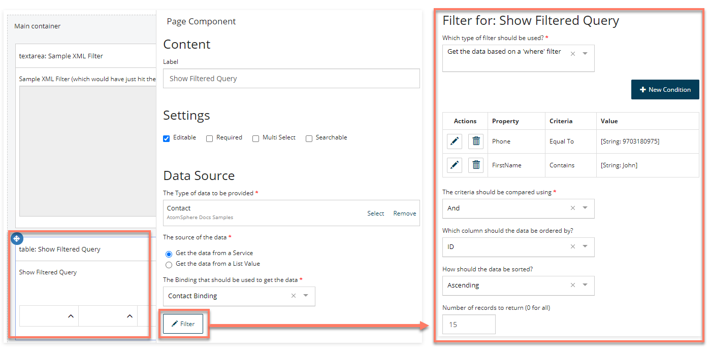

# Querying data from Integration in Flow

<head>
  <meta name="guidename" content="Flow"/>
  <meta name="context" content="GUID-e8edb564-4458-4db5-b313-75daee3084cd"/>
</head>


This section of the flow uses a [Database Load map element](c-flo-ME_Load_d47f5e01-a760-4aa2-8342-e843dd3abc48.md) to query data from and display the results in a table.



There are three different query examples in the flow, each one using a [ Table component](flo-pages-components-table_90740e9b-77c3-44cb-8e01-9e7f19f2f63c.md) to display results:

-   Querying directly from the service

-   Querying a List value

-   Filtered Querying


Each example query mechanism initiates the **Get Process** assigned to the Flow Service Data Action. In this example, the process retrieves the data records from a database, for example:



## Querying directly from the service

The 'Show Query Results' page map element directly retrieves and displays the query results using a table component.



:::note

Search and pagination functionality is not supported with querying directly from the service; if query results are likely to be large, you can use a Database Load map element to load the query results data into a list value and then display the list value data using a table component \(see below\).

:::

## Querying a List value

The 'LOAD List via Query' Database Load map element loads the query results into a 'ContactsList' list value.



The flow then progresses onto the 'Show Query Results 2' page map element that retrieves and displays the data of the 'ContactsList' list value using a table component.



## Filtered Querying 

The 'Show Filtered Query Results' page map element directly retrieves and displays the query results using a table component.


A filter is configured for the table component; this is then passed into Integration in XML format.


For example:

```
<QueryFilter>
  <expression operator="and">
    <nestedExpression operator="EQUAL" property="Phone">
      <argument>9703180975</argument>
    </nestedExpression>
    <nestedExpression operator="CONTAINS" property="FirstName">
      <argument>John</argument>
    </nestedExpression>
  </expression>
  <sort property="ID" sortOrder="ASC"></sort>
</QueryFilter>
```

In Integration this XML filter can then be converted into a database filter, for example by filtering an HTTP step call with an XML profile.
