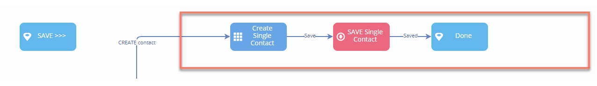
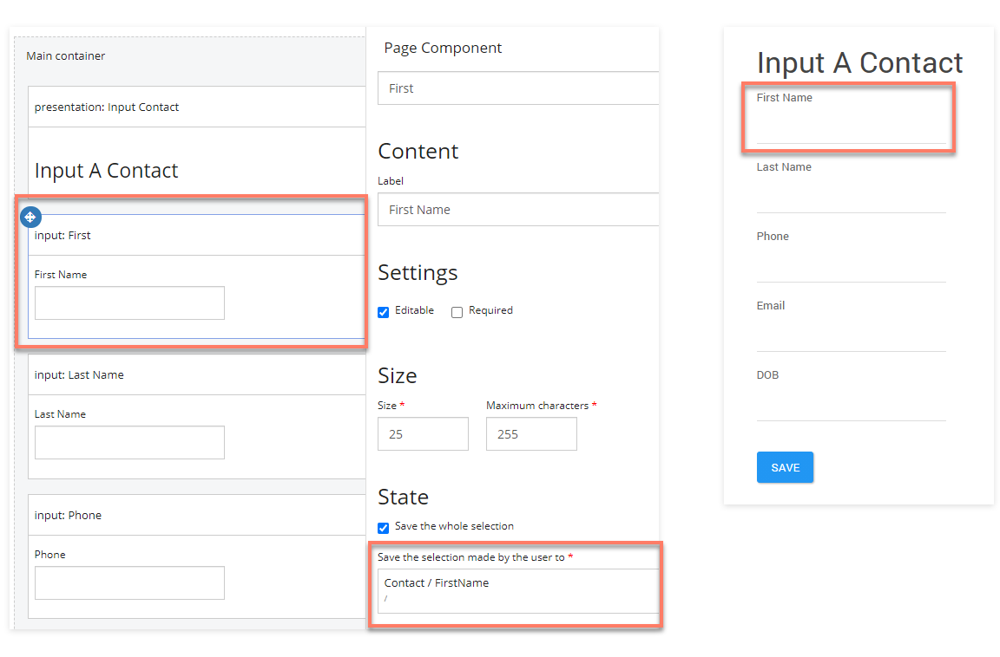
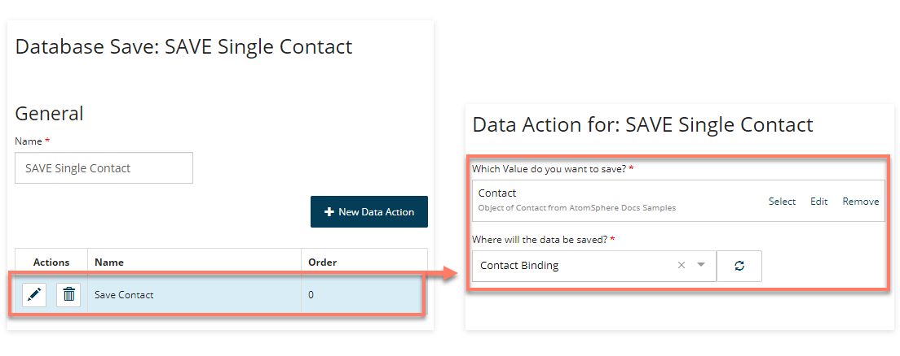
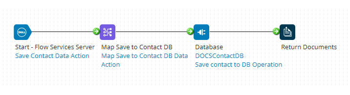

# Saving data into Integration from Flow

<head>
  <meta name="guidename" content="Flow"/>
  <meta name="context" content="GUID-63da707b-f521-4644-81db-1c8c39a7911f"/>
</head>

This section of the flow uses a [Database Save map element](c-flo-ME_Save_bffa5a42-8d81-4dd9-9528-1eb26ae04d4c.md) to save data into Integration.

1.  The 'Create Single Contact' page map element presents the user with a series of input fields for entering details of a new contact. The data entered into each input field is linked to and stored in the relevant property of the main 'Contact' object value.

    

2.  When the user clicks the **Save** outcome, the flow progresses to the 'SAVE Single Contact' Database Save map element, where a Data Action has been set up to save the passed/stored 'Contact' object value data of the 'Contact' type.

    

3.  This request is passed into Integration by the service, initiating the **Save Process** assigned to the Flow Service Data Action. In this example, the process saves the data into a database, for example:

    