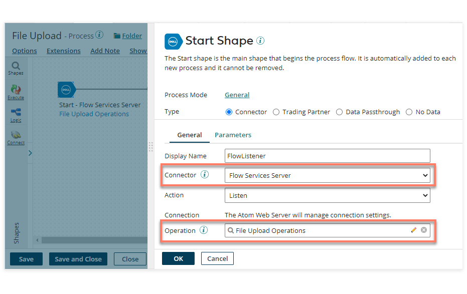
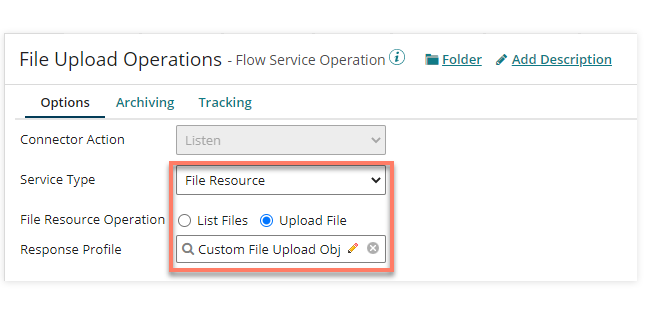
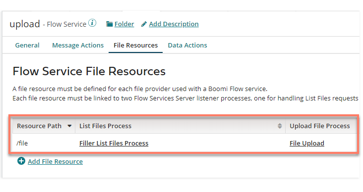
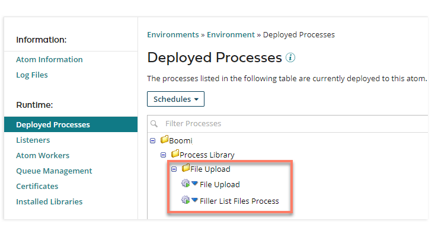
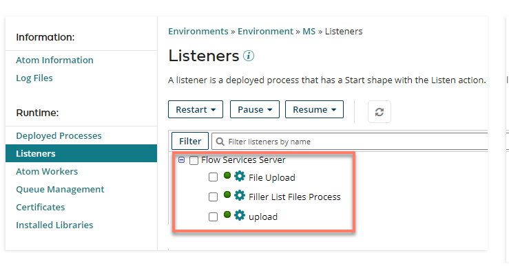
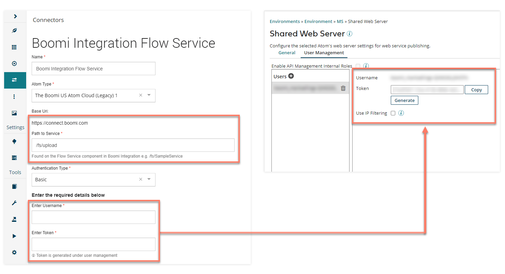
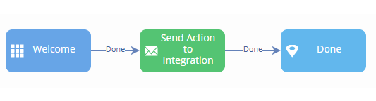
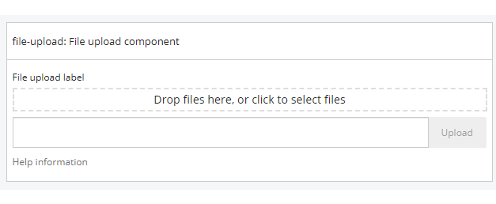
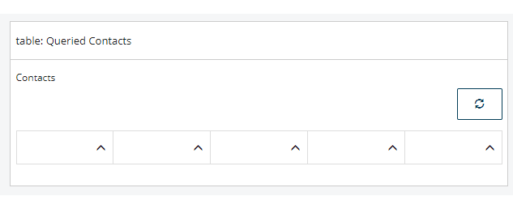

# An example workflow for using Integration with Flow

<head>
  <meta name="guidename" content="Flow"/>
  <meta name="context" content="GUID-c9e84942-a88c-4e4c-bf9a-6c31a48dae79"/>
</head>

This example shows the typical steps involved in setting up a Flow Service in Integration so that it can connect to Flow using the Boomi Flow Services Server connector.

:::note

This example workflow is supplied for illustration only; each Integration/Flow use case will most likely be different, depending on the integration scenario and requirements.

:::

## Step 1: Creating a 'listener' process with the Boomi Flow Services Server connector in Integration

A process needs to be created in order to perform the Integration tasks required in your scenario.

The Start step for the process should be configured to use the 'Boomi Flow Services Server' connector in the **Connector** field.

For example:

- The **Action** field is automatically set to 'Listen'.

- A Flow Service Operation needs to be selected/created in the **Operation** field. This will define what type of operation is going to be performed in your flow (for example, whether the process supports a Message Action, a File Resource, or a Data Action), and what JSON (JavaScript Object Notation) Request/Response profiles should be used for exchanging data.

  

- The operation **Service Type** will depend on what type of operation you wish to perform in Flow. For example, if you are going to use a Message Action map element in your flow, 'Message Action' should be selected, or if you are going to be using the database Load, Save or Delete map elements in your flow then 'Data Action' should be selected.

  [Using the Flow Service component with Flow](c-flo-AS_Flow_Services_Component_f757eeb1-028b-4fac-b866-1f518817a8a9.md).

- The **Request/Response** Profile you select/create is used to define the structure of data processed between Integration and Flow. To exchange data with a flow, the profile must be in JSON format.
  
  [Integration Profiles and Flow Types](c-flo-AS_Profiles_Types_676ebeec-a3e4-495e-8c14-4da287b2751a.md).

- If you wish to send data back to from the process, a **Return Documents** step should be added to the end of the process. Alternatively, a **Stop** step can be used if this is not required.

## Step 2: Creating a Flow Service in Integration

A Flow Service needs to be set up in Integration to build and manage the connection to Flow.

See [Using the Flow Service component with Flow](c-flo-AS_Flow_Services_Component_f757eeb1-028b-4fac-b866-1f518817a8a9.md).

For example:

- The Flow Service will need to be configured to match your operation/action requirements. For example, for a file upload process, the **File Resources** tab should be configured with processes created for listing and uploading files. Multiple Message Actions and Data Actions can be assigned to a single Flow Service.

  

- The **Path to Service** field on the **General** tab will be needed when setting up the Boomi Flow Integration Service in Flow.

  

## Step 3: Deploying the Flow Service and Processes in Integration

Once you have set up your Flow Service and created/assigned any relevant processes, you will need to ensure that they are deployed to an Atom using Atom Management. If your Flow Service and processes are not deployed correctly, Flow will be unable to communicate succesfully with Integration.

For example:

- You can check that your processes are shown in **Deployed Processes**:

  

- You can check that your Flow Service and any processes configured to listen for events are shown in **Listeners**.

  

## Step 4: Installing the Boomi Integration Service connector in Flow

Once you have successfully created and deployed your Flow Service and processes, the [Boomi Flow Integration Service](c-flo-Services_Boomi_Flow_Integration_7c2deca1-a3f3-4397-b9ba-ef58f27308b8.md) needs to be installed into your Flow tenant.

The Boomi Integration Service connector allows you to connect your flows to the Integration Flow Service component.

For example:

The connector URI is defined by the Atom URI that you select during connector installation, along with the **Path to Service** value.

For example:

- The 'Boomi US Atom Cloud (Legacy) 1' cloud Atom Type is selected. The URI for this atom cloud is 'https://connect.boomi.com', which is used as the base URI for the connector endpoint.

- The **Path to Service** is entered as '/fs/upload', as specified in the Path to Service field in the Integration Flow Service component.

- This results in a connector URL of 'https://connect.boomi.com/fs/upload'.

If you are using basic authentication for the connector, you will need to enter the Username and Token to use for connecting to the specified Atom. These can be found in the **User Management** tab in the **Shared Web Server** settings for your environment in Integration.

:::note

When this connector is installed, types may be automatically generated in Flow, using the Integration profiles that you have set up. See [Integration Profiles and Flow Types](c-flo-AS_Profiles_Types_676ebeec-a3e4-495e-8c14-4da287b2751a.md).

:::

## Step 5: Creating and configuring a flow in Flow

Once you have installed the into your tenant, you can build your flow and configure it to connect to Integration.

The following map elements and components are typically used for integrating with Integration:

### Message map elements

A message map element can be added to a flow in order to send and receive message requests between Flow and the Integration Flow Service. Message actions added to a message map element are used by a flow to define the interface of inputs/outputs when calling against your Flow Service Message Actions, allowing you to map values in a flow to the inputs and outputs specified by your Flow Service.

See [Using Flow Service component Message Actions with Flow](c-flo-AS_Flow_FSS_MA_74e3374a-5402-442c-8dbf-2ec3d032ab27.md).

### Database map elements

The three types of database map element in Flow (Load, Save, and Delete) can be added to a flow to integrate with your Flow Service Data Actions and their associated processes. Data actions added to a database map element are used to handle all Create, Read, Update, Delete (CRUD) operations for a particular variety of record, using a single type in the flow.

See [Using Flow Service component Data Actions with Flow](c-flo-FSS_Data_Actions_76d3fc99-d10d-46a1-b1b9-d19571bec6b6.md).

### Files and File Upload components

Flow uses two file components for interacting with files. The **File Upload** component allows you to upload a file, which can then be consumed by a process. The **Files** component allows you to both upload a file, and list files for download from an outside system.

See [Using Flow Service component File Resources with Flow](c-flo-AS_FSS_File_Resources_cbb6c466-88d2-4f25-af79-8d6226399712.md).

### Page components

[Table](flo-pages-components-table_90740e9b-77c3-44cb-8e01-9e7f19f2f63c.md), [Combobox](./flo-pages-components-combobox_c96a1731-1c14-46e6-9a53-5e7cd6328aa2.md) and [Radio](./flo-pages-components-radio_57f3369f-45e8-40b7-b77b-5ebbdc626335.md) page components can also be populated with data using . For example, data can be loaded directly from the Flow Service \(or via a list value\) into a [Table component](./flo-pages-components-table_90740e9b-77c3-44cb-8e01-9e7f19f2f63c.md) on a page in order to display data to flow users.

See [Querying data from Integration in Flow](c-flo-AS_DA_Querying_e8edb564-4458-4db5-b313-75daee3084cd.md) for an example scenario of loading data into a table component.
