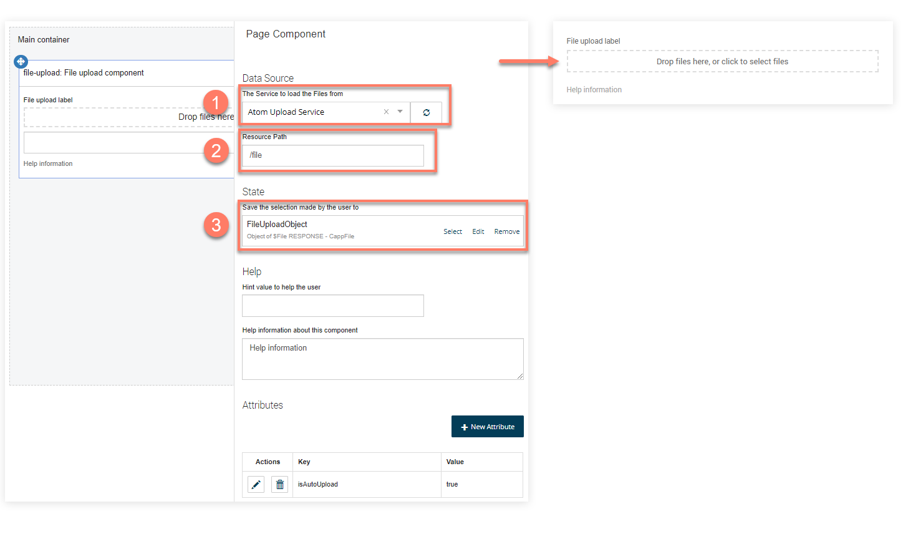

# Using file resource components in a flow

<head>
  <meta name="guidename" content="Flow"/>
  <meta name="context" content="GUID-2c5c94e4-3496-4990-ac61-16fefed71d63"/>
</head>

There are two file resource page components that can be added to a [page map element](c-flo-ME_Page_539c415f-59d7-47d5-90ef-cb3a108b3010.md) on the corresponding [page layout](c-flo-Pages_Overview_15c245e1-5232-4173-8a85-dae7ea7f060b.md) for the page.

- The [File Upload component](./flo-pages-components-fileupload_edb868aa-5a66-4cbf-9019-42e1df0ed027.md) allows you to upload a file, which can then be consumed by a process.

- The [Files component](./flo-pages-components-files_78d1140b-67ad-4561-bce7-e14086cc2122.md) allows you to both upload a file, and list files for download from an outside system.

When setting up these file resource page components, you will need to ensure that you have configured them correctly:

- The Integration Flow connector that you have set up in Flow should be selected as the Data Source.  

- The Resource Path must be the same as the resource path you have defined in the Boomi Flow Services Server File Resource configuration. For example, '/file'. 

- Response data can be populated into an Object value using the base type you have created to map to your profile. Note that when you initially create the value, you may need to change it from the global '$File' system type 

:::note

See the Community article '[File Uploads with the Boomi Flow Services Server Component](https://community.boomi.com/s/article/File-Uploads-with-the-Flow-Services-Server-Component)' for a useful quide to setting up file upload functionality in a flow.

:::
