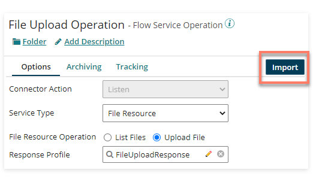
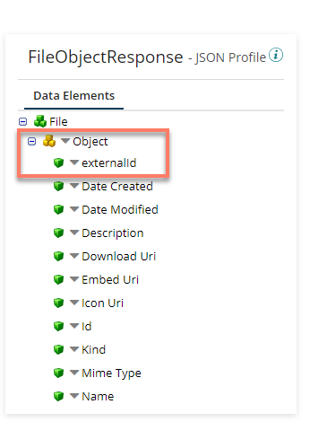

# File Resource Response Profiles 

<head>
  <meta name="guidename" content="Flow"/>
  <meta name="context" content="GUID-06906d56-0226-43ca-b06b-1e12aa154174"/>
</head>

Although you can build your profiles manually, clicking **Import** on the Flow Service Operation opens the **Flow Service Operation** Import wizard; this allows you to automatically generate a standard Response Profile template for either of the two File Resource Operations.

This profile will define the data that is returned to Flow after a file has uploaded. An example of an automatically generated Upload File Operation Response Profile is shown below:

-   The top-level Object element should be renamed from the generic 'Object' to a more meaningful reference, as this profile name will map to the name of the type that you will use in Flow with the file data. For example, renaming this to 'RefA' will then align with a type name of '$File RESPONSE - RefA' in Flow.

-  It is mandatory for a process to return a populated 'externalid' value in the profile, so this element must be included in the profile. Some external systems (such as AWS S3) may provide a GUID in response to a file-save mechanism that could be used in this value, or alternatively a default piece of data could be used to populate this value. All other profile entries are optional, and can be removed if not required. Best practice recommends that any necessary destination or identifier information is returned to the flow as part of the profile, with this data saved as needed from the flow.

- Additional entries can be added into the automatically generated profile if you wish to include additional information in the contents of uploaded files. For example, a simple Character entry (FileSimpleContents) could be added to return simple text contents for a file.