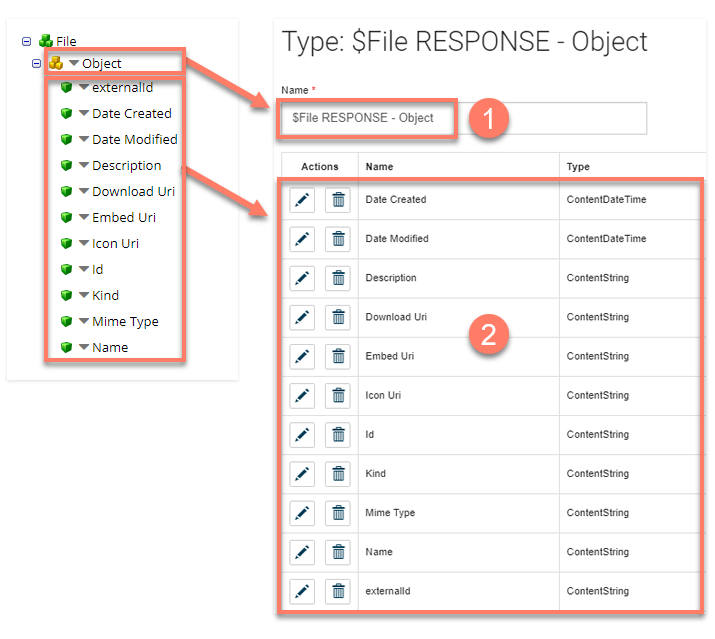
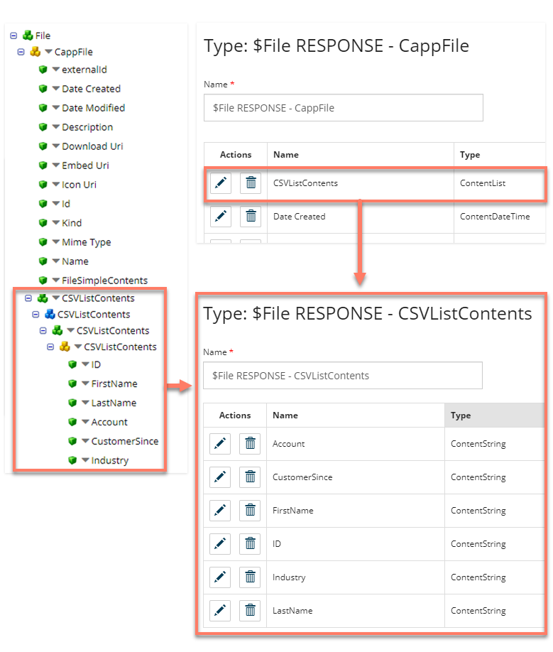

# File Resource Operations and Flow types

<head>
  <meta name="guidename" content="Flow"/>
  <meta name="context" content="GUID-f2ccb413-d0e2-401c-a654-8fd0e6f7469a"/>
</head>

Unlike Flow Service Message Actions and Data Actions, File Resource Operations do not automatically generate your types when the connector is installed/updated in Flow. Because of this, you will need to manually create any type required for mapping to the profile you have created.

This can be done by:

- Adding a new type and properties on the **Types** page. See [Types](c-flo-Types_d429840a-ffa4-47c5-8131-5411965e422c.md).

- Using the **API tool** to execute a `POST` request to the `api/draw/1/element/type` endpoint. An example JSON is available at [Boomi Flow Github Community](https://github.com/boomiflow-community/metadata-file-upload-type/blob/master/metadata.json).

For example:

- A type has been created in Flow to map to the Flow Service profile. The type is named using the format:

  `$File RESPONSE - [Object Name]`

  The `[Object Name]` is replaced to match the top-level Object name in the profile. 

- A matching property has been created for each of the profile entries. The data types align between the profile entries and the type properties, for example, Character profile entries align with a string property, and datetime profile entries align to date/time properties. See [ Type Properties](c-flo-Types_Properties_19f429ec-b9d3-42bf-bf0a-055bd61b4024.md). 

Adding nested Array(Repeating) or Object entries into your profile will require separate types to be created to match these entries, with these types linked to a property of the base type, as with the profile nesting.

For example:

- A nested Array(Repeating) entry has been added inside the 'base level' file response profile. As this is a complex value, this requires a separate type to be created as a property of the base type.

- A new type is created and named according to the standard naming format as '$File RESPONSE - CSVListContents'. Properties are added to this type to match the profile entries.

- A new 'CSVListContents' List property is added to the base type for the profile, with the new '$File RESPONSE - CSVListContents' type selected as the type of value.
