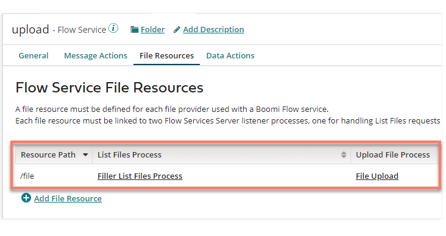

# Using Flow Service component File Resources with Flow

<head>
  <meta name="guidename" content="Flow"/>
  <meta name="context" content="GUID-cbb6c466-88d2-4f25-af79-8d6226399712"/>
</head>

This type of Flow Service Operation is used to map to either of the two page layout components available in Flow for interacting with files.

A Flow Service **File Resource** Operation must be defined for any file resource process Start step.

-   **List Files**: This option should be selected if you will be using the **Files** component in Flow. A Request Profile and a Response Profile can be defined.

-   **Upload File**: This option should be selected if you will be using the **File Upload** component in Flow. Only a Response Profile needs to be defined when uploading files.

Your Flow Service will need to have a File Resource added to the **File Resources** tab:

-   The **Resource Path** will need to be defined for the File Resource, for example '/file'. This will be used as the **Resource Path** on the file upload/list component in Flow.

-   Both a **List Files Process** and an **Upload File Process** must be added/selected; if you are only uploading files however, a 'dummy' **List Files** process can be selected.

## File Resource Response Profiles

Although you can build your profiles manually, clicking **Import** on the Flow Service Operation opens the **Flow Service Operation** Import wizard; this allows you to automatically generate a standard Response Profile template for either of the two File Resource Operations.

-   [File Resource Response Profiles](c-flo-AS_FR_RP_06906d56-0226-43ca-b06b-1e12aa154174.md)

## File Resource Operations and types 

Unlike Flow Service Message Actions and Data Actions, File Resource Operations do not automatically generate your types when the service is installed/updated in Flow. Because of this, you will need to manually create any type required for mapping to the profile you have created.

-   [File Resource Operations and types](c-flo-AS_FR_Types_f2ccb413-d0e2-401c-a654-8fd0e6f7469a.md)

## Using file resource components in a flow 

There are two file resource page components that can be added to a page map element on the corresponding page layout for the page.

-   [Using file resource components in a flow](c-flo-AS_FR_Flow_2c5c94e4-3496-4990-ac61-16fefed71d63.md)