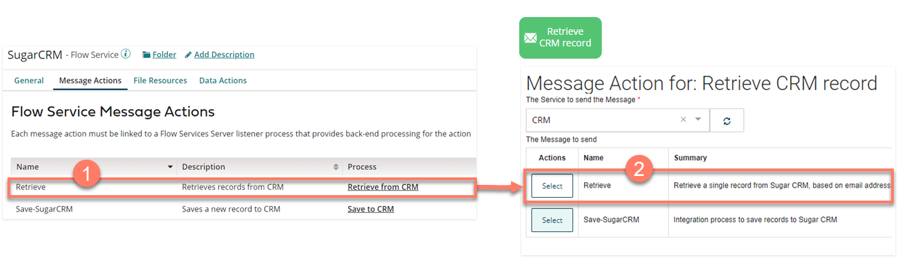

# Using Flow Service component Message Actions with Flow

<head>
  <meta name="guidename" content="Flow"/>
  <meta name="context" content="GUID-74e3374a-5402-442c-8dbf-2ec3d032ab27"/>
</head>

This type of Flow Service Operation is used to map to Message Actions in a Message map element in Flow.

A [message map element](c-flo-ME_Message_342e9efb-0f11-4083-a2dc-195d52d1f939.md) can be added to a flow in order to send and receive message requests between Flow and the Integration Flow Service.

Message actions are used by a flow to define the interface of inputs/outputs when calling against your Flow Service Message Actions, allowing you to map values in a flow to the inputs and outputs specified by your Flow Service.

Message actions are useful if the request/response data passed between Integration and Flow are in different formats, for example if passing a selected date range from a flow into an API endpoint, in order to receive back stock price data.

When you import or update a Integration connector in Flow, actions are created that can then be accessed through a Message map element.

For example:

-   A Integration process named 'Retrieve' is assigned to a Flow Service component Message Action. 

-   A 'Retrieve CRM record' Message map element is added to the flow canvas, and a new Message Action is added to this map element. See [ Adding Message Actions to a map element](c-flo-Config_Message_Outcomes_81616add-ed70-45c7-a844-3e98f14844e2.md). 

-   The Boomi Integration Service connector is selected as **The connector to send the Message**.

-   The available Actions in **The Message to send** table are then populated with the Flow Service Message Actions set up in Integration .

-  The Action can be configured by selecting the relevant value in Flow to use for each Input/Output parameter.

The Input and Output values passed to and from Message Actions are named and configured using the Request and Response profiles assigned to your Integration process.

-   [Profile mapping to Message Action Input/Output parameters](c-flo-AS_MA_IO_b755e9fb-cfa3-4680-99d5-72ae0c812fa5.md)

-   [An example profile mapping to Message Action Input/Output parameters](c-flo-AS_MA_IO_Example_ee67c035-438f-4ef0-abf4-49e08280a8de.md)