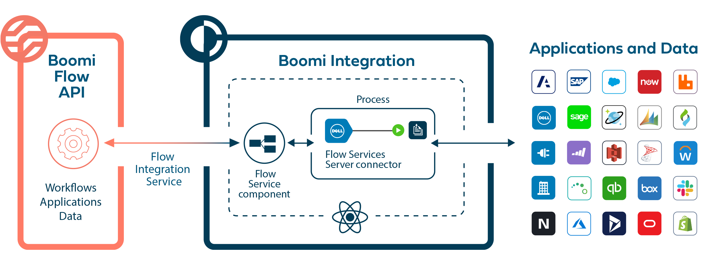

# Flow and Integration

<head>
  <meta name="guidename" content="Flow"/>
  <meta name="context" content="GUID-29be6cb0-f11a-4eaa-a03a-d1ce7c42e77d"/>
</head>

Flow applications can be seamlessly integrated with Integration, allowing access to the full range of connectors and applications supported by Integration and the Boomi Enterprise Platform.

The Boomi Flow Services Server (FSS) in Integration allows Flow applications to connect to and exchange data with the Integration platform, using Integration connectors hosted on a Boomi Atom, or in the Boomi Cloud. Installing a Flow Integration Service in a Flow tenant allows Flow to use a Integration process to connect to and interact with other systems and applications.

## Getting started with Flow and Integration

Connecting Integration to Flow typically uses the following elements:

- Flow Service component

- Boomi Flow Services Server connector

- Boomi Integration Service connector
  
- Boomi Flow Client connector

[An example workflow for using with Flow](c-flo-AS_Example_workflow_c9e84942-a88c-4e4c-bf9a-6c31a48dae79.md) is provided to illustrate the different concepts and features that may be required when configuring Flow and Integration to work together.

## Flow Service component

A [Flow Service component](../../Integration/Process%20building/c-atm-Flow_Service_components_697a4043-7e92-4df6-8f57-331107da2f67.md) is set up in Integration to build and manage the connection to Flow. This component is used to implement the callback logic required to continue flow progression once the integration process completes. Timeouts are managed by returning wait responses to Flow while a process executes.

-  [Using the Flow Service component with Flow](c-flo-AS_Flow_Services_Component_f757eeb1-028b-4fac-b866-1f518817a8a9.md)

## Boomi Flow Services Server connector

A [Boomi Flow Services Server connector](../../Integration/Process%20building/r-atm-Flow_Services_Server_connector_cfd73e0d-a94c-4a02-b09b-471b9d9e5faa.md) is set up in the start step of a Integration process to listen for requests from Flow. Flow connector requests originate in flows as REST requests.

When a process using this connector is deployed to an Atom, the Atom’s internal Flow Services Server listens for flow connector requests based on the configurations made in the Flow Services Server operation.

- [Using Flow Service component Message Actions with Flow](c-flo-AS_Flow_FSS_MA_74e3374a-5402-442c-8dbf-2ec3d032ab27.md)

- [Using Flow Service component Data Actions with Flow](c-flo-FSS_Data_Actions_76d3fc99-d10d-46a1-b1b9-d19571bec6b6.md)

- [Using Flow Service component File Resources with Flow](c-flo-AS_FSS_File_Resources_cbb6c466-88d2-4f25-af79-8d6226399712.md)

Integration profiles are used to specify the structure of the data that is processed, and should be configured with an understanding of how profiles relate and map to types in Flow.

- [Integration Profiles and Flow Types](c-flo-AS_Profiles_Types_676ebeec-a3e4-495e-8c14-4da287b2751a.md)

## Boomi Integration Service connector

The Boomi Integration Service connector is installed in Flow, to allow your flows to connect to and interact with the Flow Service component in Integration.

- [Boomi Integration Service connector](c-flo-Services_Boomi_Flow_Integration_7c2deca1-a3f3-4397-b9ba-ef58f27308b8.md)

## Flow Client Connector

As well as the more commonly used Flow Services Server connector above, a Flow Client connector is also available for use in processes, in order to launch and execute flows. This connector needs to be configured with relevant flow information such as the tenant id and flow user credentials.

- [Boomi Flow Client connector](../..//Integration/Connectors/r-atm-Flow_Client_connector_f5bb5da8-a28d-4587-bdb7-d2c21a7969e5.md)
