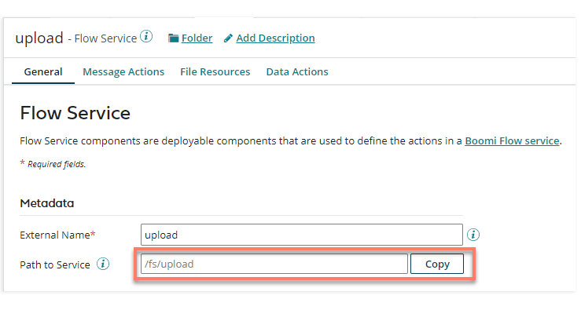
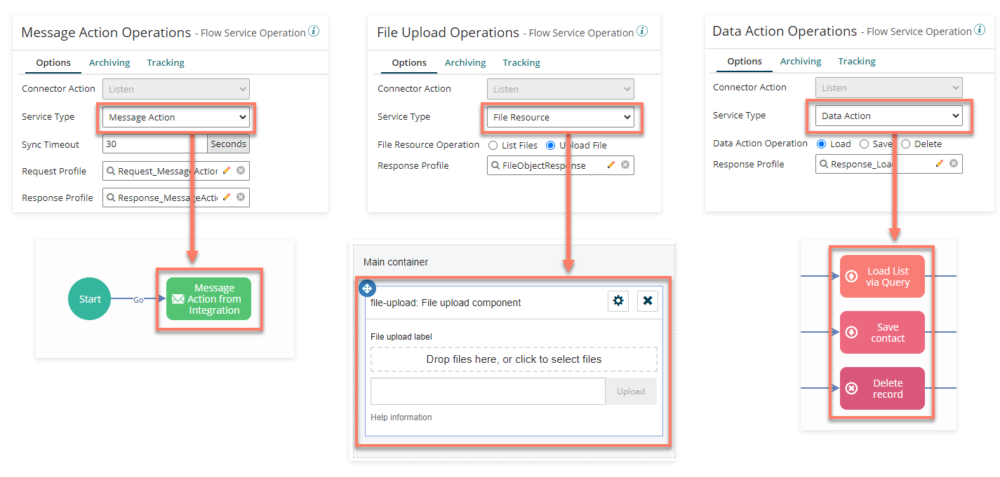

# Using the Flow Service component with Flow

<head>
  <meta name="guidename" content="Flow"/>
  <meta name="context" content="GUID-f757eeb1-028b-4fac-b866-1f518817a8a9"/>
</head>

A Flow Service component is set up in Integration to build and manage the connection to Flow.

This component is used to implement the callback logic required to continue flow progression once the integration process completes. Timeouts are managed by returning wait responses to Flow while a process executes.

The Flow Service component is specifically used by Flow for:

- Defining the Path to Service

- Mapping [Boomi Flow Service Operations](../../Integration/Process%20building/r-atm-Flow_Services_Server_operation_39812d14-99b6-436a-8761-e5172ac6f0f1.md) to actions/elements

## Defining the Path to Service

The **Path to Service** field on the **General** tab of the Flow Service is used to define the path to the connector on an atom.

The connector URI used by the Boomi Flow Integration Service in Flow uses this **Path to Service** value.

## Mapping Flow Service Operations to actions/elements

The Flow Service will need to be configured to match your operation/action requirements.

The Boomi Flow Service Operation that you have selected in your process Flow Services Server Start step is used to define what type of operation is going to be performed in your flow. For example, whether the process supports a Message Action, a File Resource, or a Data Action, and what JSON Request/Response profiles should be used for exchanging data.

### Message Actions

[Flow Service Message Actions](../../Integration/Process%20building/t-atm-Adding_an_action_to_a_Flow_Service_component_8e6ba3f7-2b29-411b-a226-9fa66bae05c6.md) are used to map to message actions in a message map element in Flow. A message map element can be added to a flow in order to send and receive message requests between Flow and the Integration Flow Service. Message actions are used by a flow to define the interface of inputs/outputs when calling against your Flow Service Message Actions, allowing you to map values in a flow to the inputs and outputs specified by your Flow Service.

- [Using Flow Service component Message Actions with Flow](c-flo-AS_Flow_FSS_MA_74e3374a-5402-442c-8dbf-2ec3d032ab27.md)

### File Resources

[Flow Service File Resources](../../Integration/Process%20building/t-atm-Adding_a_file_resource_to_a_Flow_Service_component_113814d4-b0e0-48a3-b5d9-a2b5373859bc.md) Are used to map to either of the two page layout components available in Flow for interacting with files. The **File Upload** component allows you to upload a file, which can then be consumed by a process. The **Files** component allows you to both upload a file, and list files for download from an outside system.

- [Using Flow Service component Message Actions with Flow](c-flo-AS_FSS_File_Resources_cbb6c466-88d2-4f25-af79-8d6226399712.md)

### Data Actions

[Flow Service Data Actions](../../Integration/Process%20building/t-atm-Adding_a_database_object_type_to_a_Flow_Service_comp_18628032-b1d8-416c-9941-71f1d8bc913d.md) are used to integrate with the database map elements in Flow that are used to handle all Create, Read, Update, Delete (CRUD) operations for a particular variety of record, using a single type in a flow. There are three types of database map element that can be added to a flow (Load, Save, and Delete) to allow Flow to integrate with your Flow Service Data Actions and their associated processes.

- [Using Flow Service component Data Actions with Flow](c-flo-FSS_Data_Actions_76d3fc99-d10d-46a1-b1b9-d19571bec6b6.md)

### Page Components

[Table](flo-pages-components-table_90740e9b-77c3-44cb-8e01-9e7f19f2f63c.md), [Combobox](./flo-pages-components-combobox_c96a1731-1c14-46e6-9a53-5e7cd6328aa2.md) and [Radio](./flo-pages-components-radio_57f3369f-45e8-40b7-b77b-5ebbdc626335.md) page components can also be populated with data using . For example, data can be loaded directly from the Flow Service \(or via a list value\) into a [Table component](./flo-pages-components-table_90740e9b-77c3-44cb-8e01-9e7f19f2f63c.md) on a page in order to display data to flow users.

- See [ Querying data from Integration in Flow](c-flo-AS_DA_Querying_e8edb564-4458-4db5-b313-75daee3084cd.md) for an example scenario of loading data into a table component.
