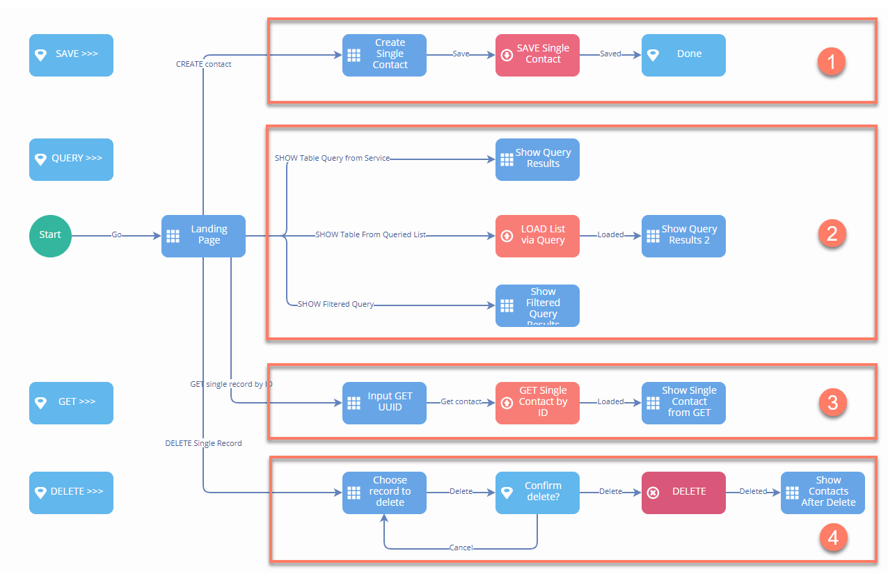
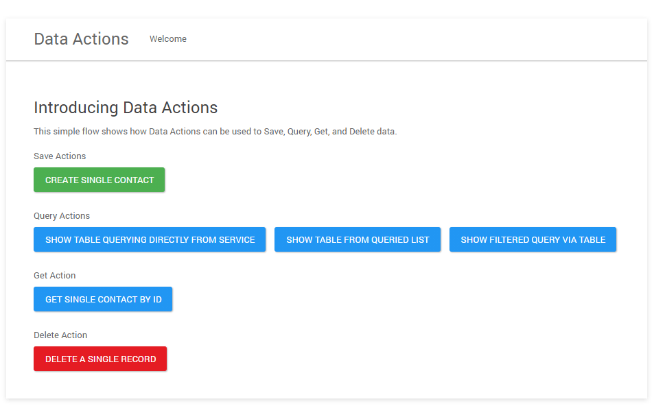

# A worked example of using Integration Data Actions with Flow

<head>
  <meta name="guidename" content="Flow"/>
  <meta name="context" content="GUID-f8255f8b-0e12-4a79-bf6d-307c56639e1d"/>
</head>

This topic provides an example of how Integration Flow Service Data Actions can be used to retrieve and work with data in Flow.

In this example, a flow is built in the flow canvas that allows users to save, query, load, and delete data to and from a simple database in Integration.

## Integration setup

Integration is set up as follows:

- A PostgreSQL [database](../../Integration/Connectors/r-atm-Database_connector_c4bd0269-5f4b-42d6-b4cf-08ddada63a94.md) table is set up to act as the target data system for the processes to interact with.

- A [Flow Service component](c-flo-AS_Flow_Services_Component_f757eeb1-028b-4fac-b866-1f518817a8a9.md) is set up, and a [Flow Service Data Action](c-flo-FSS_Data_Actions_76d3fc99-d10d-46a1-b1b9-d19571bec6b6.md) added to it.

- The JSON **Profile** for the Data Action consists of a single level 'Contact' Object.

- Processes are created and assigned for each of the different types of request, using a Flow Services Server listener process Start step. The Flow Service Operations are set as a 'Data Action' **Service Type**, with the relevant **Data Action Operation** selected \(Load, Save, Delete\).

- All elements are deployed to a Cloud Atom.

## Flow setup

Flow is set up as follows:

- A [Boomi Integration Service connector ](c-flo-Services_Boomi_Flow_Integration_7c2deca1-a3f3-4397-b9ba-ef58f27308b8.md) is installed and configured to connect to the Flow Service component in Integration.

- A 'Contact' type is automatically created from the Integration profile once the service is installed. This type and it's properties/binding are associated with values to allow data to be passed to and from Flow.
  
- A main 'Contact' Object value is created to store and work with data of this type.

A flow is built in the flow canvas to allow users to save, query, load, and delete data to and from the database:

The flow is laid out in four main sections:

- [Saving data into Integration from Flow](c-flo-AS_DA_Saving_63da707b-f521-4644-81db-1c8c39a7911f.md) 

- [Querying data from Integration in Flown](c-flo-AS_DA_Querying_e8edb564-4458-4db5-b313-75daee3084cd.md) 

- [Loading data from Integration into Flow](c-flo-AS_DA_Load_081bdc6c-1481-4097-91f5-fec8aeb7c389.md) 

- [Deleting data from Integration using Flow ](c-flo-AS_DA_Delete_d3baf6e2-e355-4fff-a323-0582815c481f.md) 

When the flow is run in a web browser, the user is presented with the landing page:

