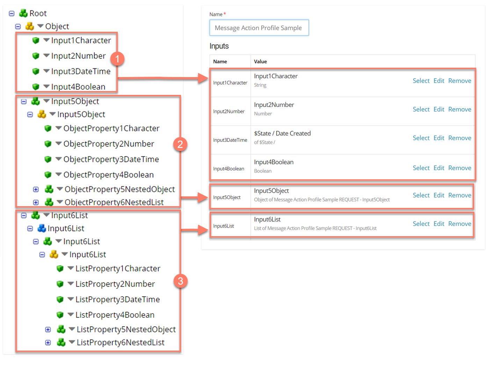

# An example profile mapping to Message Action Input/Output parameters

<head>
  <meta name="guidename" content="Flow"/>
  <meta name="context" content="GUID-ee67c035-438f-4ef0-abf4-49e08280a8de"/>
</head>

This example shows how a Integration Request Profile maps to Input and Output Message Action parameters in Flow.

- Simple Character, Number, DateTime and Boolean values in the Integration Request Profile have been mapped respectively to primitive string, number, date/time, and Boolean values in Flow. The date input value has been mapped to the $State/Date Created system value 

- A complex Object value in the Integration Request Profile has been mapped to a complex Object value in Flow, using the type that was automatically created by the connector.  
  
- A complex Array(Repeating) value in the Integration Request Profile has been mapped to a complex List value in Flow, using the type that was automatically created by the connector.. 

:::note

To learn more about values and types in Flow , see [Understanding Values, Types, Objects, and Lists](c-flo-Values_Understanding_0a938b9f-c1be-45d9-b53f-aa9d0addad86.md).

:::
