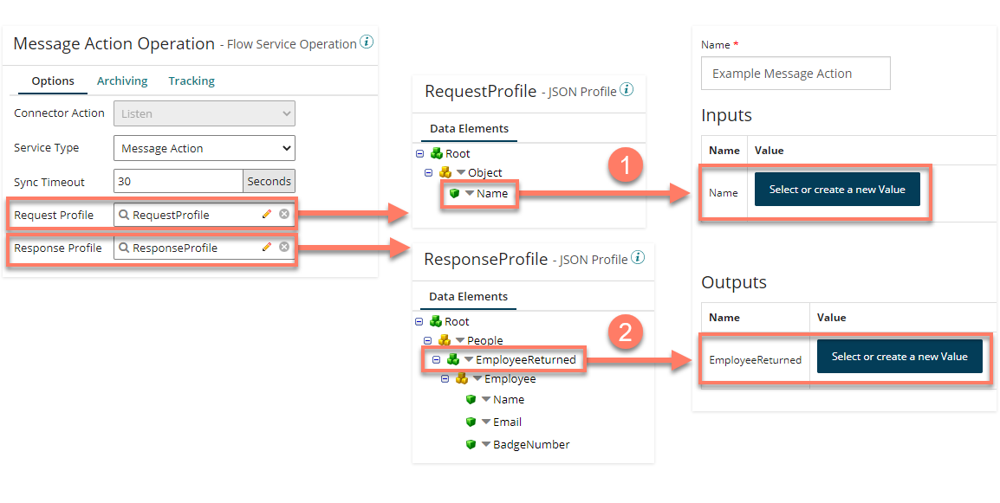

# Profile mapping to Message Action Input/Output parameters

<head>
  <meta name="guidename" content="Flow"/>
  <meta name="context" content="GUID-b755e9fb-cfa3-4680-99d5-72ae0c812fa5"/>
</head>

The Input and Output values passed to and from Message Actions are named and configured using the Request and Response profiles that you have assigned to your process.

- Integration Request profiles map to Input parameters in Flow.

- Integration Response profiles map to Output parameters in Flow.

For example:

- A Message Action Operation is set up in Integration and a Request and Response Profile assigned.
The Request Profile contains a simple 'Name' Character' value. When a corresponding Message Action is set up in Flow, the Input parameter is automatically created and available for passing data using the Action. As it is a simple Character value, a string value would then be selected. 

- The Response Profile contains an 'EmployeeReturned' Object value. When a corresponding Message Action is set up in Flow, the Output parameter is automatically created and available for passing data using the Action. As it is an Object value, an object value that uses a type would then be selected. 

:::note

For an example of how a profile is mapped to Input/Output parameters, see [An example profile mapping to Message Action Input/Output parameters](c-flo-AS_MA_IO_Example_ee67c035-438f-4ef0-abf4-49e08280a8de.md).

:::
