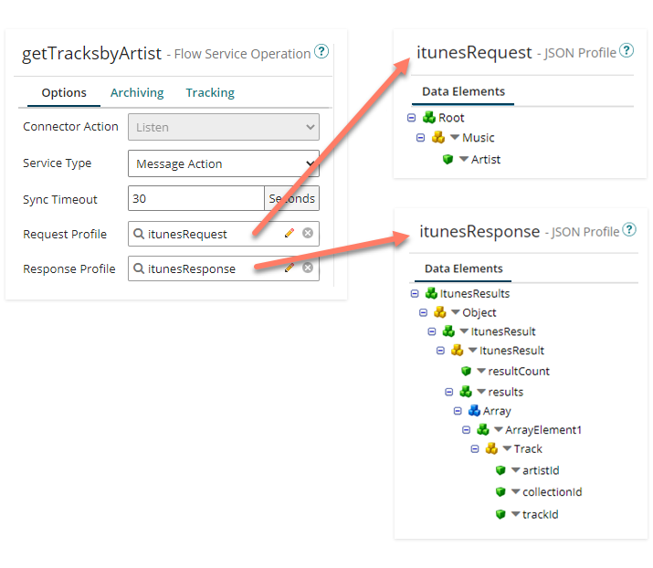
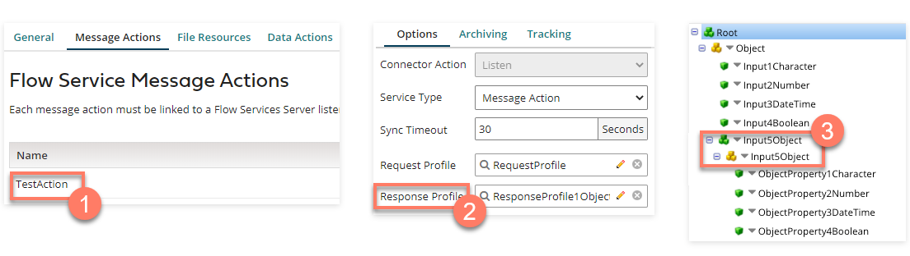
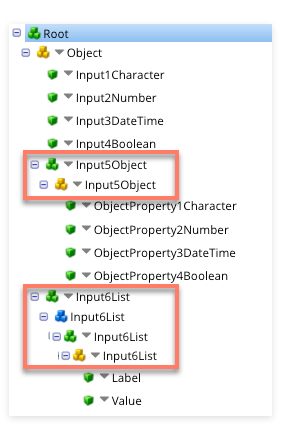
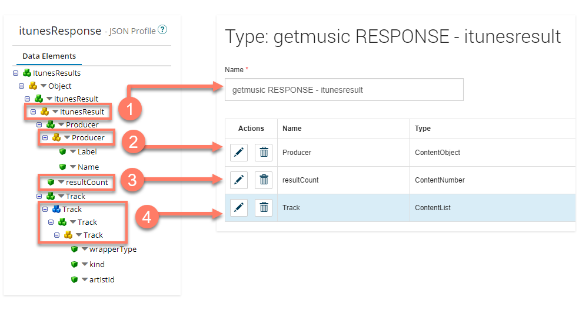

# Integration Profiles and Flow Types

<head>
  <meta name="guidename" content="Flow"/>
  <meta name="context" content="GUID-676ebeec-a3e4-495e-8c14-4da287b2751a"/>
</head>

Integration profiles are used to specify the structure of the data that is processed, and should be configured with an understanding of how profiles relate and map to types in Flow.

- To exchange information with Flow, a profile must be in JSON (JavaScript Object Notation) format.

- The root entry for the profile will always be an Object.

- A Request and Response Profile can be specified in the Flow Service operation to define the data structure of requests and responses made between Integration and Flow. If data only needs to be moved in one direction (for example, if you do not require input data to get the desired response from Integration) the unnecessary profile selection can be left empty.

  

The Request/ Response profiles specified in the Flow Service operation are used by Flow to:

- Create types; types are automatically created in Flow for Object or Array(Repeating) profile entries when installing or updating the service. Object profile entries are automatically converted to an object  \(`ContentObject`\) type, and array profile entries are automatically converted to a list  \(`ContentList`\) type.

  To learn more about the different kinds of values/types in Flow, see [Understanding Values, Types, Objects, and Lists](c-flo-Values_Understanding_0a938b9f-c1be-45d9-b53f-aa9d0addad86.md),  and [Value content kinds](c-flo-Values_Content_Types_782220dc-722d-4d55-8576-e0274117e190.md).

- Convert Simple profile entries; entries such as Character, Number, Boolean, or Date/Time, do not automatically generate a type in Flow when installing or updating the service, but are instead converted to properties/values (found in a message action configuration for example). Note that Date/Time data in Request/Response profiles must be in the `yyyy-MM-dd'T'HH:mm:ss.SSS'Z'` format.

- Populate Message action Input and Output parameters. See [Profile mapping to Message Action Input/Output parameters](c-flo-AS_MA_IO_b755e9fb-cfa3-4680-99d5-72ae0c812fa5.md).

## Profiles and naming of types in

Types that are automatically generated in from object/array profile entries \(as well as any message action binding names\) are named using a combination of:

- The name of the Flow Service action/process.

- The type of profile \('Response' or 'Request'\). 

- The name of the object/array profile entry. 

In the example above, an object type would be automatically created in Flow, and named 'TestAction RESPONSE - Input5Object'.

Best practice is for all the profile entry 'layers' of an object/array to be given the same name. This should also be done before the service is installed for the first time in Flow, to avoid types being generated with less meaningful names in the first instance; this will help to avoid types being created and named 'MyProcessName REQUEST Object_1' for example.

- Object profile entries should have 2 identically named layers.
  
- Array profile entries should have 4 identically named layers.

## An example of how profiles map to types in

In this example, a profile will generate and map to types and properties in Flow as follows:

- The top level profile entry is always an Object. In the example shown, it is named 'Object'.

- The first object profile entry nested under the root object hierarchy (named 'itunesResult') automatically creates a type in Flow named 'getmusic RESPONSE - itunesresult' 

- This first object entry also generates three type properties for the new type in Flow:

  - The 'Producer' property is generated from the 'Producer' object entry in the profile 

  - The 'resultCount' property is generated from the 'resultCount' simple number data type value entry in the profile. 

  - The 'Track' property is generated from the 'Track' array entry in the profile. 
