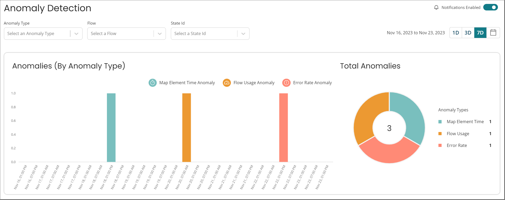

# Anomaly Detection

<head>
  <meta name="guidename" content="Flow"/>
  <meta name="context" content="GUID-2ffe6cdd-98db-4fa9-b599-bd372cc292f2"/>
</head>

## Overview

Anomaly Detection analyzes your flows and reports anomalies when unexpected actions or behaviors occur. This can assist you in identifying and diagnosing faults in your flow that are not easily identifiable.

## Navigation

Select **Anomaly Detection** from the left-hand-menu

