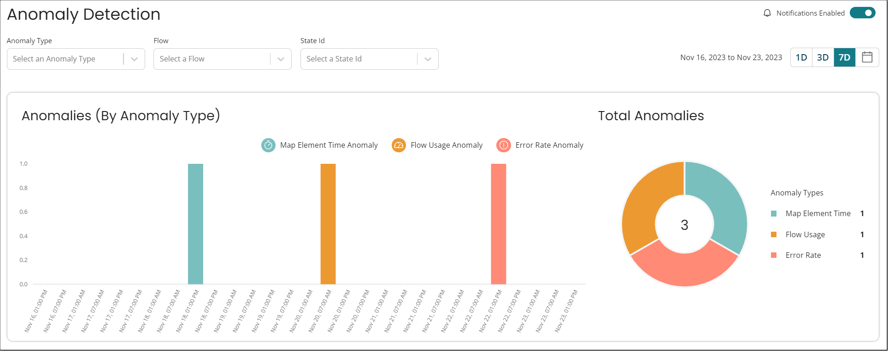

# Anomaly Detection Page Overview

<head>
  <meta name="guidename" content="Flow"/>
  <meta name="context" content="GUID-da1e3cbf-e514-466a-a498-cd11bdeb0aa2"/>
</head>

## Page Overview

- You can filter the detection selecting options from the drop-down, **Anomaly Type**, **Flow**, and **State Id**.
- The detected anomalies can be also viewed using filters that helps you monitoring day(s) wise:
  - 1D: Filter to last day
  - 3D: Filter to last three days
  - 7D: Filter to last seven days

Following are the anomalies that are being detected:

- **Map Element Time Anomaly** - Identifies spikes in the time it takes a user to move on from a map element in a flow. The time of each map element is taken into consideration independently. For example, 20s on Map element 1 may be normal, whereas 20s on Map element 2 may be abnormal.
- **Error Rate Anomaly** - Identifies spikes in error rates of a flow. (Not every error is necessarily an anomaly, only new spikes are anomalous)
- **Flow Usage Anomaly** - Identifies spikes in flow utilization as a whole. Usage might be one starting a new flow or progressing through an existing one.

## Notifications

- You will receive in-platform badge notifications for anomalies. This badge will appear on the **Anomaly Detection** sidebar item.
- You may disable this by selecting the option on the Anomaly Detection screen.

## Additional Notes

- Anomalies are only stored for 1 week (7 day sliding window).
- While the flow is being reviewed for typical usage, no anomalies can be raised during the first week that a flow or map element is created.
- Only usage for production flows are monitored. 
  - When the environments feature is turned ON, then only the flows run in the production environment. 
  - When the environments feature is turned OFF, then only the flows run without a specified flow version id.
