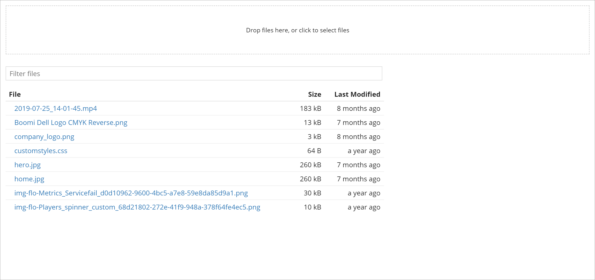

# Assets

<head>
  <meta name="guidename" content="Flow"/>
  <meta name="context" content="GUID-7d21c82d-c700-437d-bdaa-ae4b0716726b"/>
</head>

Assets are resources that can be used in a flow web application, such as images, presentations, spreadsheets, text files, stylesheets or code snippets for example.

Assets are managed and uploaded on the **Assets** page.

-   The **Assets** page displays all the assets currently set up within the tenant. See [Assets page](c-flo-Assets_Page_f1d604a7-b133-4d4d-8dd1-4f29a62be2be.md).

-   You can upload new assets into the asset library as required. See [Uploading a new asset](t-flo-Assets_Uploading_a28577c2-84b1-44c9-8b63-37ace8968163.md).

-   Once you have uploaded an asset, you can then include the asset within your flows. See [Using assets in your flows](c-flo-Assets_Using_b67e1757-fbca-479f-94c2-590953df302f.md).

-   Assets are not encrypted, and so should **not** be considered a secure endpoint. See [Assets technical reference](r-flo-Assets_Technical_Reference_98b38258-3328-45f9-9d71-3c6d0ac7bd9d.md).

## Example asset usage scenarios

-   When you have static user-facing content, that you want to display within your flow \(such as your corporate logo, graphics, presentations and so on\). See [Using assets in your flows](c-flo-Assets_Using_b67e1757-fbca-479f-94c2-590953df302f.md).

-   When you want to use custom styling by uploading and linking to a custom CSS file within a flow HTML5 player.

-   When you want to upload custom JavaScript files, for example, if you are a developer using Bootstrap.