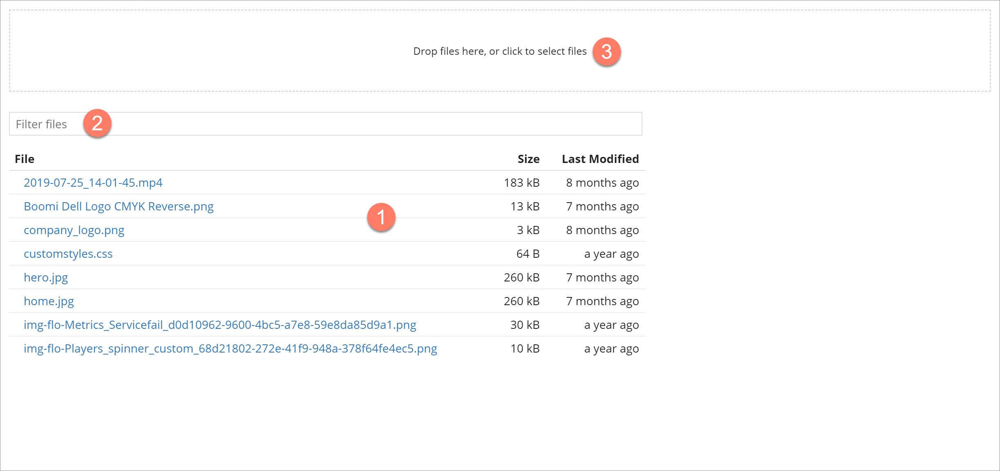

# Assets page

<head>
  <meta name="guidename" content="Flow"/>
  <meta name="context" content="GUID-f1d604a7-b133-4d4d-8dd1-4f29a62be2be"/>
</head>

The **Assets** page allows you to manage existing assets and upload new assets for use within your flows.

## Opening the page

-   Select **Assets** from the left-hand menu.

## Page overview

The **Assets** page displays all the assets currently set up within the tenant.

-   Assets are displayed in a table, sorted alphabetically by the **File** column. 

-   Click on an asset row to preview the asset in the right-hand preview pane, and access options for renaming or deleting the assset. See [Renaming an asset](t-flo-Assets_Renaming_9b727586-9232-4acc-b11f-7fe2a4082a0f.md) and [Deleting an asset](t-flo-Assets_Deleting_6aed5341-86b8-4645-a04d-c284e62df29b.md).

## Filtering the list

The **Filter files** field allows you to search for and filter which assets are displayed in the list. 

This is useful if you have a large number of assets, or wish to quickly search for a specific asset.

1.  Enter the text into the **Filter files** field that you wish to filter the table by. Partial search terms can be used, for example, entering 'Doc' will filter the list so that all assets containing 'Doc' in their name will be shown. You can also search for all files of a particular type, for example searching for 'css' will display all files with a .CSS extension.
2.  Press **Enter** to perform the search and apply the filter.

## Uploading a new asset

As well as managing existing assets on this page, you can also upload a new asset into the tenant asset library via the **File Upload** area.  See [Uploading a new asset](t-flo-Assets_Uploading_a28577c2-84b1-44c9-8b63-37ace8968163.md).