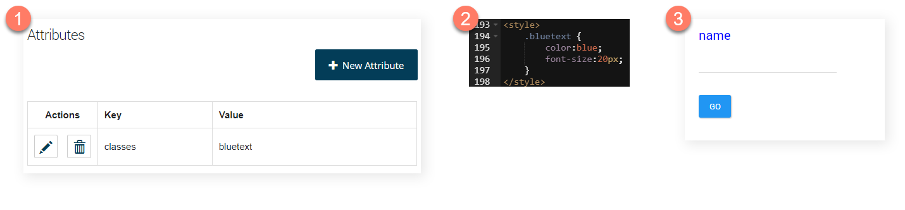

# Using attributes to style components 

<head>
  <meta name="guidename" content="Flow"/>
  <meta name="context" content="GUID-ed09909d-5c7e-48c2-be21-138f6490760e"/>
</head>

You can use attributes to apply CSS classes to page components.

## Default player runtime 
Attributes are not used to apply CSS classes when running flows with the default player.

Instead, you can add multiple space-delimited CSS classes to a component using the **CSS Class** field on the component configuration panel. To learn more about applying CSS to your flow players, see [CSS reference](r-flo-CSS_Reference_d32122b8-0f11-47be-91c6-6986575f933e.md).

## Default legacy player runtime 
When running flows with the default legacy player, you can add a generic 'classes' attribute to components, allowing you to apply CSS classes directly.

These styles can then be applied at runtime, either directly in the player or by linking to a stylesheet, in order to modify the appearance/behaviour of the component.

The string value for the attribute can consist of multiple entries separated by a space character to build up the CSS class selector. To learn more about applying CSS to your flow players, see [CSS reference](r-flo-CSS_Reference_d32122b8-0f11-47be-91c6-6986575f933e.md).

:::note 

Full stop characters should be removed from the attribute value. For example, to reference a .bluetext style, only the text 'bluetext' would be entered as the value for the attribute, i.e. the full stop character has been removed.

:::

Applying a single CSS class:

-   A `classes` attribute is added to a component on a page layout with a value of 'bluetext'. 

-   In a custom player, a `.bluetext` style is added to show text as blue and increase the font size.

-   When the flow is run using the custom player, the CSS in the player is applied to the component. 

Applying multiple CSS classes:

A `classes` attribute is added to an outcome button component on a page layout with a value of 'btn-lg btn-outline CustomButton'. This applies three CSS classes to the outcome button:

-   The `btn-lg` part of the value makes the outcome button large \(applying the Bootstrap `btn-lg` CSS class\).

-   The `btn-outline` part of the value makes the outcome button outlined \(applying the Bootstrap `btn-outline` CSS class\).

-   The `CustomButton` part of the value applies a `CustomButton` CSS class that has been added to the player.