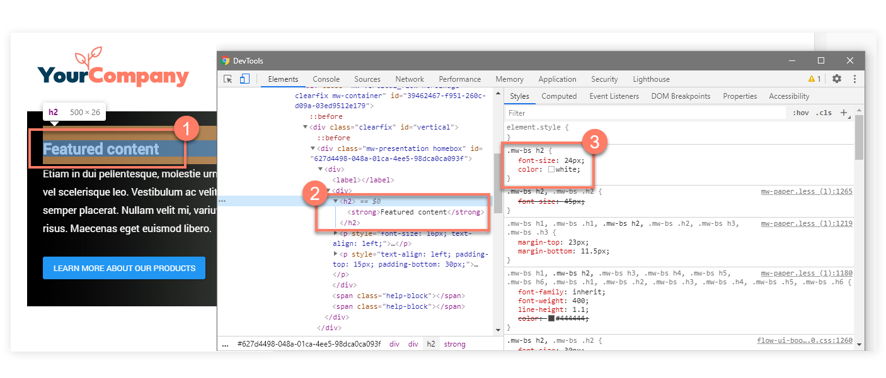

# Detecting the correct CSS style 

<head>
  <meta name="guidename" content="Flow"/>
  <meta name="context" content="GUID-af239813-da04-45e3-8bda-9cb5d08d7ee9"/>
</head>

Learning how to detect and identify the CSS style you should target is a fundamental skill required for using CSS to customize your flows.

## Overview 

Although the [CSS reference](r-flo-CSS_Reference_d32122b8-0f11-47be-91c6-6986575f933e.md) outlines the main CSS styles within , you may need to target specific, more complex CSS selectors that are not detailed in the reference.

This process is made easier by using a browser CSS inspector tool, such as the 'Google Chrome Dev Tools' console in Google Chrome \(right-click on a web page and select **Inspect**\). These tools allow you to identify exactly which CSS styles you need to target and override when developing your custom CSS styles.

## A worked example 

In the following example, a flow running the default legacy player is inspected in Google Chrome:

-   A heading is inspected in the flow web application, identified as an 'H2' \(heading 2\) element. 

-   The HTML for the element is shown in the **Elements** console. 

-   The classes that are applied to the element are shown in the **Styles** panel, showing that the '`.mw-bs h2`' CSS selector is what you should target in a default legacy player if you wish to override the style of all second-level headings in the flow. 

## Additional resources 

The following links provide more information on using common web browser developer tools:

-   [Chrome](https://developers.google.com/web/tools/chrome-devtools/?__hstc=20629287.e829d894e9eb334370cdf9c73d539ff7.1591362400059.1591362400059.1591362400059.1&__hssc=20629287.1.1591362400060&__hsfp=3977930374)

-   [Firefox](https://developer.mozilla.org/en-US/docs/Tools/Page_Inspector)

-   [Microsoft Edge](https://docs.microsoft.com/en-us/microsoft-edge/devtools-guide)

-   [Safari](https://support.apple.com/guide/safari/examine-webpage-elements-and-activity-ibrw1018/mac)