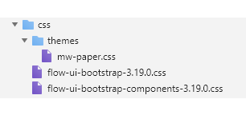

# Understanding stylesheet hierarchy

<head>
  <meta name="guidename" content="Flow"/>
  <meta name="context" content="GUID-e674458a-6b51-4811-b96e-7bcd49b3397f"/>
</head>

Correctly targeted CSS styles allow you to override the existing styles applied by the stylesheet framework.

## Default player runtime

You can use the fo

CSS styling cascades down through the default stylesheets, so that the last styles applied take priority and will override previously applied styles. Your own linked stylesheet or inline player styles should be applied last, meaning that they will override the default styles applied by the earlier stylesheets.

For example, if you are adding CSS inline in a player, best practice is to insert your new `<style>` tag just inside the `</body>` tag at the end of the player; this ensures your custom styles are lower in the 'cascade' than the default CSS styles being inserted from the default stylesheets.

## Default legacy player runtime

You can use the following classes/selectors to apply additional CSS styling to all images in a flow running the default legacy player.

The default legacy player runtime CSS framework is cascaded from a hierarchy of stylesheets.

-   A player theme stylesheet. For example, the default player uses the 'paper' theme 'mw-paper.css' stylesheet. See [c-flo-Players\_Themes\_c08a4544-961f-478d-b949-a833634034b0.md](c-flo-Players_Themes_c08a4544-961f-478d-b949-a833634034b0.md).

-   A user interface stylesheet. For example, the 'flow-ui-bootstrap-\[version\].css' stylesheet.

-   A component stylesheet. For example, the 'flow-ui-bootstrap-components-\[version\].css' stylesheet.

CSS styling cascades down through the default stylesheets, so that the last styles applied take priority and will override previously applied styles. Your own linked stylesheet or inline player styles should be applied last, meaning that they will override the default styles applied by the earlier stylesheets.

For example, if you are adding CSS inline in a player, best practice is to insert your new `<style>` tag just inside the `</body>` tag at the end of the player; this ensures your custom styles are lower in the 'cascade' than the default CSS styles being inserted from the default stylesheets.

See [c-flo-Players\_Stylesheets\_ebaf21f6-277a-4a8e-8f12-e6d48c2a99be.md](c-flo-Players_Stylesheets_ebaf21f6-277a-4a8e-8f12-e6d48c2a99be.md) to learn more about adding CSS in a player.