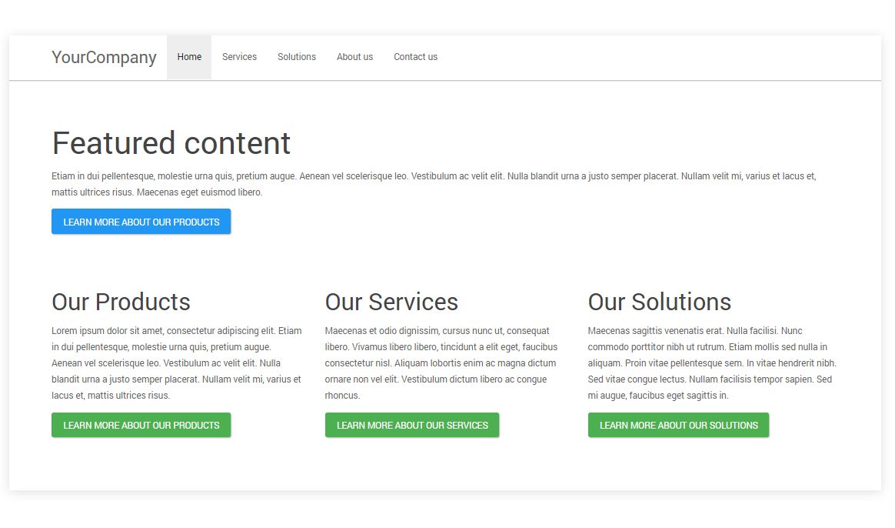
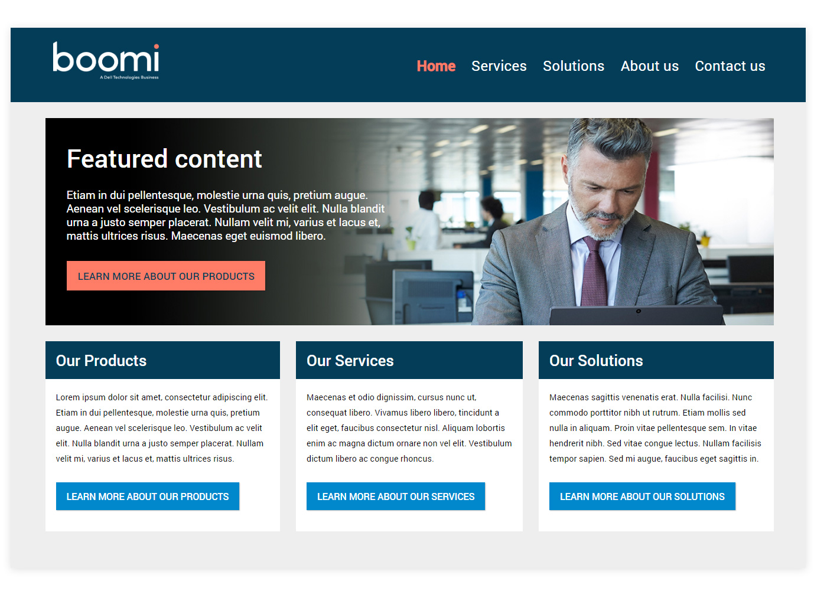
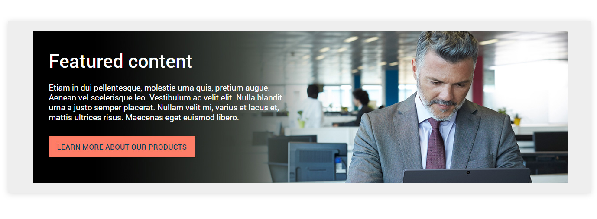
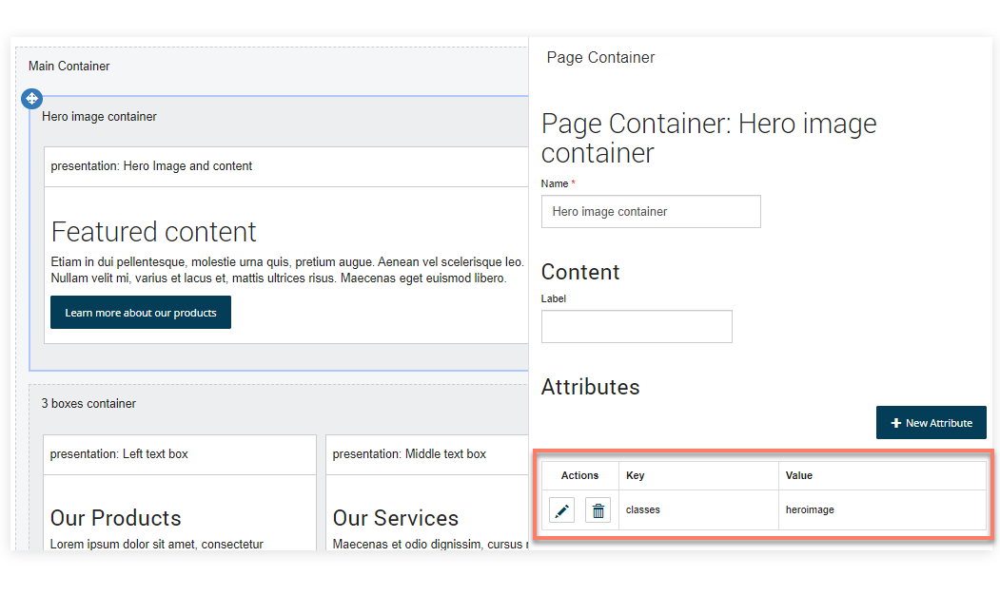
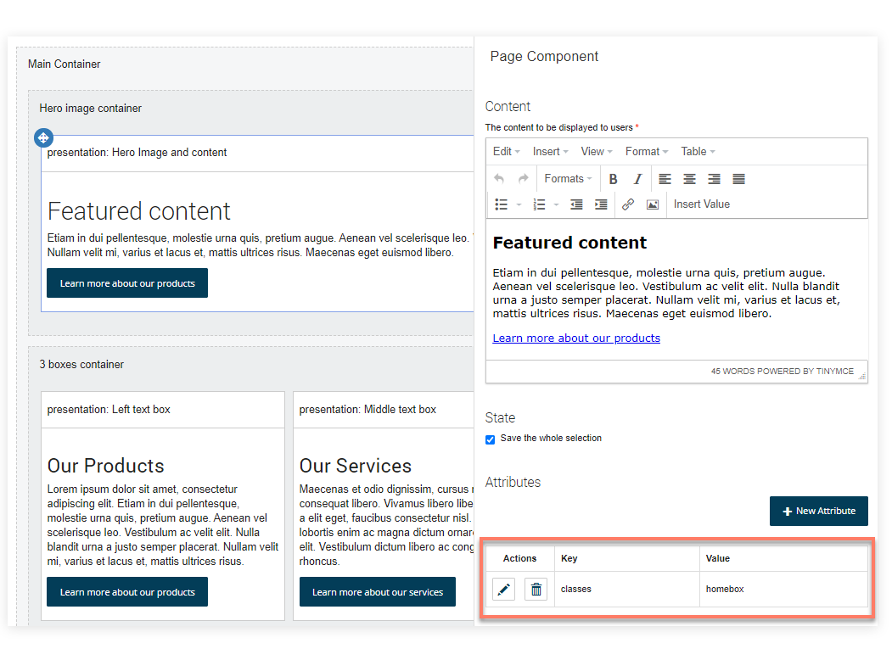
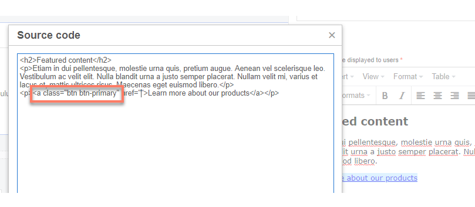
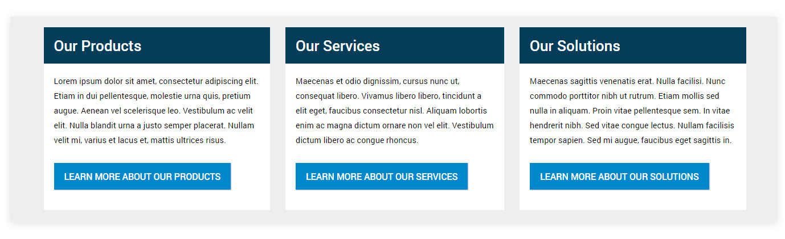

# Using CSS to customize a flow 

<head>
  <meta name="guidename" content="Flow"/>
  <meta name="context" content="GUID-39a3be31-b53a-432e-947d-70f34bf1b0e2"/>
</head>


This tutorial shows how you can use CSS to customize a simple flow web application using the default legacy player.

## About this tutorial 

In this tutorial, we are going to learn how CSS can be used to customize the appearance of a flow. This tutorial uses the default legacy player.

## What you will learn 

This tutorial is designed for intermediate users with some understanding of and experience with CSS, and aims to introduce the basic concepts involved in using CSS to customize a flow, such as overriding default selectors and classes, and using attributes to add custom classes to page components. This tutorial uses the default legacy player.

| |
|-|
|  **Duration:** 30 mins \|  **Skill level:** Intermediate |


## Before you begin 

-   Ensure that you understand how CSS styles can be added into a player, either inline or as a linked stylesheet. See [Adding CSS and Javascript to custom players](c-flo-Players_Stylesheets_ebaf21f6-277a-4a8e-8f12-e6d48c2a99be.md).

-   Ensure that you understand how to use browser development tools to inspect a flow web application, in order to detect the correct CSS styles to target/override when modifying the appearance of HTML elements on the page. See [ CSS reference](r-flo-CSS_Reference_d32122b8-0f11-47be-91c6-6986575f933e.md) and [Detecting the correct CSS style](c-flo-CSS_Detection_af239813-da04-45e3-8bda-9cb5d08d7ee9.md).

-   Ensure that you understand how to use the classes attribute to apply a custom class to components in a page layout. See [ Attributes reference](r-flo-Attributes_Reference_4f153424-8c52-4e24-b289-2d961f0b9830.md).


## Overview 

In this tutorial a very basic flow has been set up, that uses four presentation components in a page, and a navigation component, to display a simple home page.

When the flow is run using the default legacy player, it is displayed as follows:



When the flow is run using a custom player \(based on the default legacy player\) that contains additional CSS, the same flow is displayed as follows:



## Step 1: Customizing the navigation bar 

A number of CSS styles are used to modify the appearance of the navigation bar. We are simply going to override the existing CSS used to style a flow navigation component.


Adding a logo

A custom logo is inserted in place of the navigation label text, by adding `.mw-bs .navbar-brand` into the custom player and configuring it to display a logo image file from the assets library. The margins and padding are modified to give space around the logo, and the font size set to zero so that any label text is always hidden from view.

```language-css
.mw-bs .navbar-brand {
    background: url(https://yoururl/logo.png);
    background-position: left center;
    background-repeat: no-repeat;
    background-size: contain;
    width: 243px;
    height: 73px;
    font-size: 0px;
    margin: 10px 15px 10px 15px !important;
    padding: 0px 0px 0px 36px !important;
    }
```

Removing the horizontal line

The .mw-bs .navbar is targeted to remove the horizontal line from the bottom of the navigation, change the background color, specify the height, and add padding to the top of the navigation.

```language-css
.mw-bs .navbar {
    padding-top:15px;
    -webkit-box-shadow: 0 0px 0px rgba(0, 0, 0, 0.3);
    box-shadow: 0 0px 0px rgba(0, 0, 0, 0.3);
    background:#033D58;
    height:140px;
    }
```

Styling the menu items

The `.mw-bs .navbar-default .navbar-nav \> li \> a` is targeted to style the individual navigation menu items, increasing the font size and weight, and changing the color to white so that they show clearly on the dark blue background.

The `.mw-bs .navbar-default .navbar-nav \> .active \> a` is targeted to style the currently active individual navigation menu item, changing the color so that the user can see which page/menu item they are viewing.

```language-css
.mw-bs .navbar-default .navbar-nav > li > a {
    color: #ffffff;
    font-size: 1.7rem;
    font-weight:400;
    }
.mw-bs .navbar-default .navbar-nav > .active > a {
    color:#FF7C66;
    background-color:transparent;
    font-weight:600;
}
```

The `.mw-bs .navbar-nav` container is targeted to align the menu items to the right of the navigation bar, and add some more padding to the top, aligning the menu items with the logo.

```language-css
.mw-bs .navbar-nav {
 float: right;
 margin: 0;
 padding-top:25px;
 }
```

The `.mw-bs .navbar-collapse` is targeted to remove any padding on the right of the navigation bar, aligning the menu items completely to the right.

```language-css
.mw-bs .navbar-collapse {
 padding-right:0px;
 }
```

To learn more about navigation CSS, see [Navigation CSS](r-flo-CSS_Navigation_8fee82d5-854e-4327-b77f-8afeb3a62edf.md).

## Step 2: Customizing the featured content and applying a hero image 

A single presentation component is added into the page layout, inside a container. These are styled using the `classes` attribute, mapped to new CSS styles in the custom player. This method is used as we only want to apply the custom styling to only this particular container and component, not to all presentation components and containers.



Adding a background to the container

The container has a `classes` attribute added, with the value set to 'heroimage'. This means that the container will have the CSS `.heroimage` class applied by the custom player.



The `.heroimage` class is added to the custom player, and used to apply a background image to the entire container.

```language-css
.heroimage {
    background-image: url(https://yoururl/heroimage.jpg);
    }
```

To learn more about using the `classes` attribute, see [Using attributes to style components](c-flo-Att_Using_Classes_ed09909d-5c7e-48c2-be21-138f6490760e.md).

Formatting the featured content

Next, the content of the presentation component is styled with a `classes` attribute, with the value set to 'homebox'. This means that the component will have the CSS `.homebox` class applied by the custom player.



The root `.homebox` class is added to the custom player, and used to format the text within the component. A maximum width is set for the component, so that the text remains on the left of the container, rather than filling up the entire width and obscuring the image.

```language-css
.homebox  {
    color:#ffffff;
    margin-left:40px;
    max-width:600px;
    font-size:1.3rem;
    padding-bottom:30px;
    line-height:1.6rem;
    }
.homebox  p{
    padding-bottom:15px;
    }
```

The `.homebox h2` class targets the heading within the component, changing the font color to white.

```language-css
.homebox  h2{
    color:#ffffff;
    }
```

The 'Learn more...' hyperlink in the content is rendered as a button by adding 'class="btn btn-primary"' directly onto the hyperlink element in the source of the presentation component.



The `.mw-bs .btn-primary` CSS class is then modified in the custom player, changing the button colors, font, style and padding. Note that this CSS change will affect all 'primary' class buttons in the flow.

```language-css
.mw-bs .btn-primary {
    background-image:none!important;);
    background-color: #FF7C66;
    border-color: #FF7C66;
    border-radius:0;
    padding:10px 20px 10px 20px;
    color:#033D58;
    font-weight:500;
    font-size:1.2rem;
    }
```

To learn more about outcome button CSS, see [Buttons CSS](r-flo-CSS_Outcome_04570576-ce37-42f7-8885-0f3cabc204b3.md).

## Step 3: Customizing the highlighted content boxes 

A container is added to the page layout below the featured content container, and set to use the 'Columns' layout style so that any elements within it are laid out as equal columns. Three presentation components are added inside this container, and are styled using the `classes` attribute, mapped to a new CSS styles in the custom player.



Formatting the highlighted content boxes

Each component has a `classes` attribute added, with the value set to 'highlightbox'. This means that each component will have the CSS `.highlightbox` class applied by the custom player.

The root `.highlightbox` class is used to format the default font size within the component.

```language-css
.highlightbox  {
     font-size:1rem;
     }
```

The `.highlightbox h3` class targets the heading within the component, changing background, padding, style and font color to render the heading as a block that spans the component.

```language-css
.highlightbox h3  {
    background:#033D58;
    color:white;
    padding:20px;
    margin:0;
    }
```

The `.highlightbox p` class targets the body text within the component, changing background, padding, and font color to render the body content as a block that spans the component.

```language-css
.highlightbox p  {
    background:black;
    color:black;
    padding:20px 20px 10px 20px;
    margin:0;
    background:#ffffff;
    }
```

The `.highlightbox a` class targets the final hyperlink element within the component, ensuring that there is adequate padding at the bottom of the component.

```language-css
.highlightbox a  {
    margin-bottom:30px!important;
    }
```

The `.highlightbox label` class targets the `<DIV>` label element within the component, removing it from the content altogether, as no label is required, and the element is not needed.

```language-css
.highlightbox label {display:none;}
```

As with the featured content, each 'Learn more...' hyperlink in the content boxes is rendered as a button by adding 'class="btn btn-success"' directly onto the hyperlink element in the source of the presentation component.

The `.mw-bs .btn-success` CSS class is then modified in the custom player, changing the button colors, font, style and padding. Note that this CSS change will affect all 'success' class buttons in the flow.

```language-css
.mw-bs .btn-success {
    background-image:none!important;);
    background-color: #0087cc;
    border:0;
    border-radius:0;
    padding:10px 20px 10px 20px;
    color:#ffffff;
    font-weight:500;
    font-size:1.1rem;
    }
```

## Step 4: Customizing general typography 

The font size and styles for general typographic elements in the entire flow are also defined in the custom player. The default font size for the entire flow is specified using `.mw-bs`, as well as default second and third-level headings.

```language-css
.mw-bs {font-size:0.8rem;}
.mw-bs h2 {
    font-size:3rem;
    font-weight:500;
    margin-bottom:30px;
    }
.mw-bs h3 {
    font-size:1.8rem;
    font-weight:500;
    }
```

To learn more about general typography CSS, see [Typography CSS](r-flo-CSS_Typography_1b271022-08bb-4ad4-b96f-2ae94b22b7c7.md).

## Step 5: Customizing the page layout 

A number of general page layout elements are also modified, such as the background of the page using `.mw-bs .main-scroller`, and the width of the flow content area above the 1200px breakpoint using `.mw-bs .container`.

```language-css
.mw-bs .main-scroller {
    background:#eee;
    }
.mw-bs .mw-container {
    margin-top:5px;
    margin-bottom:30px;
    }
@media (min-width: 1200px) {
.mw-bs .container {
    width: 1400px;
  }}
```

To learn more about page containers CSS, see [Containers CSS](r-flo-CSS_Containers_3f6c5da4-4820-4880-bd19-8a0505d4dea5.md).

## Resources: Tutorial CSS example 

The full example CSS used in this tutorial is provided below. This tutorial uses the default legacy player.

:::caution

This CSS is provided for the purposes of this tutorial only, and should not be considered a complete CSS template for your flows.

:::

```language-css
<style>
/* General page layout */
.mw-bs .main-scroller {
    background:#eee;
    }
.mw-bs .mw-container {
    margin-top:5px;
    margin-bottom:30px;
    }
@media (min-width: 1200px) {
.mw-bs .container {
    width: 1400px;
  }}
/* General page typgraphy */
/* Set default font size */
.mw-bs {font-size:0.8rem;}
.mw-bs h2 {
    font-size:3rem;
    font-weight:500;
    margin-bottom:30px;
    }
.mw-bs h3 {
    font-size:1.8rem;
    font-weight:500;
    }
/* Buttons */
.mw-bs .btn-primary {
    background-image:none!important;);
    background-color: #FF7C66;
    border-color: #FF7C66;
    border-radius:0;
    padding:10px 20px 10px 20px;
    color:#033D58;
    font-weight:500;
    font-size:1.2rem;
    }
.mw-bs .btn-success {
    background-image:none!important;);
    background-color: #0087cc;
    border:0;
    border-radius:0;
    padding:10px 20px 10px 20px;
    color:#ffffff;
    font-weight:500;
    font-size:1.1rem;
    }
/* Navigation */
/* remove the horizontal line under the navigation container */
.mw-bs .navbar {
    padding-top:15px;
    -webkit-box-shadow: 0 0px 0px rgba(0, 0, 0, 0.3);
    box-shadow: 0 0px 0px rgba(0, 0, 0, 0.3);
    background:#033D58;
    height:140px;
    }
/* Replace nav label with logo image and modify padding */
.mw-bs .navbar-brand {
    background: url(https://yoururl/logo.png);
    background-position: left center;
    background-repeat: no-repeat;
    background-size: contain;
    width: 243px;
    height: 73px;
    font-size: 0px;
    margin: 10px 15px 10px 15px !important;
    padding: 0px 0px 0px 36px !important;
    }
/* Format individual navigation menu items */
.mw-bs .navbar-default .navbar-nav > li > a {
    color: #ffffff;
    font-size: 1.7rem;
    font-weight:400;
    }
.mw-bs .navbar-default .navbar-nav > .active > a {
    color:#FF7C66;
    background-color:transparent;
    font-weight:600;
}
/* Align individual navigation menu items right */
.mw-bs .navbar-nav {
    float: right;
    margin: 0;
    padding-top:25px;
    }
/* Featured Content */
/* Add background image to the featured content container */
.homebox  {
    color:#ffffff;
    margin-left:40px;
    max-width:600px;
    font-size:1.3rem;
    padding-bottom:30px;
    line-height:1.6rem;
    }
/* Format the h2 of the featured content container */
.homebox  h2{
    color:#ffffff;
    }
/* Format the p of the featured content container */
/* Background image for the featured content presentation component */
.heroimage {
    background-image: url(https://yoururl/heroimage.jpg);
    }
/* Highlighted content boxes */
/* format hightlight boxes */
.highlightbox  {
     font-size:1rem;
     }
/* format hightlight box h3 */
.highlightbox h3  {
    background:#033D58;
    color:white;
    padding:20px;
    margin:0;
    }
/* format hightlight box p */
.highlightbox p  {
    background:black;
    color:black;
    padding:20px 20px 10px 20px;
    margin:0;
    background:#ffffff;
    }
/* format hightlight box a */  
.highlightbox a  {
    margin-bottom:30px!important;
    }
/* remove hightlight box label container */
.highlightbox label {display:none;}
</style>
```