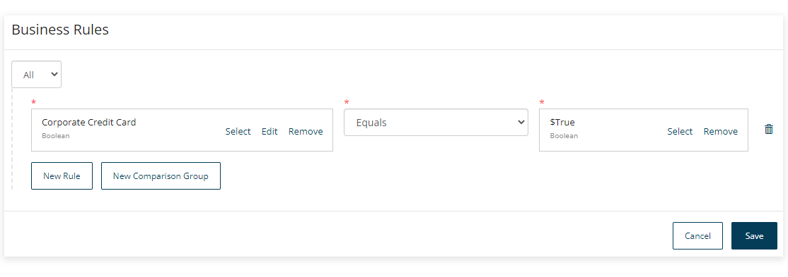
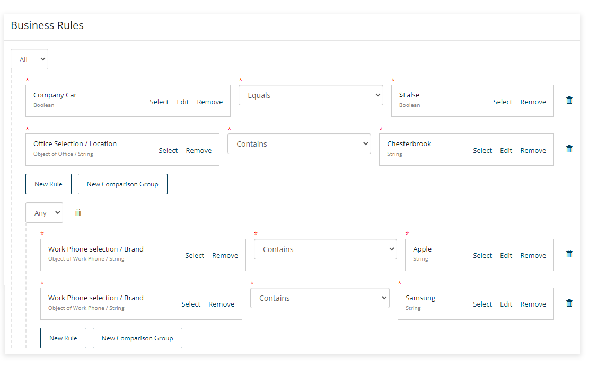
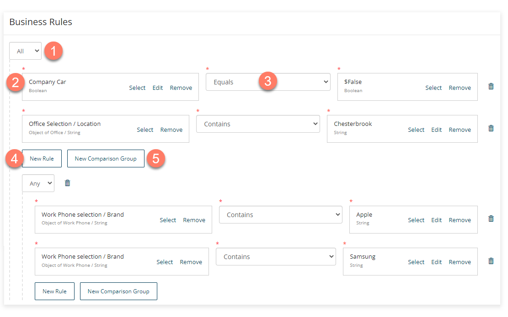
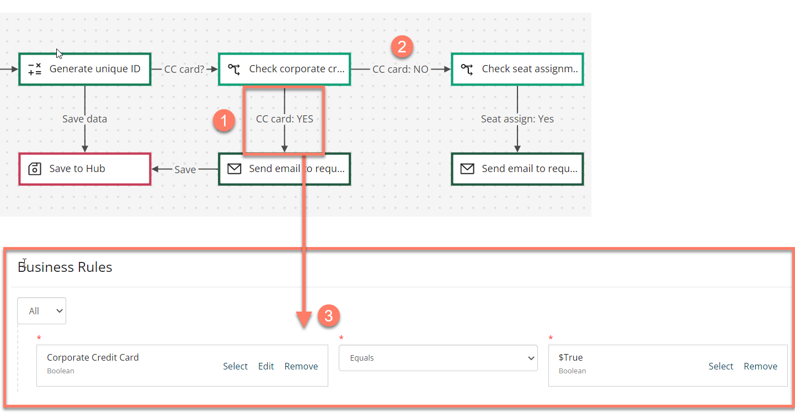

# Business rules

<head>
  <meta name="guidename" content="Flow"/>
  <meta name="context" content="GUID-e8860ab5-4260-449c-b72d-137d9902baec"/>
</head>

Business rules allow you to define different outcomes or actions, based on whether the conditions specified in the rule have been met. Business rules are typically applied in a flow to determine which path a flow should take if there are multiple outcomes available, but can also be implemented on a user interface, data, or validation.

## Overview 

Business rules are added to outcomes to define the path that a flow will take. See [Outcomes](c-flo-Outcomes_4049ee93-d7e4-4bc0-ba33-88e523bf4d89.md).

If you have multiple outcomes from a map element on the flow canvas, you can set up business rules on each outcome to define which outcome path a user will be directed along. This is done by configuring conditional statements in the business rule.

-   If no business rules are added to outcomes from a map element, or when the business rules for more than one outcome match and are both satisfied, the flow will always progress along the outcome that is set to the highest order priority. For example, an outcome with an order set to '0' will be followed above an outcome with an order set to '1'.

-   Business rules can be configured as simple or fairly complex logical comparisons, with multiple nested rules and comparisons used to build up the conditional statement. Business rules are formed using `ANY` and `ALL` comparison operators:

    -   ​**ANY** = Equivalent to an OR​ statement

    -   **ALL** = Equivalent to an AND​ statement

    For example, the following image shows a complex business rule that is met in the following scenario: '*IF the value of Company Car is False __AND__ the Office Location is Chesterbrook ​__AND__ the selected Work Phone brand is either Apple __OR__ Samsung*'.

    

-   Business rules cannot be set up on outcomes that are rendered as buttons, as these outcomes are triggered by a user clicking the outcome button.

-   Business rules can only be set up on outcomes connected to decision, message or page map elements.

## Adding a business rule to an outcome

To add a business rule to an outcome:

1.  Create an outcome from one map element to another that allows business rules to be added \(from a decision map element to a step map element for example\).
2.  On the **Outcome** panel, click **Create Business Rules** in the **Business Rules** section to open the **Business Rules Editor**.
3.  Create new and nested business rule conditions by adding values and operators as required:

    

    -   **Any/All**: Select what type of statement you wish to build. 

    -   **Values**: Click **Select or create a new Value** to select the relevant value\(s\) or create a new value that you wish to use in the conditional statement. When setting up a conditional statement, you will typically need to specify two values to compare. 

    -   **Operators**: Select the type of operator that you wish to use with the selected value from the standard types of logic operations, such as "Equals", "Greater than", and so on. 

    -   **New Rule**: Create a new business rule, including nesting a business rule inside another. 

    -   **New Comparison**: Create a new comparison condition for the business rule \(**ANY** = equivalent to an OR​ statement, **ALL** = Equivalent to an AND​ statement\). 

4.  Click **Save** to save the business rule and return to the **Outcome** panel. To edit an existing business rule on an outcome, click **Edit Business Rules**.

## A worked example - using a business rule to define a flow path 

In this example, a page map element in an employee onboarding flow asks a user to indicate whether they require a company credit card or not, using a simple toggle component to return a boolean value of either '$True' or '$False'.

There are two possible outcomes:

-   If the user selects "Yes", the flow needs to be directed along the outcome that will initiate a credit card request for the employee. 

-   If the user selects "No", the flow needs to be directed along a different outcome, for example, to the next stage in the flow that checks whether the user requires a seat assigned. 

This routing logic is handled by setting up a business rule on the first possible outcome. 

1.  The business rule checks whether the user answered "Yes", and if they did then the flow will proceed along that outcome.
2.  If the user answered "No", then the business rule is not met, and the flow will progress to the next outcome instead, directing the user to the seat assignment section of the flow.