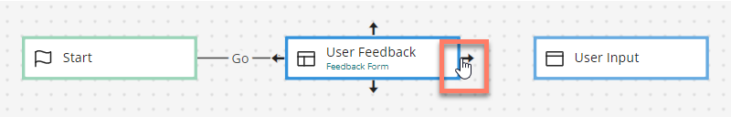
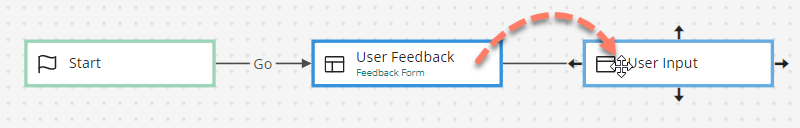
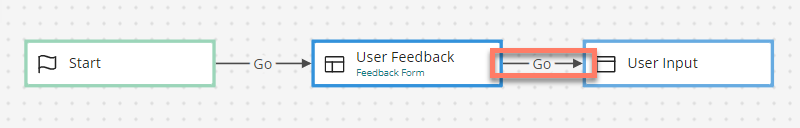

# Joining map elements with outcomes on the flow canvas 

<head>
  <meta name="guidename" content="Flow"/>
  <meta name="context" content="GUID-dfc06eea-8adf-4baa-a35e-4e8a3d3b1e75"/>
</head>

Outcomes are used to connect map elements together into a workflow, allowing flow users to move from one map element in the flow to another, or from one map element into another flow.

Outcomes are displayed on the flow canvas as labelled arrows between two map elements. See [Outcomes](c-flo-Outcomes_4049ee93-d7e4-4bc0-ba33-88e523bf4d89.md).

## Joining two map elements with an outcome 

To join two map elements with an outcome:

1.  Hover over the first map element until arrows appear on the map element, and then hover over the arrow direction that you wish to create an outcome from, until the pointer changes to a hand icon. Left-click and hold.

    

2.  Drag the outcome arrow onto another map element, and release and drop the outcome onto the second map element.

    

3.  A configuration panel opens, allowing you to configure and save the outcome. Once saved, the outcome is displayed as a labelled arrow between the two map elements.

    

## Moving an outcome to a different map element 

You can change which map element is connected to by an outcome:

1.  Left-click on the outcome arrow connector to select it.
2.  Hover over the end of the connector until the pointer changes to a hand icon.
3.  Left-click and drag the outcome over the new map element. Release and drop the outcome onto the new map element.
4.  The **Confirm Move** dialog is displayed. Click **Save** to move the outcome to the new map element.

## Re-positioning the outcome connector arrow 

You can change the position of the outcome connector arrow, for example to make the flow canvas layout clearer if outcome connector lines have become too overlapped, making the flow visually difficult to understand.

1.  Left-click on the outcome arrow connector to select it.
2.  Left-click and hold on the square connector icon in the outcome arrow connector, and drag the connector line around the canvas.
3.  Release and drop the connector line when you are satisfied with the new position. If you wish to re-position the outcome back to it's starting position, right-click the outcome and select **Reset Position**.

## Deleting outcomes from the flow canvas 

You can delete outcomes from the flow canvas:

1.  Click on the outcome arrow connector to select it and press the **Delete** key, or right-click on the outcome arrow connector and select **Delete**.
2.  The **Delete Outcome** dialog is displayed. Click **Delete** to delete the outcome from the canvas.