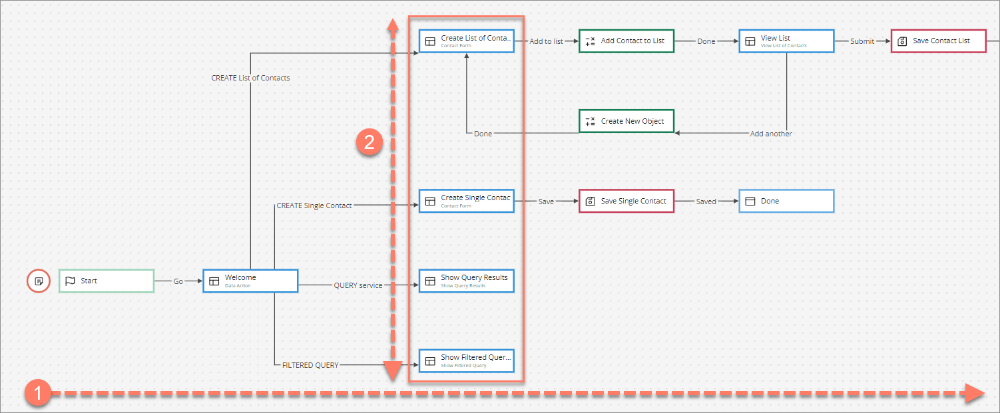

# Best practice for flow canvas layout 

<head>
  <meta name="guidename" content="Flow"/>
  <meta name="context" content="GUID-58a35d34-73e5-46f9-bcf1-1489e4f8815a"/>
</head>

When working with the flow canvas, it is important to be aware of best practice guidelines for efficiently organizing and laying out map elements on the canvas.

## Horizontal progression and vertical complexity 

The central principle for laying out your flows on the canvas is that progression through a flow should be laid out horizontally from left to right, and complexity within sections of a flow should be laid out vertically.

The example diagram below shows this best practice applied to a flow:

-   **Horizontal Progression**: In this example flow, the progression of a user through the flow is visually clear as the map elements have been laid out horizontally from left to right, simulating the journey of the user through the flow once it has been published as a web application. 

-   **Vertical Complexity**: In this example flow, whenever a stage of the flow is reached that requires more complexity in terms of multiple map elements, decisions, configuration etc, it is helpful to lay these elements out vertically so that they are visually grouped against each stage of progression within the flow. 

## Overlapping outcomes 

In this example flow, you can clearly see the relationship between map elements and their connecting outcomes, as the outcomes have been laid out so that they do not overlap.

Some flows will require a certain amount of overlap, but where possible it is best to avoid overlapping outcome connector lines as much as possible. See [Joining map elements with outcomes on the flow canvas](c-flo-Canvas_Joining_Elements_dfc06eea-8adf-4baa-a35e-4e8a3d3b1e75.md).