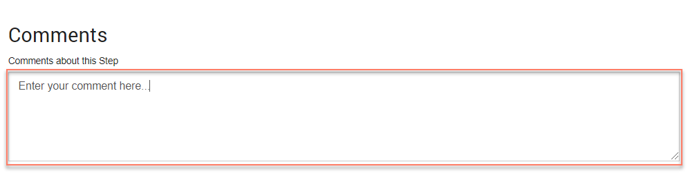

# Adding Comments to a map element 

<head>
  <meta name="guidename" content="Flow"/>
  <meta name="context" content="GUID-647ce9d6-5c9e-4e27-aa29-1a69732957a5"/>
</head>

Comments can be added to a map element to record useful information.

These comments are not displayed to end users of the flow, but only to users working with the map element within .

## Adding a comment to a map element 

To add a comment to a map element:

1.  Open the configuration panel for the map element you wish to add a comment to. See [Editing map elements on the flow canvas](c-flo-Canvas_Editing_Elements_656a364c-879f-4153-8ee5-b19e47dca8f5.md).
2.  Enter your comments into the **Comments about this \{map element\}** field.

    

3.  Save any changes you have made to the map element, including your comment.