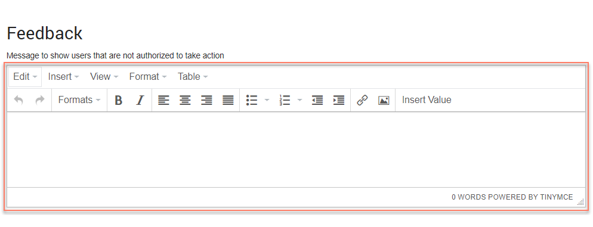

# Adding Feedback to a map element 

<head>
  <meta name="guidename" content="Flow"/>
  <meta name="context" content="GUID-1240ae6b-af20-4eee-b5b4-5e172926c4a4"/>
</head>

This configuration option allows an optional customized message to be shown to users who are not authorized to perform an action when using the published flow.

The nature of the feedback depends on which map element it is being defined against. For example, if this is defined on a step map element, the feedback will take the form of a message shown to users who are not authorized to access the map element, whereas the message map element allows you to show feedback to a user not authorized to access the map element as well as provide a feedback message to users waiting for the message map element to complete loading.

## Adding feedback to a map element 

To add feedback to a map element:

1.  Open the configuration panel for the map element you wish to add feedback to. See [Editing map elements on the flow canvas](c-flo-Canvas_Editing_Elements_656a364c-879f-4153-8ee5-b19e47dca8f5.md).
2.  Enter and format the feedback message in the **Message to show users that are not authorized to take action** field \(and/or the **Message to show users that are waiting for this Message to complete** field if configuring a message map element\).

    

3.  Click **Save** to save any changes you have made to the map element, including your feedback.

## Map elements this configuration option is available for 

This configuration option can be defined for the following map elements:

-   [Step map elements](c-flo-ME_Step_f2f3f25f-f6c8-4f34-9c44-6210cdef30a2.md): Configure a message to be shown to users who are not authorized to access the map element.

-   [Page map elements](c-flo-ME_Page_539c415f-59d7-47d5-90ef-cb3a108b3010.md): Configure a message to be shown to users who are not authorized to access the map element.

-   [Message map elements](c-flo-ME_Message_342e9efb-0f11-4083-a2dc-195d52d1f939.md): Configure a message to be shown to users who are not authorized to access the map element, and also define a feedback message to show to users waiting for the message map element to complete loading.