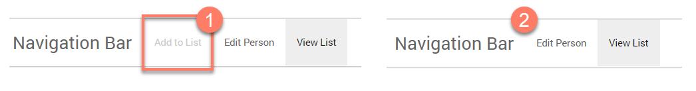
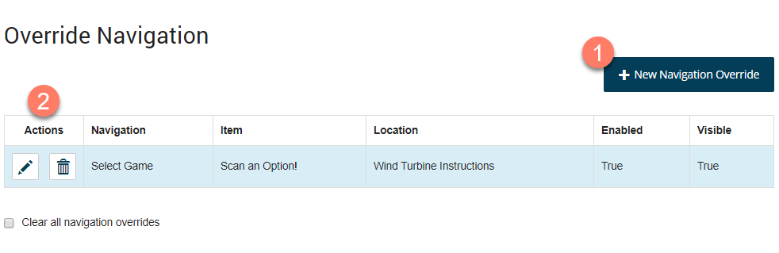

# Configuring Navigation Override on a map element 

<head>
  <meta name="guidename" content="Flow"/>
  <meta name="context" content="GUID-69de98e7-e100-4957-a865-2a2d76ffdb90"/>
</head>

A navigation override can be used to override \(and modify\) the navigation behaviour defined in a flow for a map element.

Navigation is usually defined for an entire flow by setting up a navigation bar. See [Navigation](c-flo-Navigation_871ceb19-15cf-4fe6-bc34-7e07acbf5878.md).

However, a navigation override can also be set up for individual map elements, allowing you to 'override' the main navigation, for example to disable or hide navigation for a map element. For example, a navigation menu is already set up for a flow, but you then decide to disable the menu option for a particular map element using a navigation override instead of changing the main site navigation.

For example, the image below shows how a navigation override can disable a navigation element , or hide it completely from an end user. 

## Adding a navigation override to a map element 

1.  Open the configuration panel for the map element you wish to override navigation for. See [Editing map elements on the flow canvas](c-flo-Canvas_Editing_Elements_656a364c-879f-4153-8ee5-b19e47dca8f5.md).
2.  Expand the **Advanced** section by clicking on the **Advanced** heading.
3.  Locate the **Override Navigation** section within this.
4.  Any existing navigation overrides for the map element are shown and can be edited or deleted as required. Click **New Navigation Override** to add a new navigation override. 

    

5.  The **Override Navigation** form is displayed. Define the navigation override options:
    -   **Which Navigation do you want to override?**: Select the navigation that you wish to override from the drop-down menu.

    -   **Which item do you want to override?**: Select the menu item in the navigation that you wish to override.

    -   **Change the location of the Item to**: This optional field allows you to select a new location for the menu item to be re-directed to. However, this can be left blank if you only wish to disable or hide the menu item.

    -   **Should the Item be visible to users?**: This option is selected by default which means that the menu item is displayed to end users of the flow. De-select this option to hide the menu item so that it is no longer shown in the navigation menu.

    -   **Should the Item be enabled for users to select?**: This option is selected by default which means that the menu item is able to be selected by end users of the flow. De-select this option to disable the menu item so that it is still displayed to end users but is greyed out and cannot be selected from the navigation menu.

6.  Click **Apply Navigation Override** to save the new navigation override and return to the configuration panel. The new navigation override is shown in the **Override Navigation** section. 
7.  Click **Save** to save your changes and apply the override to the selected map element.

**Note:** Once you have added a navigation override, the **Clear all navigation overrides** option is displayed and can be selected to temporarily disable all overrides on the map element until the check box is cleared again. This allows you to quickly apply and remove any overrides without having to delete them permanently.

## Map elements this configuration option is available for 

This configuration option can be defined for all map elements. Best practice guidelines may apply to your flows as follows:

-   If a navigation item is hidden or disabled, any child navigation items that belong to it are also hidden or disabled.

-   Overriding the linked map element to the current map element allows a single navigation item to remember which step/page a user has reached in a particular 'section'. This can be useful for wizard style applications where a single navigation item represents a set of steps/pages.

-   It is often better to perform navigation overrides using an operator map element. If the navigation override is performed by a page or step, it can be harder to manage navigation behaviors when a user moves around inside the flow. For example, if a page disables a navigation item, every time the user returns to the page, the navigation item will be disabled. Often, however, the behavior is that the navigation item should be disabled at the beginning of the flow, but not disabled simply because the user jumps back to make a change.

-   Consider using decision/business rules with the operator map element to change the navigation based on complex business logic.