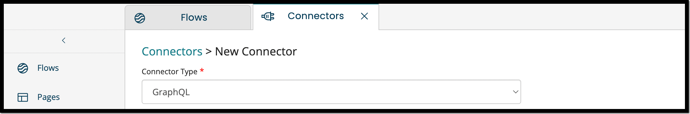
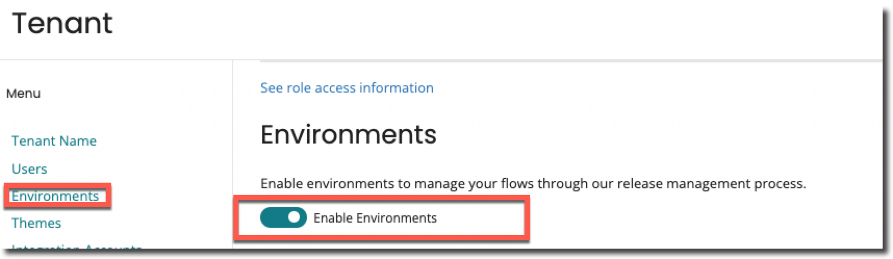
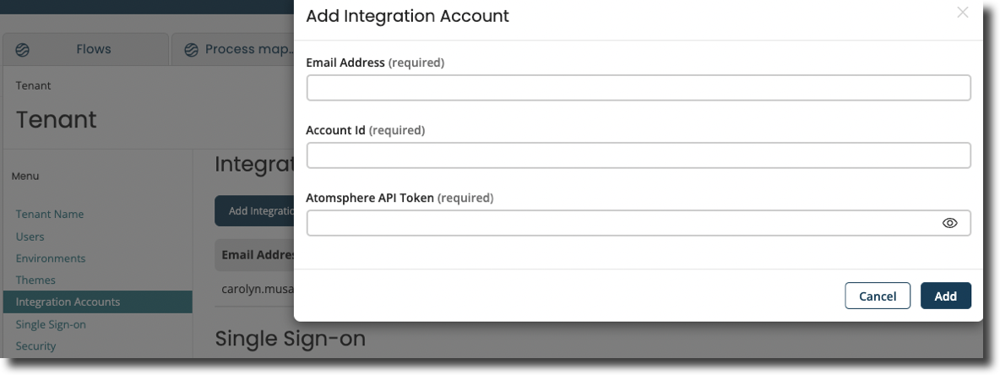

# GraphQL Connector

<head>
  <meta name="guidename" content="Flow"/>
  <meta name="context" content="GUID-77181d90-9d66-4ce1-bbbb-1c1278fd1b63"/>
</head>

## Overview

GraphQL is a query language for APIs and a runtime for fulfilling the queries with your existing data. It offers a comprehensive and intelligible description of the data in your API, empowers you to request only what you want, makes it simpler to adapt APIs over time, and allows powerful developer tools. GraphQL is a syntax that developers may use to request specific data from many sources.

## Navigation

1. Go to **Connectors** on the left-hand-menu.
2. Select **New Connector**.
3. From the drop-down under Connector Type, select **GraphQL**.

## Prerequisite

### Configuring Integration Account

The steps to setup under tenant:

1. On the main menu, click **Settings** and select **Tenant** from the drop-down.
2. In the Tenant page, on the left side under Menu, select **Environments** and enable the Enable Environment toggle button.

3. On the same menu, select **Integration Accounts**, click **Add Integration Account**.
4. You will be directed to a page where you must enter your **Email Address**, **Account Id**, and **Atmosphere API Token**.

:::note

You can retrieve the Email Address, Account ID and Atmosphere API Token from your Integration Account.

:::

5. Select the **Integration Accounts** tab in the Environments page for each environment in your tenant and point the tenant environment to the relevant integration environment.

## Additional Notes

- GET requests encode the payload into the URL of the GET request.
- POST requests use the payload in a typical request body. It is recommended to use a POST over GET for more complex requests.
- Variables are added as JSON into a Key Value pair:

    ``{"queryId": "1"}``
