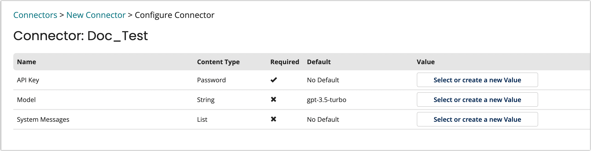

# OpenAI Connector

<head>
  <meta name="guidename" content="Flow"/>
  <meta name="context" content="GUID-4856d164-98fd-42e9-b345-5e33f8cfaeff"/>
</head>

## Overview

The popular conversational interface ChatGPT is created by OpenAI, an artificial intelligence research organization. In addition, you may use its many models for text editing, image generation, and even categorization. With OpenAI, you may develop and refine your own models and expose them internally.

## Navigation

1. Go to **Connectors** on the left-hand-menu.
2. Select **New Connector**.
3. From the drop-down under Connector Type, select **OpenAI**.

## Configuration

Follow the steps to configure the  OpenAI connector:

1. Navigate to the **Connectors** screen.
2. Provide a name to your OpenAI connector under **Name**, the URL field is a pre-populated input.
3. Click **Retrieve Connector Configuration Data**.
4. Configure the following three fields:
    - **API Key**
    - **Model** 
    - **System Message**

5. Click **Install**.

:::note

To view settings and configuration, click **Preview Actions & Types**.

:::

## OpenAI connector configuration values

|Option|Type|Default Value|Description|
|:-----|:---|:------|:------------|
|API Key|Password|None|The Open API key to use if API key based authentication is required.|
|Model|String|gpt-3.5-turbo|The model's name with whom you wish to communicate. This is an optional field, if no value is specified it will default to *gpt-3.5-turbo*.|
|System Message|List|None|The values entered into the $Chat Message list. They will always appear top in the list of messages delivered to OpenAI.|
