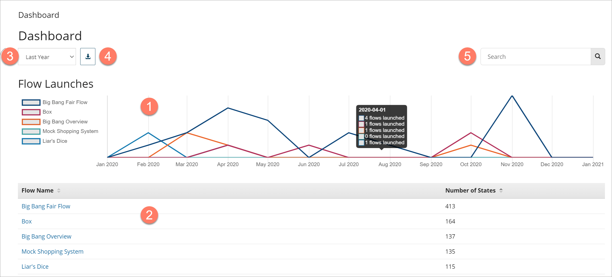

# Dashboard

<head>
  <meta name="guidename" content="Flow"/>
  <meta name="context" content="GUID-4f5270f0-9144-4ab7-8cef-d8007c075190"/>
</head>

The **Dashboard** page provides a dashboard view of all the flows launched within your tenant, and allows you to drill down into individual flows to view detailed flow state, log and root fault information.

## Opening the page

-   Select **Dashboard** from the left-hand menu.

## Page overview

-   The dashboard is divided into two main areas:

    -   The **Flow Launches** chart  in the upper half of the page provides a visual overview of the number of times the top 5 most launched flows have been launched within the selected date range. Hover over a date on the chart to view details of the number of launches.

    -   The **Flow States** table  in the bottom half of the page provides a list of all the flows that have been launched and how many states have been created for each flow. Click on a flow in the **Flow Name** column to open the [Insights](c-flo-Dashboard_Insights_Details_page_e683bf2d-5c66-465e-84bf-ecc51c02496b.md) page and view details of the individual flow states for the flow.

-   The date range for the dashboard is selected in the **Date Range** drop-down menu. 

-   Click the **Download results in CSV format** icon  to download the dashboard results as a .CSV file. See [Downloading Dashboard results](t-flo-Dashboard_Downloading_361e6922-d0e2-440e-b453-683ae6fe24c2.md).

-   Filter the page results by searching for specific flows using the **Search** field.  The **Flow Launches** chart and the **Flow States** table update to show only information for the flows that match your search.

-   Flows are automatically added to the dashboard once they have been created.