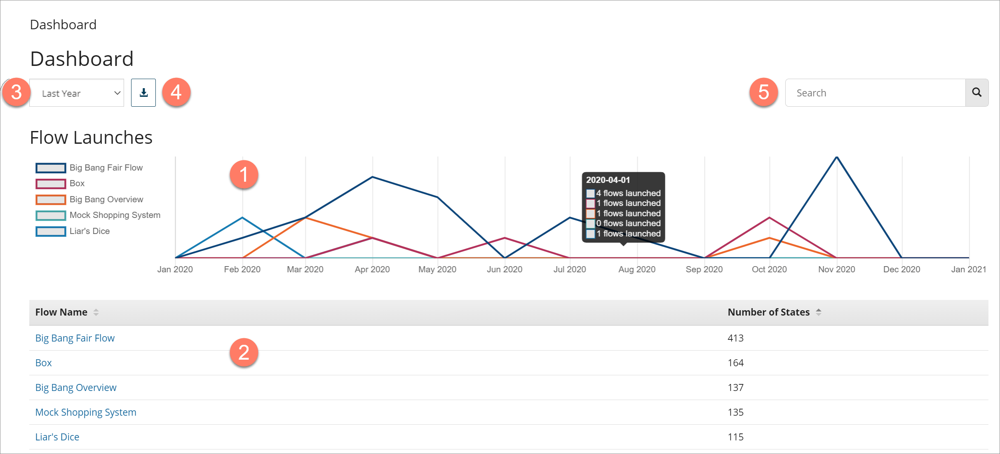

# Dashboard page

<head>
  <meta name="guidename" content="Flow"/>
  <meta name="context" content="GUID-88ea8c15-cf67-421d-b022-d9f3e712b2a5"/>
</head>

The **Dashboard** page provides a dashboard view of all the flows within your tenant.

## Opening the page

-   Select **Dashboard** from the left-hand menu on the **Home** tab.

## Page overview

-   The dashboard is divided into two main areas - a **Flow Launches** chart in the upper half of the page  and a **Flow States** table  below this.

-   The **Flow Launches** chart provides a visual overview of the number of times the top 5 most launched flows have been launched within the date range selected in the **Date Range** drop-down menu . Hover over a date on the chart to view details of the number of launches.

-   The **Flow States** table provides a list of all the flows that have been launched and how many states have been created for each flow. Click on a flow in the **Flow Name** column to drill down into details of the individual states of the flow on the **Insights Flow Dashboard Details** page. See [Insights](c-flo-Dashboard_Insights_Details_page_e683bf2d-5c66-465e-84bf-ecc51c02496b.md).

-   Click on the **Download results in CSV format** icon  to download the dashboard results as a .CSV file. See [Downloading Dashboard results](t-flo-Dashboard_Downloading_361e6922-d0e2-440e-b453-683ae6fe24c2.md).

-   Filter the results on the page by searching for specific flows using the **Search** field.  The **Flow Launches** chart and the **Flow States** table will update to show only information for the flows that match your search.