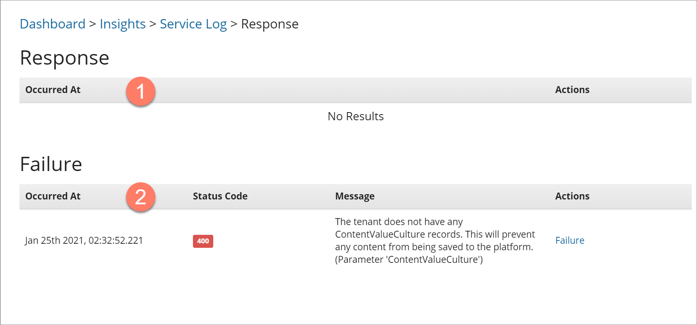
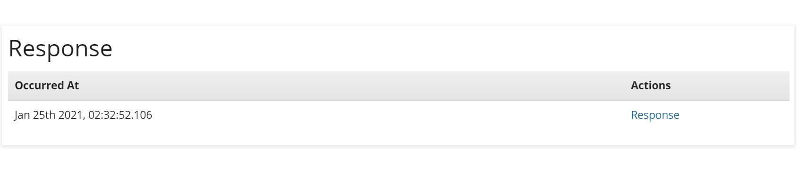
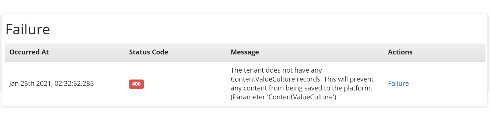

# Service Log Response

<head>
  <meta name="guidename" content="Flow"/>
  <meta name="context" content="GUID-4c8614c3-a46d-4971-956d-c94759d5826b"/>
</head>

The **Service Log Response** page provides detailed information on the service log event selected on the **Service Log** page.

## Opening the page

-   Click the **Response** link in the **Actions** column of the event that you wish to view information for on the [Connector Log](c-flo-Dashboard_Service_Log_878d14da-33a6-4728-8e5e-6dfe3364edee.md) page.

## Page Overview

The page is divided into two main sections, with information displayed depending on whether the API endpoint request was successful or failed.

-   **Response**: If the API endpoint request was successful, details and additional actions are displayed in this section. 

    

    -   **Occurred At**: The date and time when the event was logged.

    -   **Actions**: Click **Response** to open the **Response Content** form and view the JSON formatted metadata that was returned from the successful API endpoint request.

-   **Failure**: If the API endpoint request failed, details and additional actions are displayed in this section. 

    

    -   **Occurred At**: The date and time when the event was logged.

    -   **Status Code**: The Rest API status code that was returned with the failure.

    -   **Message**: Displays the failure message from the metadata response; this should provide useful information about why the API endpoint request failed.

    -   **Actions**: Click **Failure** to open the **Failure Content** form and view the JSON formatted metadata that was returned from the failed API endpoint request.