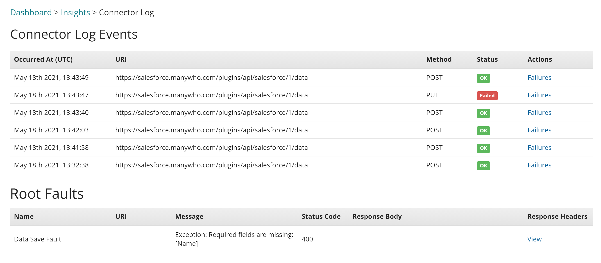

# Connector Log

<head>
  <meta name="guidename" content="Flow"/>
  <meta name="context" content="GUID-878d14da-33a6-4728-8e5e-6dfe3364edee"/>
</head>

The **Connector Log** page provides detailed information on the connector log events and any root faults for the flow state selected on the **Insights** page.

## Opening the page

-   Click the **Log** link in the **Actions** column of the flow state that you wish to view information for on the [Insights](c-flo-Dashboard_Insights_Details_page_e683bf2d-5c66-465e-84bf-ecc51c02496b.md) page.

## Page Overview

The page is divided into separate sections:

-   Connector Log Events

-   Root Faults

## Connector Log Events

The **Connector Log Events** table displays all the connector log events for the selected flow state, with each event shown on a separate row. The table columns provide information about each specific event as follows:

-   **Occurred At**: The date and time when the event was logged.

-   **URI**: The API endpoint that the event occurred against.

-   **Method**: The REST API method executed against the API endpoint, from one of the four standard REST API methods \(GET, POST, PUT, DELETE\). The selected method will depend on what action was performed against the API endpoint.

-   **Status**: Indicates whether the API endpoint request was successful or not.

    -   **OK**: The API endpoint request was successful.

    -   **Failed**: The API endpoint request failed to execute correctly. You can view further details for this failure by clicking the **Response** link in the **Actions** column \(see below\).

-   **Actions**: If an event was logged with a 'Failed' status, select **Failures** to open the **Failures** form and view the JSON formatted metadata for the failed request.

    **Note:** Passwords are not stored in connector invoker logs, and so are not displayed in the metadata.

## Root Faults

The **Root Faults** table displays information on any root fault/system errors that occur during the execution of the selected flow state, with each fault event shown on a separate row.

The table columns provide information about each specific fault as follows:

-   **Name**: The name of the root fault, such as a 'Data Save Fault' for example.

-   **URI**: The API endpoint that the fault occurred against, if applicable.

-   **Message**: The descriptive message returned for the fault. For example, if a connector did not receive a valid response then an HTTP status code 502 "Bad Gateway" message is generated. If the message returned is over 65 characters in length it will be truncated; click the **View** link to view the full message text.

-   **Status Code**: The HTTP status code returned for the fault. For example, standard HTTP status codes such as Client errors \(400 – 499\) and Server errors \(500 – 599\).

-   **Response Headers**: If an HTTP response header is returned with the fault, click the **View** link to view the formatted response header details.

:::note

Root fault information can also be viewed when running a flow in debug mode. See [Debugging a flow](c-flo-Debugging_a82ae672-dd07-469f-b2a4-baa8180cb522.md).

:::