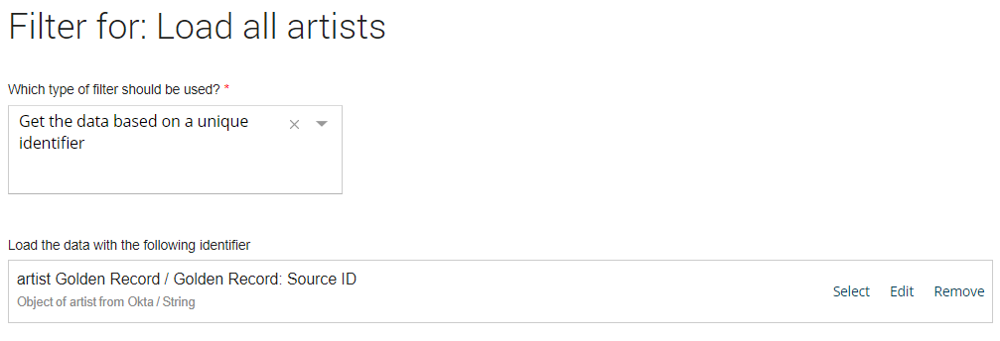
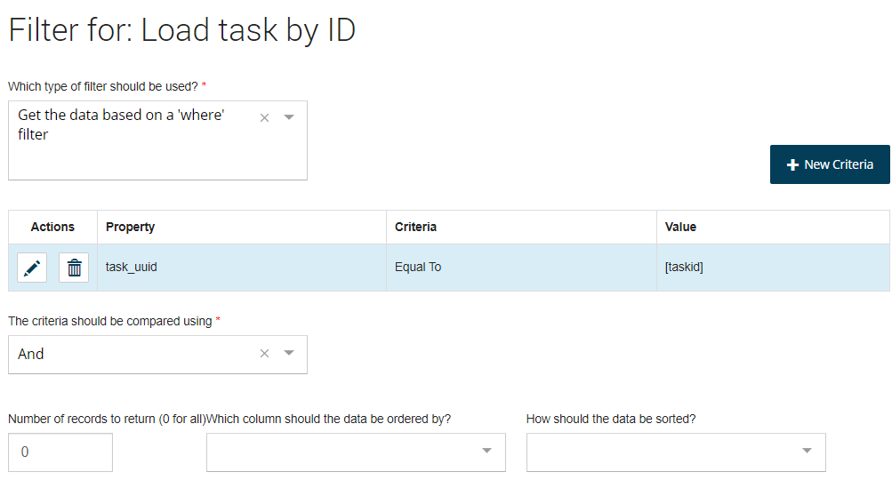

# Data action filters 

<head>
  <meta name="guidename" content="Flow"/>
  <meta name="context" content="GUID-7246bf53-46ad-4ecb-88f9-177803b59ac0"/>
</head>

Filters can be applied to data actions to filter the data returned based on a unique identifier or using a 'where' statement filter.

## Overview 
The following types of filter can be added to a data action:

-   **Do not filter the data**: Applies no filter to the data.

-   **Get the data based on a unique identifier**: Allows you to filter the data using a unique identifier. For example, you could add this filter to a database load data action in order to only load a single specific user record into a flow.

-   **Get the data based on a 'where' filter**: Allows you to filter the data by building up a 'where' type of filter. you can add different criteria to the filter, and build up the filter using '`AND`' or '`OR`' comparison operators. The number of records returned and the column ordering can also be defined.

## Adding a 'unique identifier' filter to a data action 

1.  Click **Edit Filter**when adding/editing a data action on the **Data Action** panel. The **Filter** panel is displayed.
2.  Select the 'Get the data based on a unique identifier' filter type from the **Which type of filter should be used?** drop-down menu.
3.  Click **Select or create a new Value** to specify the unique identifying value that should be used to filter the data.
4.  Click **Apply Filter** to save the filter and return to the **Data Action** panel.

## Adding a 'where' filter to a data action 

1.  Click **Edit Filter**when adding/editing a data action on the **Data Action** panel. The **Filter** panel is displayed.
2.  Select the 'Get the data based on a 'where' filter' filter type from the **Which type of filter should be used?** drop-down menu.
3.  You will need to define the criteria that should be used to build up the filter. Click **New Criteria** to open the **Criteria** panel and add a new criteria to the filter.
    -   **Which property/column do you want to filter by?**: This drop-down menu is automatically populated depending on the data action and type of you are using. Select the relevant property that you wish to use for the filter.

    -   **The criteria to filter by**: Select the type of operation you wish to use to build the filter.

    -   **Which Value should be applied in the filter?**: Click **Select or create a new Value** to either select an existing value or create a new value to compare to the property.

4.  Click **Apply Criteria** to save the new criteria and return to the **Filter** panel. Add new criteria as required.
5.  Specify other settings for the filter as follows:
    -   **The criteria should be compared using**: Select whether the filter should use an '`AND`' or '`OR`' comparison operator.

    -   **Number of records to return \(0 for all\)**: Enter '0' to return all the records from the data source that match the filter, or enter a specific numeric value to restrict how many records are returned.

    -   **Which column should the data be ordered by?**: Select a column from the drop-down menu if you wish the data returned to be ordered by a specific column.

    -   **How should the data be sorted?**: Select whether the data should be sorted in either ascending or descending order if you have selected a specific column to order the data by.

6.  Click **Apply Filter** to save the filter and return to the **Data Action** panel.